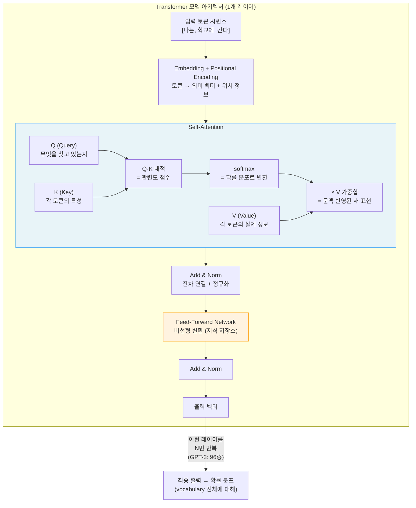
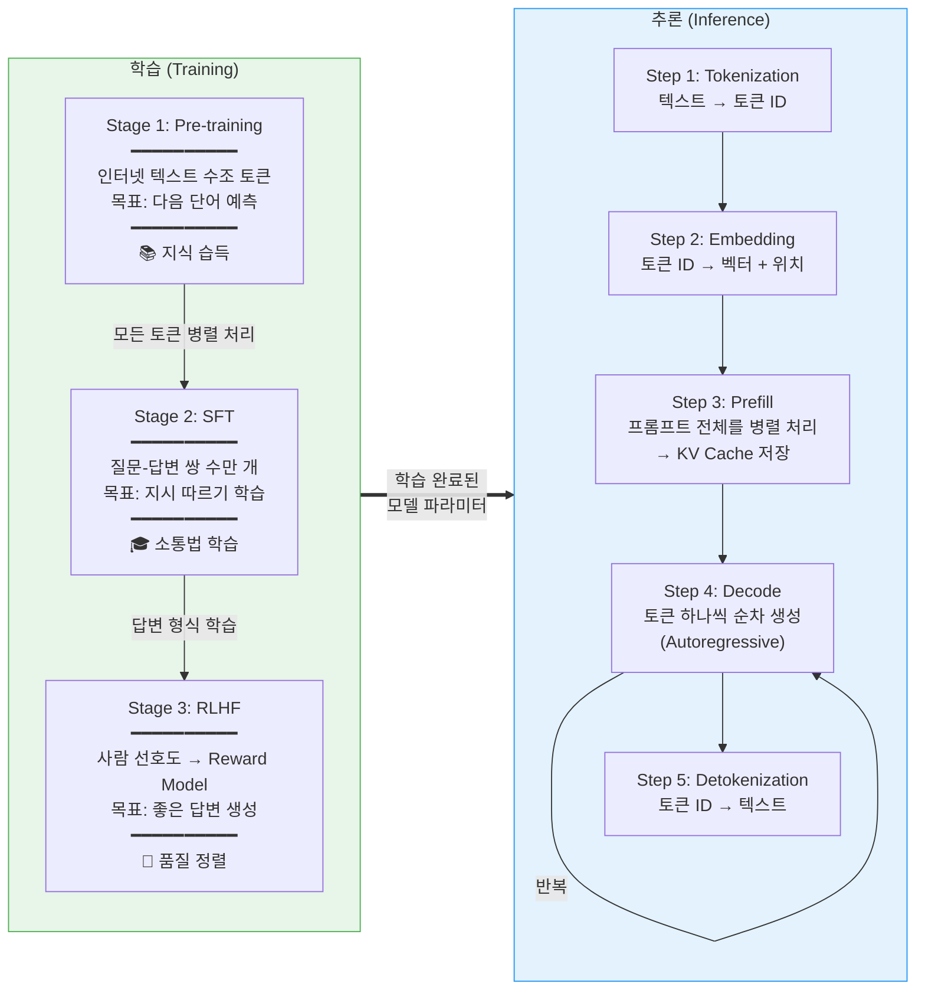
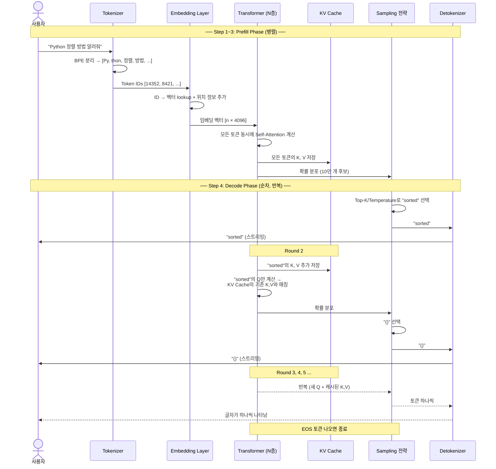

# AI 개론: Machine Learning에서 LLM까지 — 소프트웨어 엔지니어를 위한 가이드

> ML → Deep Learning → Transformer → LLM으로 이어지는 AI 발전 역사와 각 단계의 핵심 기술을 소프트웨어 엔지니어의 시선으로 정리한다. "이 모델이 내부에서 뭘 하는지"를 이해하는 것이 목표다.

---

## 목차

```
Chapter 1. AI의 큰 그림: 용어 정리와 관계도
  1.1 AI ⊃ ML ⊃ DL ⊃ Transformer의 포함 관계
  1.2 소프트웨어 엔지니어가 AI를 알아야 하는 이유

Chapter 2. Machine Learning — 규칙을 코딩하지 않고 데이터에서 학습
  2.1 전통적 프로그래밍 vs ML
  2.2 ML의 3대 패러다임: 지도/비지도/강화 학습
  2.3 핵심 알고리즘 예제 (Linear Regression, SVM, Decision Tree)
  2.4 Feature Engineering: 인간이 특징을 설계하던 시대
  2.5 ML vs LLM: 실무에서의 선택 기준

Chapter 3. Deep Learning — 특징 추출도 모델이 한다
  3.1 신경망의 기본 구조 (Neuron, Layer, Activation)
  3.2 역전파(Backpropagation)와 경사 하강법
  3.3 CNN: 이미지 인식의 혁명
  3.4 RNN → LSTM → GRU: 시퀀스 데이터의 도전
  3.5 AlexNet과 ImageNet 모멘트 (2012)
  3.6 딥러닝 3요소: 데이터 + GPU + 알고리즘

Chapter 4. Transformer — Attention Is All You Need
  4.1 RNN의 한계와 Transformer의 등장 배경
  4.2 Self-Attention 메커니즘 상세 (Q, K, V)
  4.3 Multi-Head Attention
  4.4 Positional Encoding
  4.5 Encoder-Decoder 전체 구조
  4.6 왜 Transformer가 이겼나: 병렬화와 장거리 의존성

Chapter 5. LLM — 대규모 언어 모델의 세계
  5.1 LLM이란 무엇인가
  5.2 학습 파이프라인: Pre-training → SFT → RLHF
  5.3 추론 파이프라인: 입력에서 답변까지의 전체 과정
  5.4 토큰 선택 전략: Greedy, Temperature, Top-p/Top-k
  5.5 KV Cache와 추론 최적화
  5.6 GPT, BERT, Claude: 모델 계보와 차이점

Chapter 6. 2024-2025 최신 동향
  6.1 DPO: RLHF의 대안
  6.2 Reasoning Models (DeepSeek R1, OpenAI o1)
  6.3 MoE (Mixture of Experts)
  6.4 Context Window 확장과 RAG
```

---

## Chapter 1. AI의 큰 그림

### 1.1 AI ⊃ ML ⊃ DL ⊃ Transformer의 포함 관계

```
┌─────────────────────────────────────────────────────────────┐
│  Artificial Intelligence (AI)                                │
│  "인간의 지능을 모방하는 모든 기술"                             │
│                                                              │
│  ┌─────────────────────────────────────────────────────┐     │
│  │  Machine Learning (ML)                               │     │
│  │  "데이터에서 패턴을 학습하는 알고리즘"                   │     │
│  │                                                      │     │
│  │  ┌──────────────────────────────────────────────┐    │     │
│  │  │  Deep Learning (DL)                           │    │     │
│  │  │  "다층 신경망으로 특징까지 자동 학습"            │    │     │
│  │  │                                               │    │     │
│  │  │  ┌───────────────────────────────────────┐    │    │     │
│  │  │  │  Transformer / LLM                     │    │    │     │
│  │  │  │  "Attention 기반 아키텍처, 언어 모델"    │    │    │     │
│  │  │  └───────────────────────────────────────┘    │    │     │
│  │  └──────────────────────────────────────────────┘    │     │
│  └─────────────────────────────────────────────────────┘     │
└─────────────────────────────────────────────────────────────┘
```

**소프트웨어 엔지니어를 위한 비유:**
- **AI** = 모든 "if-else부터 GPT까지" 포함하는 최상위 개념
- **ML** = `f(x) = y`를 데이터로 학습하는 것. 규칙을 하드코딩하지 않음
- **DL** = ML인데, feature extraction까지 모델이 알아서 함 (Multi-layer Neural Network)
- **Transformer** = DL의 한 아키텍처. 2017년 이후 NLP/CV 등 거의 모든 분야를 지배

### 1.2 소프트웨어 엔지니어가 AI를 알아야 하는 이유

```python
# 전통적 프로그래밍
def is_spam(email):
    if "무료" in email and "당첨" in email:
        return True
    return False

# ML 접근
model = train(spam_dataset)  # 데이터에서 패턴을 학습
model.predict(new_email)     # 학습된 패턴으로 판단
```

우리가 API를 호출하는 LLM은 이 연속선 위에 있다. 블랙박스로 쓸 수 있지만, 내부 동작을 이해하면:
- **프롬프트 엔지니어링**이 왜 효과적인지 (Attention이 어디에 집중하는지)
- **토큰 비용**이 왜 이렇게 나오는지 (Tokenization → Embedding → 연산)
- **환각(Hallucination)**이 왜 발생하는지 (확률 분포에서 샘플링)
- **RAG가 왜 필요한지** (학습 데이터의 한계)

이 모든 것이 설명된다.

---

## Chapter 2. Machine Learning — 규칙을 코딩하지 않고 데이터에서 학습

### 2.1 전통적 프로그래밍 vs ML

```
전통적 프로그래밍:
  입력 데이터 + 규칙(코드) → 출력

머신러닝:
  입력 데이터 + 출력(정답) → 규칙(모델)
```

| 구분      | 전통적 프로그래밍         | 머신러닝            |
| ------- | ----------------- | --------------- |
| **규칙**  | 개발자가 명시적으로 코딩     | 데이터에서 자동으로 학습   |
| **변경**  | 규칙이 바뀌면 코드 수정     | 데이터가 바뀌면 재학습    |
| **복잡도** | 규칙이 많아지면 유지보수 어려움 | 데이터가 많아지면 성능 향상 |
| **예시**  | 정규표현식 기반 이메일 필터   | 스팸 분류 모델        |

### 2.2 ML의 3대 패러다임

```
┌─────────────────┐  ┌─────────────────┐  ┌─────────────────┐
│  Supervised      │  │  Unsupervised  │  │  Reinforcement  │
│  Learning        │  │  Learning      │  │  Learning       │
│                  │  │                │  │                 │
│  입력 + 정답       │  │  입력만          │  │  환경 + 보상      | 
│  → 예측 모델       │  │  → 패턴 발견      │  │  → 최적 전략      │
│                  │  │                │  │                 │
│  예: 스팸 분류      │  │  예: 고객 군집화  │  │  예: 게임 AI      | 
│  예: 집값 예측      │  │  예: 이상 탐지    │  │  예: 로봇 제어     │
│  예: 번역          │  │  예: 차원 축소    │  │  예: RLHF (!)   │
└─────────────────┘  └─────────────────┘  └─────────────────┘
```

**소프트웨어 엔지니어를 위한 비유:**
- **지도학습** = 단위 테스트가 있는 코드. 입력-출력 쌍(=테스트 케이스)으로 학습
- **비지도학습** = 로그 분석. 정답 없이 패턴을 찾음
- **강화학습** = A/B 테스트의 자동화. 보상 시그널로 최적 행동을 학습 → LLM의 RLHF가 이것

#### 3대 패러다임 심화: 선택 기준과 차이점

**패러다임 선택 흐름도:**

```
데이터에 정답(label)이 있나?
│
├─ Yes → Supervised Learning (지도학습)
│        "이 사진은 고양이야" 처럼 정답을 알려주며 학습
│
└─ No  → 보상 신호(reward)라도 있나?
         │
         ├─ Yes → Reinforcement Learning (강화학습)
         │        "좋아/싫어" 정도의 피드백으로 학습
         │
         └─ No  → Unsupervised Learning (비지도학습)
                  아무 신호 없이 데이터 자체의 패턴만 찾음
```

**정보량 스펙트럼:**

```
정보량:  많다 ◀──────────────────────▶ 적다

지도학습          강화학습          비지도학습
"정답은 5야"      "맞는 방향이야"    "알아서 찾아봐"
(What)            (How good)        (Nothing)
```

**보상 신호 vs 정답의 차이:**

```
지도학습의 정답:     "이 이메일은 스팸이야" (명확한 정답)
강화학습의 보상신호:  "지금 한 행동이 +1점짜리야" (점수)
```

지도학습은 "정답이 뭐야"를 알려주는 것이고, 강화학습은 "얼마나 잘했어/못했어"를 점수로 알려주는 것이다. 미묘한 차이가 있다:

```
지도학습:  "서울의 수도는?" → 정답: "서울은 수도가 아니라 한국의 수도입니다"
          → 모델이 정답 문장을 그대로 따라하도록 학습

강화학습:  "Python 정렬 방법 알려줘" → 모델이 답변 A, B, C 생성
          → 사람이 B가 가장 좋다고 평가 (= 보상)
          → 정확한 정답 문장은 안 알려줌. "B 방향이 좋아"라는 신호만 줌
```

```
더 직관적인 비유:

강화학습 = 강아지 훈련
  "앉아" → (앉음) → 간식! (+1)        ← 잘했으니 보상
  "앉아" → (누움) → 간식 없음 (0)     ← 틀렸지만 "정답 자세"를 보여주진 않음
  "앉아" → (짖음) → "안돼" (-1)       ← 벌점

지도학습 = 학교 시험
  문제: "2+3=?" → 정답: "5"           ← 정확한 답을 알려줌
```

> **참고:** ChatGPT의 Thumb Up/Down이 바로 이 보상 신호의 **수집 과정**이다. 다만 Thumb Up을 누른다고 모델이 실시간으로 바뀌는 건 아니고, 이런 피드백을 **대량으로 모아서** 나중에 RLHF 재학습할 때 사용한다.

> **Q&A — 정보량 스펙트럼이 "좋고 나쁨"을 의미하나?**
>
> 아니다. "정보량이 많으면 지도학습이 좋고, 적으면 비지도학습이 좋다"가 아니라, **사용 가능한 정보에 따라 쓸 수 있는 방법이 달라진다**는 뜻이다.
>
> - 정답 데이터가 있으면 → 지도학습을 **쓸 수 있다**
> - 정답이 없으면 → 지도학습을 **쓸 수 없으니** 다른 방법을 써야 한다
>
> 비유: 요리를 배우는 3가지 방법
> - 🎓 지도학습 = 요리 선생님이 옆에서 "이건 소금 5g, 불 세기는 중불" (정확한 레시피 = 정답)
> - 🏆 강화학습 = 혼자 만들고 친구가 "오 맛있어!" or "으... 별로" (맛있는 방향은 알지만 레시피는 안 알려줌)
> - 🔍 비지도학습 = 식재료만 잔뜩 줌. 알아서 비슷한 것끼리 묶어봐 (아무 피드백 없음)

> **Q&A — 강화학습은 답이 없는 문제를 푸는 건가?**
>
> 맞다. 강화학습은 "정답"이 없는 상황에서 **"좋은 방향"의 반복 경험**으로 학습한다. 게임 AI에서 "이 상황에서 정답 수는 e4다"라고 알려주는 게 아니라, "이 수를 뒀더니 이겼다(+1)" / "졌다(-1)"라는 결과(보상)만 알려준다. 수천 번 게임을 하면서 "이런 상황에서 이런 수를 두면 이길 확률이 높구나"를 스스로 깨닫는 것이다. 어떤 상황 속에서 좋은 판단이라는 걸 자꾸 알려주면, 비슷한 상황에서 학습된 판단을 적용한다 — 이것이 **경험의 축적**이다.

> **Q&A — 비지도 학습이 이해 안 됨 / ML 대신 그냥 코딩하면 되지 않나?**
>
> **비지도 학습의 실제 예시 — 넷플릭스 추천:**
> "A가 컴퓨터를 자주 봐 → 컴퓨터 추천"은 비지도 학습이 아니라 단순 **통계 집계**다. 비지도 학습이 진짜로 하는 일은 더 복잡하다:
>
> ```
> 사용자 1만 명의 시청 기록:
>   User A: 어벤져스⭕ 인셉션⭕ 노트북❌ 타이타닉❌ 다크나이트⭕
>   User B: 어벤져스❌ 인셉션⭕ 노트북❌ 타이타닉❌ 다크나이트⭕
>   User C: 어벤져스❌ 인셉션❌ 노트북⭕ 타이타닉⭕ 라라랜드⭕
>   ... (1만 명 × 1만 개 영화)
>
> 비지도 학습이 발견하는 것:
>   → 그룹 1: 액션/SF 좋아하는 사람들 (A, B와 비슷한 패턴)
>   → 그룹 2: 로맨스 좋아하는 사람들 (C와 비슷한 패턴)
>   → ... 수백 개의 미묘한 그룹
>
> "액션을 좋아한다"라는 라벨은 아무도 안 붙여줬다.
> 데이터의 패턴에서 자동으로 발견한 것이다.
> ```
>
> **ML을 쓰는 진짜 이유 — 규칙을 코딩할 수 없을 때:**
>
> 간단한 경우에는 코딩이 더 낫다. 하지만:
>
> | 예시 | 코딩 접근 | 한계 |
> |------|-----------|------|
> | **스팸 필터** | "무료" 포함 → 스팸 | 스패머가 "무 료", "Vi@gra"로 변형하면? 규칙 10,000개 → 유지보수 불가능 |
> | **얼굴 인식** | 눈 2개 + 코 가운데 + 입 아래 → 얼굴 | 선글라스? 45도 각도? 어두운 조명? "얼굴"이라는 개념을 규칙으로 정의 불가능 |
> | **감성 분석** | "좋다" → 긍정 | "이 영화가 좋다고? ㅋㅋㅋ" = 비꼼. 반어법, 맥락 → 규칙 표현 불가능 |
>
> **결론:** ML은 **"규칙을 사람이 정의할 수 없을 때"** 필요하다. 규칙이 명확하면(세금 계산, BMI) 코딩이 더 싸고 빠르다.

#### 3대 패러다임이 "숫자 공간"에서 학습하는 방식의 차이

2.4에서 Feature Engineering(현실 데이터 → 숫자 벡터)을 배우면, "그 숫자 공간에서 각 패러다임이 어떻게 다르게 학습하는가?"라는 질문이 자연스럽다. 세 패러다임의 핵심 차이를 숫자 공간에서 시각화하면:

```
📌 지도학습 — "정답 라벨을 보고 선을 긋는다"

  무게
  30 │         🐕(개)        ← 사람이 "이건 개야"라고 라벨을 줌
     │ ─ ─ ─ / ─ ─ ─ ─      ← 모델이 개와 고양이를 나누는 선을 학습
   6 │  🐈(고양이)            ← 사람이 "이건 고양이야"라고 라벨을 줌
   4 │  🐈(고양이)
     └────────────────
  → 정답(개/고양이)을 알려주니까, "이 선으로 나누면 정답과 일치한다"를 학습

📌 비지도학습 — "라벨 없이, 가까운 점끼리 묶는다"

  무게
  30 │         ●              ← 라벨 없음! 개인지 고양이인지 모름
   6 │  ●
   5 │  ●
   4 │  ●
     └────────────────
  모델: "위쪽에 점 1개, 아래쪽에 점 3개가 모여있네 → 2그룹!"
  ⚠️ 이게 "개"인지 "고양이"인지는 모른다! 가까운 것끼리 묶었을 뿐.
  → 나중에 사람이 보고 "아 그룹 B가 고양이구나"라고 해석하는 것.

📌 강화학습 — "시행착오로 좋은 위치를 찾는다"

  무게
  30 │       ★ ← 에이전트가 여기로 이동. "좋아! +1" (보상)
     │      ↗
   6 │  ★ ← 에이전트 시작점
   4 │    ↘ ★ "안돼! -1" (벌점)
     └────────────────
  → 정답 좌표를 알려주지 않음. "위로 가면 +1" 보상 신호만 있음.
  → 수천 번 시행착오 끝에 "위쪽이 좋은 곳이구나"를 학습.
```

비지도 학습의 핵심 원리를 조금 더 풀어보면 — **정답 없이 "거리"만으로 학습**한다:

```
K-Means 클러스터링 예시:

Step 1: 랜덤으로 중심점 2개를 찍는다
  중심 A = (50, 20), 중심 B = (30, 5)

Step 2: 각 점이 어느 중심에 더 가까운지 계산
  (60, 30) → A까지 거리 14, B까지 거리 35 → A 그룹!
  (30, 4)  → A까지 거리 24, B까지 거리 1  → B 그룹!

Step 3: 각 그룹의 평균 위치로 중심점 이동
  A 새 중심 = (60, 30), B 새 중심 = (33, 5)

Step 4: 2~3 반복 → 중심이 더 이상 안 움직이면 완료!
→ "정답"이 아니라 "거리"만 가지고 그룹을 만든 것.
```

> 비유: 100개의 풍선이 공중에 떠 있다.
> - **지도학습** = 각 풍선에 "빨강", "파랑" 라벨이 붙어있음 → 색별로 묶기
> - **비지도학습** = 라벨 없음 → 가까이 있는 것끼리 묶기
> - **강화학습** = 라벨 없음, 하지만 "이 묶음은 좋아!(+1)" 피드백 있음

**발전 순서가 아닌 용도별 도구:**

세 가지 패러다임은 **발전 순서가 아니다.** 1950~60년대부터 **동시에** 연구되어 왔고, 각각 잘하는 영역이 다르다. 문제의 성격에 따라 선택하는 "도구"다.

```
          문제의 성격에 따라 선택하는 "도구"

┌──────────────────┬──────────────────┬──────────────────┐
│  정답 데이터가    │  패턴만 찾으면    │  시행착오로       │
│  있을 때          │  될 때           │  최적화할 때      │
│                   │                   │                   │
│  Supervised       │  Unsupervised     │  Reinforcement    │
│                   │                   │                   │
│  • 스팸 분류      │  • 고객 군집화    │  • 게임 AI        │
│  • 번역           │  • 이상 탐지      │  • 로봇 제어      │
│  • 이미지 인식    │  • 추천 시스템    │  • 자율주행       │
└──────────────────┴──────────────────┴──────────────────┘
```

**LLM은 세 패러다임의 집대성:**

LLM은 재미있게도 세 가지 패러다임을 순서대로 **모두** 활용한다:

```
Stage 1: Pre-training  → 자기지도학습 (비지도학습의 변형)
         "인터넷 텍스트에서 다음 단어 예측"
         정답 라벨링 불필요 (텍스트 자체가 정답)

Stage 2: SFT           → 지도학습
         "질문-답변 쌍으로 학습"
         사람이 작성한 (질문, 정답) 데이터 필요

Stage 3: RLHF          → 강화학습
         "사람의 선호도(Thumb Up)로 미세 조정"
         정답은 모르지만 "A가 B보다 낫다"는 보상 신호 사용
```

→ 발전 순서가 아니라, 각각의 강점을 **단계별로 조합**한 것이다. (Chapter 5.2에서 상세히 다룸)

> **Q&A — Pre-training, SFT, RLHF가 3대 패러다임과 어떻게 연관되나?**
>
> ```
> ┌─────────────────────────────────────────────────────────────────┐
> │ Stage 1: Pre-training = 자기지도학습(Self-Supervised Learning)   │
> │─────────────────────────────────────────────────────────────────│
> │ 데이터: 인터넷의 모든 텍스트 (위키피디아, 뉴스, 책, 코드...)     │
> │ 방법:  "나는 오늘 학교에 [???]" → 다음 단어 예측                │
> │ 정답:  텍스트 자체가 정답 (사람이 라벨링 안 해도 됨!)             │
> │                                                                 │
> │ 전통 분류에서는 비지도학습의 하위 범주로 분류되지만,               │
> │ Yann LeCun(2021)은 "자기지도학습은 독립적 패러다임"이라고 주장.   │
> │ 데이터 자체에서 감독 신호(다음 토큰)를 자동 생성하기 때문이다.     │
> │                                                                 │
> │ 결과: 세상의 지식, 문법, 논리를 대략 습득한 "박학다식한 앵무새"    │
> └─────────────────────────────────────────────────────────────────┘
> ┌─────────────────────────────────────────────────────────────────┐
> │ Stage 2: SFT = 지도학습 (Supervised Learning)                    │
> │─────────────────────────────────────────────────────────────────│
> │ 데이터: 사람이 직접 만든 (질문, 모범답변) 쌍 수만~수십만 개       │
> │ 방법:  "Python 정렬 방법은?" → "sorted() 함수를 사용합니다..."   │
> │ 정답:  사람이 작성한 모범답변 (= 명확한 정답)                     │
> │ → 입력(질문) + 정답(모범답변)이 있으므로 완전한 지도학습 구조     │
> │                                                                 │
> │ 결과: "질문하면 답변하는 형식"을 배움                              │
> └─────────────────────────────────────────────────────────────────┘
> ┌─────────────────────────────────────────────────────────────────┐
> │ Stage 3: RLHF = 강화학습 (Reinforcement Learning)                │
> │─────────────────────────────────────────────────────────────────│
> │ 데이터: 같은 질문에 대한 답변 A, B, C → 사람이 "B가 제일 좋아"  │
> │ 방법:  Reward Model이 점수 매김 → 점수 높이는 방향으로 학습      │
> │ 정답:  없다! "B가 A보다 낫다"는 상대적 평가(= 보상 신호)만 있음  │
> │ → 강아지 훈련과 동일: 정답 자세를 보여주진 않지만 간식(+1)/안돼(-1)│
> │                                                                 │
> │ 결과: 안전하고, 도움이 되고, 정직한 답변을 생성하는 최종 모델      │
> └─────────────────────────────────────────────────────────────────┘
> ```
>
> 비유: Pre-training = 📚 도서관에서 1만 권 읽기, SFT = 🎓 과외 선생님에게 답변법 배우기, RLHF = 🏆 면접관이 "이 답변이 더 나아"

### 2.3 핵심 알고리즘 예제

2.2에서 3대 패러다임은 **"데이터를 어떤 형태로 주느냐"** (정답 있음/없음/보상)를 다뤘다. 2.3의 알고리즘은 **"주어진 데이터를 어떤 수학 구조로 학습하느냐"**, 즉 모델의 구조를 다룬다.

ML 알고리즘은 "학습하는 방법"과 "결과를 내는 방법"이 분리되지 않는다. 하나의 알고리즘이 둘 다 정의한다:

```
Linear Regression:
  학습: 데이터에서 w, b를 찾는다 (경사하강법으로 Loss 최소화)
  예측: y = wx + b 에 새 x를 넣어서 y를 구한다
  → 하나의 알고리즘이 "어떻게 학습하고, 어떻게 예측하는지" 모두 규정

Decision Tree:
  학습: 데이터에서 최적의 분기 조건(나이 > 30? 소득 > 5000만?)을 찾는다
  예측: 새 데이터를 트리 따라 내려가며 결과 도출
  → 역시 학습 방법과 예측 방법이 하나로 묶여 있음
```

**패러다임이 먼저 정해지면, 쓸 수 있는 모델이 제한된다:**

```
                    지도학습      비지도학습     강화학습
                    (정답 있음)   (정답 없음)    (보상 신호)
────────────────────────────────────────────────────────
Linear Regression    ✅ 핵심용도    ❌            ❌
                     (집값 예측)

Decision Tree        ✅ 핵심용도    ❌            ❌
                     (대출 심사)

SVM                  ✅ 핵심용도    △ 변형 있음    ❌
                     (이미지 분류)  (One-class SVM)

K-Means              ❌            ✅ 핵심용도    ❌
                                   (고객 군집화)

Neural Network       ✅            ✅            ✅
                     (이미지 분류)  (오토인코더)   (게임 AI)
────────────────────────────────────────────────────────
```

**왜 이런 차이가 생기나:**

- **Linear Regression**은 `y = wx + b`에서 **정답 y가 있어야** w와 b를 찾을 수 있다. Loss = (예측 - 정답)²을 최소화하는 구조이므로, 정답이 없으면 학습 자체가 불가능하다. 지도학습 전용.
- **Decision Tree**도 분기 조건을 결정하려면 나눈 후 각 그룹의 **정답 분포**를 봐야 한다. 정답이 없으면 "좋은 분기"를 판단할 기준이 없다.
- **SVM**은 두 클래스 사이의 경계선을 찾는데, 클래스 라벨(정답)이 있어야 한다. 다만 One-class SVM이라는 변형으로 이상치 탐지(비지도)도 가능하다.
- **K-Means**는 정답 없이 데이터의 거리만 보고 군집을 만드는 비지도학습 전용이다.
- **Neural Network**만 유일하게 세 패러다임 모두에 사용 가능하다. 구조가 유연해서 Loss 함수만 바꾸면 된다. 이 유연성이 Neural Network가 Deep Learning → Transformer → LLM으로 발전할 수 있었던 이유다.

#### Linear Regression — 가장 단순한 ML

```python
# "집 크기 → 집값" 예측
# y = wx + b (w: 가중치, b: 편향)

# 학습 데이터
sizes  = [50, 70, 80, 100, 120]  # 평수
prices = [2.0, 2.8, 3.2, 4.0, 4.8]  # 억원

# 학습 결과: w=0.04, b=0.0
# predict(90평) = 0.04 * 90 + 0.0 = 3.6억
```

이것이 ML의 본질이다: **데이터에서 w와 b를 찾는 것** = 학습(Training).

#### 잠깐, y = wx + b 가 뭐길래? — 1차 함수와 Loss의 직관적 이해

**y = wx + b는 중학교 때 배우는 1차 함수(직선)다.**

"x가 1 늘어나면 y가 일정하게 늘어나는" 관계:

```
아이스크림 가게 예제:

  아이스크림 1개 = 1000원 → y = 1000 × x

  1개 사면: 1000 × 1 = 1000원
  3개 사면: 1000 × 3 = 3000원
  5개 사면: 1000 × 5 = 5000원

  근데 가게에 들어가면 기본 봉투값 500원이 붙는다면:
  y = 1000 × x + 500

  1개 사면: 1000 × 1 + 500 = 1500원
  3개 사면: 1000 × 3 + 500 = 3500원

  여기서 w = 1000 (개당 가격), b = 500 (봉투값), x = 개수, y = 총 가격
```

**이게 왜 ML에 쓰이나?** 세상의 많은 관계가 "대충 직선"이기 때문이다:

```
집 크기(평수) → 집값:        대충 직선 (클수록 비쌈)
공부 시간 → 시험 점수:       대충 직선 (많이 할수록 오름)
키 → 몸무게:                대충 직선 (클수록 무거움)

완벽한 직선은 아니지만, "대략적인 경향"을 잡기엔 충분하다.
```

ML이 하는 일:

```
우리가 아는 것: 집 데이터
  50평 → 2억, 70평 → 2.8억, 80평 → 3.2억, 100평 → 4억

모르는 것: 90평짜리 집은 얼마?

ML의 방법:
  "y = w × x + b 에서 w와 b를 찾자"
  데이터를 보니... w=0.04, b=0 이 가장 잘 맞네!

  검증: 0.04 × 50 + 0 = 2.0억 ✅
       0.04 × 70 + 0 = 2.8억 ✅
       0.04 × 100 + 0 = 4.0억 ✅

  예측: 0.04 × 90 + 0 = 3.6억 ← 이게 ML의 "예측"
```

핵심은 w와 b를 사람이 정하는 게 아니라, **데이터를 보고 컴퓨터가 찾는다**는 것이다.

**그럼 w와 b를 어떻게 찾나? → 여기서 Loss가 나온다.**

컴퓨터는 처음에 w와 b를 아무 숫자나 넣어본다. 그리고 "얼마나 틀렸는지"를 측정한다:

```
Step 1: 아무 값으로 시작 — w = 0.01, b = 0

  50평 집의 실제 가격: 2억
  모델의 예측:        0.01 × 50 + 0 = 0.5억

  틀린 정도 = 예측 - 정답 = 0.5 - 2.0 = -1.5억  ← 1.5억이나 틀림!
```

근데 "틀린 정도"를 그냥 쓰면 문제가 있다:

```
  집 A: 예측 3억, 정답 2억 → 틀린 정도 = +1억 (비싸게 예측)
  집 B: 예측 1억, 정답 2억 → 틀린 정도 = -1억 (싸게 예측)

  평균 = (+1 + -1) / 2 = 0  ← "평균 오차 0"?! 둘 다 1억씩 틀렸는데?!
```

플러스와 마이너스가 상쇄된다. 그래서 **제곱**을 한다:

```
  집 A: (3 - 2)² = (+1)² = 1
  집 B: (1 - 2)² = (-1)² = 1

  평균 = (1 + 1) / 2 = 1  ← "평균 1만큼 틀렸다" ← 정직한 숫자!
```

제곱하면 부호가 사라져서, "얼마나 틀렸는지"를 항상 양수로 측정할 수 있다. 이것이 **Loss = (예측 - 정답)²** 의 존재 이유다.

```
비유: 과녁 맞추기 게임

  과녁 중심 (정답) = ◎
  내가 쏜 곳 (예측) = ●

  왼쪽으로 3cm 빗나감 = 거리 3
  오른쪽으로 3cm 빗나감 = 거리 3
  → 방향은 상관없고, "얼마나 멀었나"만 중요

  Loss = 거리² = "과녁에서 얼마나 멀었는지"의 측정값
  ML의 목표: 이 거리(Loss)를 최대한 0에 가깝게 줄이는 것
```

**전체 학습 흐름:**

```
1. w, b를 아무 값으로 시작          (랜덤 초기화)
2. 예측해본다: y = wx + b           (Forward Pass)
3. 얼마나 틀렸는지 계산: (예측-정답)²  (Loss 계산)
4. w, b를 살짝 조정                 (Backpropagation)
5. 2~4를 수천~수만 번 반복
6. Loss가 충분히 작아지면 학습 완료!

이게 ML 학습의 전부다.
```

> **참고:** "왜 제곱이지, 절대값(|x|)이면 안 되나?" → 써도 된다! 실제로 MAE(Mean Absolute Error)라는 방법도 있다. 근데 제곱이 수학적으로 미분하기 편해서(=컴퓨터가 w를 조정하는 방향을 계산하기 쉬워서) 더 많이 쓰인다.

#### Decision Tree — 규칙을 자동으로 만드는 ML

```
                    [나이 > 30?]
                   /            \
                Yes              No
               /                  \
      [소득 > 5000만?]         [대출 거절]
      /            \
    Yes             No
    /                \
[대출 승인]      [대출 거절]
```

사람이 `if-else`로 짤 수도 있지만, Decision Tree는 데이터에서 **최적의 분기 조건을 자동으로 학습**한다.

#### SVM (Support Vector Machine) — 경계선 찾기

```
     ●  ●                    ●  ●
  ●        ●              ●  |     ●
     ●  ●          →         |  ●
  ─ ─ ─ ─ ─ ─            ── | ──── (최적 경계선)
     ○  ○                 ○  |
  ○        ○           ○     |  ○
     ○  ○                 ○  |
```

두 클래스를 **가장 넓은 마진으로 분리**하는 경계선(hyperplane)을 찾는다. 이미지 인식에서 DL 이전에 가장 강력했던 알고리즘.

### 2.4 Feature Engineering: 인간이 특징을 설계하던 시대

> **맥락 연결:** 2.3에서 살펴본 알고리즘들(Linear Regression, SVM, Decision Tree)은 모두 **숫자(벡터)**를 입력으로 받는다. 그런데 현실의 데이터는 숫자가 아니다 — 사진, 텍스트, 음성 파일이다. 이 "현실 데이터 → 숫자 벡터" 변환 작업이 바로 Feature Engineering이며, ML 파이프라인에서 알고리즘 **앞단**에 위치한다.

```
ML 파이프라인에서의 위치:

현실 데이터(이미지/텍스트/음성)
    ↓
[Feature Engineering] ← 인간이 수작업으로 설계 (이 섹션의 주제)
    ↓
숫자 벡터
    ↓
[ML 알고리즘 — SVM, Decision Tree 등] ← 2.3에서 배운 것
    ↓
예측 결과
```

**구체적 예시:** 고양이 사진을 SVM에 넣으려면?
- 사진 파일을 그냥 넣을 수 없다. 먼저 "엣지가 몇 개인지", "둥근 형태가 있는지" 같은 **숫자 특징**을 뽑아야 한다
- 텍스트 "이 영화 정말 재밌다"를 ML에 넣으려면? "재밌다"라는 단어의 출현 빈도를 숫자로 변환해야 한다
- 이 변환 과정이 바로 Feature Engineering이고, **도메인 전문가가 수개월을 투자**하는 작업이었다

이 시대에는 "ML 성능 = 알고리즘 < Feature의 품질"이라는 말이 있을 정도로, feature 설계가 **ML의 최대 병목**이었다. Chapter 3에서 배울 Deep Learning이 바로 이 병목을 해결한다.

```
Chapter 2 전체 흐름 정리:
  2.2 학습 방법 (지도/비지도/강화) → 2.3 알고리즘 (도구) → 2.4 데이터 가공 (병목!)
  → Chapter 3 Deep Learning (병목 해결!)
```

```
전통 ML의 이미지 인식 파이프라인:

원본 이미지 → [SIFT/HOG 특징 추출] → [특징 벡터] → [SVM 분류기] → "고양이"
              ↑                                     ↑
              인간이 설계                             ML이 학습
              (수개월의 도메인 지식)                  (수학적 최적화)
```

**핵심 한계:** 특징(feature)을 인간이 직접 설계해야 했다.
- 이미지: 엣지 검출, 코너 검출, 텍스처 패턴 (SIFT, HOG)
- 텍스트: TF-IDF, n-gram, 불용어 제거
- 음성: MFCC, 스펙트로그램

→ **Deep Learning이 이 문제를 해결한다.**

> **Q&A — SIFT/HOG란? SVM은 이미지 전용?**
>
> **SIFT (Scale-Invariant Feature Transform):** 이미지에서 "특별한 점"(코너, 모서리)을 찾아서 128개 숫자로 변환하는 알고리즘. 이미지를 회전하거나 크기를 바꿔도 같은 특징점을 찾는다(Scale-Invariant). 비유: 범인 특징 기록 — "점, 흉터, 문신" 같은 고유 특징을 숫자로 만드는 것.
>
> **HOG (Histogram of Oriented Gradients):** 이미지의 "엣지 방향 분포"를 숫자로 바꾸는 알고리즘. 비유: 사진을 보고 "가로선 30%, 세로선 40%, 대각선 30%"처럼 윤곽 방향을 기록. 보행자 검출(사람의 실루엣 = 엣지 패턴)에서 특히 강력했다.
>
> **SVM은 이미지 전용인가?** ❌ 아니다. SVM은 "숫자 벡터를 받아서 분류하는" **범용 ML 알고리즘**이다. 이미지(SIFT/HOG → SVM), 텍스트(TF-IDF → SVM), 의료(혈액 검사 수치 → SVM) 등 숫자로 바꿔주기만 하면 무엇이든 분류할 수 있다. 이미지에서 유명했던 건 SIFT/HOG + SVM 조합이 DL 이전 시대의 최강이었기 때문이다.

> **Q&A — Feature Engineering: 현실 세계 정보를 숫자로 만들면 컴퓨터가 어떻게 "이해"하나?**
>
> **컴퓨터는 "이해"하지 않는다. "거리"를 계산할 뿐이다.**
>
> ```
> 🐕 강아지와 🐈 고양이를 구분하는 모델:
>
> Step 1: 동물을 숫자로 바꾸기
>   푸들:         크기=35cm, 무게=5kg
>   골든리트리버:  크기=60cm, 무게=30kg
>   페르시안 고양이: 크기=30cm, 무게=4kg
>   시베리안 고양이: 크기=35cm, 무게=6kg
>
> Step 2: 그래프에 점으로 찍기
>   무게(kg)
>   30 │           🐕 골든리트리버
>      │
>   10 │
>    6 │  🐈 시베리안
>    5 │  🐕 푸들
>    4 │  🐈 페르시안
>      └──────────────────── 크기(cm)
>        25  30  35  40  55  60
>
> Step 3: 컴퓨터가 하는 일 = "선 긋기"
>   → "이 선 위는 강아지, 아래는 고양이"
>   → 선을 어디에 그으면 잘 나뉘는지 찾는 것 = y = wx + b에서 w, b를 찾는 과정!
> ```
>
> **y = wx + b로 모델이 만들어지는 과정:**
>
> ```
> 1. 컴퓨터가 아무 선을 긋는다 (w, b를 랜덤으로)
>    y = 0.1 × 크기 + 0.2 × 무게 - 3
>
> 2. 이 선으로 분류해본다
>    페르시안: 0.1 × 30 + 0.2 × 4 - 3 = 0.8 → 양수 = 강아지 예측 → ❌ 틀림!
>
> 3. 틀렸으니 선을 조정한다 (w, b를 바꿈)
>    y = 0.05 × 크기 + 0.8 × 무게 - 5
>
> 4. 다시 분류해본다
>    골든리트리버: 0.05 × 60 + 0.8 × 30 - 5 = 22  → ✅ 강아지
>    페르시안:     0.05 × 30 + 0.8 × 4 - 5 = -0.3 → ✅ 고양이 (음수!)
>
> 5. 수천 번 반복 → Loss가 최소인 w, b = "모델"
> ```
>
> 컴퓨터는 "고양이가 뭔지" 모른다. 숫자들 사이의 **거리와 패턴만 계산**할 뿐이다.

#### Feature Engineering은 추론(Inference)에서도 필요하다

Feature Engineering이라고 하면 "학습 데이터를 만들 때"만 떠올리기 쉽지만, **모델을 호출하여 예측 결과를 얻을 때도** 동일한 feature 변환이 필요하다.

```
학습 시 (Training):
  원본 데이터 → [Feature Engineering] → 학습용 feature 벡터 → [모델 학습]

추론 시 (Inference):
  원본 데이터 → [Feature Engineering] → 추론용 feature 벡터 → [모델 호출] → 예측 결과
```

예를 들어 환자 데이터로 위험도를 예측하는 ML 모델이 있다면:
- **학습 시**: 과거 환자 데이터 → 나이, 바이탈 사인, 검사 결과를 수치 벡터로 변환 → 모델 학습
- **서빙 시**: 지금 입원한 환자 데이터 → **동일한 변환** → 모델 호출 → "위험도 87%"

둘 다 "원본 데이터를 모델이 이해할 수 있는 숫자로 변환"하는 작업이므로, 모두 Feature Engineering이다.

#### Training-Serving Skew — 학습과 서빙의 불일치 문제

학습과 서빙에서 feature engineering을 **각각 다른 코드로** 구현하면, 미묘한 차이가 생길 수 있다. 이것을 **Training-Serving Skew**라고 한다.

```
학습 파이프라인 (Data Scientist):
  DB → Python pandas → feature 생성 → 모델 학습
  예: age = (current_date - birth_date).days / 365.25  → 35.7

서빙 파이프라인 (Backend Engineer):
  DB → Java/Kotlin → feature 생성 → 모델 호출
  예: age = ChronoUnit.YEARS.between(birthDate, now)   → 35

→ 같은 "나이"인데 35.7 vs 35 — 모델 정확도 하락!
```

**흔한 skew 유형:**

| 유형 | 예시 |
|------|------|
| **타입 차이** | Python float vs Java Double 정밀도 |
| **시간 처리** | 학습: UTC, 서빙: KST |
| **Null 처리** | 학습: NaN → 0, 서빙: null → 다른 기본값 |
| **정규화** | 학습/서빙에서 다른 통계치 사용 |
| **버전 차이** | 학습에 feature 추가 후 서빙 코드 미반영 |

#### Feature Store — Skew를 방지하는 중앙 저장소

학습과 서빙에서 동일한 feature를 보장하기 위한 해결책이 **Feature Store**다.

```
Feature Store가 없을 때:
  학습: Python으로 feature 생성 → 모델 학습
  서빙: Java로 feature 생성 → 모델 호출
  → 두 코드가 따로 놀 수 있음 (skew 위험)

Feature Store가 있을 때:
  feature 생성 코드 (한 벌) → [Feature Store에 저장]
                                    ↓           ↓
                               학습에서 읽기   서빙에서 읽기
  → 같은 feature 보장
```

```
소프트웨어 비유:
  API 서버 여러 대가 각각 설정값을 하드코딩  → 불일치 위험
  API 서버 여러 대가 Redis에서 설정값을 읽음  → 일관성 보장
  Feature Store = ML 세계의 "설정값 중앙 관리"
```

Feature Store는 **Offline Store**(학습용, 대용량 배치 — S3/BigQuery)와 **Online Store**(서빙용, 저지연 실시간 — Redis/DynamoDB)로 나뉜다. 대표적으로 Feast(오픈소스), Tecton(상용), AWS SageMaker Feature Store 등이 있다.

> 다만 Feature Store는 **여러 모델이 feature를 공유하는 대규모 조직**에서 가치가 크다. 단일 모델이라면 학습/서빙 코드의 일치를 테스트로 검증하는 것만으로 충분할 수 있다.

#### Feature Store에 저장되는 것은 "코드"가 아니라 "코드의 실행 결과"

Feature Store는 **"임의의 input을 받아서 그때그때 Feature Engineering하는 곳"이 아니다.** Feature Store는 **"미리 계산해둔 feature 값을 꺼내주는 곳"**이다.

```
❌ 오해하기 쉬운 구조:
  사용자 요청 → Feature Store → "이 input을 분석해서 feature 만들어줘" → 반환

✅ 실제 구조:
  [배치 파이프라인] → 주기적으로 모든 사용자의 feature를 미리 계산해서 저장
  사용자 요청 → Feature Store → "user_123의 feature 값 꺼내줘" → 반환
```

**구체적 예시 — 대출 심사 시스템:**

```
Step 1: Feature Engineering 파이프라인 (배치, 매일 새벽 실행)
  ┌──────────────┐    ┌───────────────────┐    ┌──────────────┐
  │ 원본 DB       │ →  │ Feature 계산 코드   │ →  │ Feature Store │
  │ (사용자 테이블)│    │ age = (today-birth) │    │ (Redis 등)    │
  │ (거래 내역)   │    │ avg_income = ...    │    │              │
  │ (대출 이력)   │    │ loan_count = ...    │    │              │
  └──────────────┘    └───────────────────┘    └──────────────┘

  매일 새벽에 모든 사용자의 feature를 미리 계산해서 저장:
  user_123: { age: 35.7, avg_income: 5000, loan_count: 3, ... }
  user_456: { age: 28.3, avg_income: 3200, loan_count: 1, ... }

Step 2: 추론 시 (실시간)
  user_123이 대출 신청
  → 서버가 Feature Store에서 user_123의 feature를 조회
  → { age: 35.7, avg_income: 5000, loan_count: 3 } 반환
  → 이 값을 모델에 넣어서 → "승인/거절" 예측
```

```
소프트웨어 비유:
  Feature Store = 미리 썰어둔 재료 냉장고 (패스트푸드 주방)
  - 매일 새벽에 양상추를 씻고, 토마토를 썰고, 패티를 만들어둠
  - 주문이 들어오면 냉장고에서 꺼내서 조립만 하면 됨
  ❌ 주문이 올 때마다 밭에서 양상추를 뽑아오는 게 아님!
```

**Feature Store에 없는 정보가 전달되면?**

```
┌──────────────────────────────────┬──────────────────────────────┐
│ Case 1: 신규 사용자               │ Case 2: 새로운 종류의 feature │
│ (Feature Store에 아직 데이터 없음)│ (기존에 계산하지 않던 것)     │
├──────────────────────────────────┼──────────────────────────────┤
│ → 기본값(default) 사용            │ → FE 코드 수정               │
│ → 또는 cold start 전용 모델 운영  │ → 배치 파이프라인 재실행      │
│ → 가입 후 일정 기간 지나면        │   (backfill)                │
│   배치가 feature 생성             │ → 모델도 재학습              │
├──────────────────────────────────┼──────────────────────────────┤
│ Case 3: 실시간으로만 알 수 있는 것 (예: "지금 이 순간의 환율")    │
│ → Feature Store가 아니라 실시간 API에서 직접 가져옴               │
│ → Feature Store는 "미리 계산 가능한 것"만 저장                    │
└──────────────────────────────────────────────────────────────────┘
```

**Feast, Tecton 같은 도구는 어떤 성격인가?** **코드 관리 + 데이터 저장** 모두 한다:
1. Feature Definition (코드) → Git으로 관리
2. Feature Materialization → 코드를 실행해서 값 생성
3. Feature Storage → 생성된 값을 Redis/DynamoDB에 저장
4. Feature Serving → `feast.get_online_features(user_id=123)`으로 조회

즉 Feast는 "코드 + 실행 + 저장 + 제공"을 한 곳에서 관리하는 플랫폼이다. key-value store "위에" 올라가는 도구.

**Feature Store 없이는?** 가장 흔한 방법은 **공유 라이브러리 형태로 코드를 공유**하는 것이다:
```
feature_lib/
  ├── user_features.py
  └── product_features.py

학습: from feature_lib import user_features  # 동일한 코드
서빙: from feature_lib import user_features  # 동일한 코드
```
이 방법이 **실무에서 가장 흔하다.** Feature Store는 모델이 수십 개이고 팀이 여럿인 대규모 조직에서 가치가 크다.

#### Feature Engineering + DL 협력 패턴

Feature Engineering과 DL은 대립 관계가 아니라 **협력 관계**가 될 수 있다. 사람이 도메인 지식으로 의미있는 feature를 만들고, DL이 그걸 더 깊이 학습하는 조합이 최강인 경우도 많다.

```
추천 시스템 예시:
  사람이 정의한 feature: 나이, 성별, 구매이력, 카테고리
           +
  DL: 이 feature들 간의 복잡한 상호작용을 학습

정형 + 비정형 혼합 예시:
  사람이 정의: 가격, 재고, 날짜
  비정형: 상품 이미지, 리뷰 텍스트
           +
  DL: 두 가지를 함께 학습
```

전통적 ML은 feature 간 상호작용(나이 × 연봉 조합 등)을 사람이 직접 만들어야 하지만, DL은 이걸 자동으로 찾아준다. 사람이 기본 feature만 정의하고, 조합과 패턴은 DL에게 맡기는 방식이 효율적인 경우가 있다.

> **정형 데이터 ≠ 반드시 전통 ML, 비정형 데이터 ≠ 반드시 DL**
>
> 원칙: feature 정의 가능(정형) → 전통적 ML / feature 정의 불가(비정형) → DL. 하지만 실무에서는 예외가 있다:
> - **정형인데 DL**: 데이터가 수억 건이거나 feature 간 복잡한 상호작용이 필요할 때 (Netflix, 쿠팡 추천 시스템)
> - **비정형인데 ML**: 텍스트를 TF-IDF로 수치화한 뒤 SVM으로 분류하거나, 데이터/컴퓨팅 자원이 부족할 때
>
> 선택 기준: 데이터 형태, 데이터 양, 컴퓨팅 자원, 해석 가능성 — 네 가지를 종합해서 결정한다.

### 2.5 ML vs LLM: 실무에서의 선택 기준

**"LLM이 모든 것을 대체하는가?"에 대한 답: 아니요.**

실무에서는 전통 ML이 LLM보다 훨씬 많이 쓰인다. LLM은 빙산의 일각이다.

```
실무 AI 사용 비율 (체감):

│ 전통 ML (XGBoost, Random Forest, SVM 등)  ██████████████████ 60%+
│ 특화 DL (CNN, BERT-small, 추천 모델 등)     ██████████ 25%
│ LLM (GPT, Claude 등)                     █████ 15%
```

#### 비용/속도 비교 예제: 스팸 필터

```
LLM으로 스팸 필터를 만든다면:
  - 비용: 1건당 ~$0.001 × 하루 1억 건 = 하루 $100,000
  - 속도: ~500ms/건
  - 인프라: GPU 서버 클러스터

XGBoost로 스팸 필터를 만든다면:
  - 비용: CPU 서버 1대 → 하루 ~$10
  - 속도: ~0.1ms/건 (5000배 빠름)
  - 인프라: 아무 서버나 OK
  - 정확도: 이 태스크에서는 LLM과 거의 동일하거나 더 높음
```

| 기준 | 전통 ML | LLM |
|------|---------|-----|
| **비용** | 저렴 (CPU로 충분) | 비쌈 (GPU 필수) |
| **속도** | <1ms | 수백ms~수초 |
| **해석 가능성** | 높음 ("이 feature 때문에 스팸") | 블랙박스 |
| **정형 데이터** | 강함 (테이블, 수치) | 약함 |
| **비정형 데이터** | 약함 | 강함 (텍스트, 대화) |
| **규제 대응** | 쉬움 ("왜 거절했는지" 설명 가능) | 어려움 |

#### 전통 ML이 우세한 영역

```
금융:  대출 심사 → XGBoost (해석 가능성 필수, 규제 요구)
       사기 탐지 → Random Forest + 규칙 엔진
       → 규제 기관에 "왜 이 대출을 거절했는지" 설명해야 함. LLM은 불가.

이커머스: 추천 시스템 → 특화 DL 모델 (Two-Tower, DeepFM)
         검색 랭킹 → LightGBM
         → 초당 수만 요청 처리. LLM 비용으로는 불가능.

제조업: 불량 감지 → CNN (이미지) + XGBoost (센서 데이터)
       예측 정비 → Time Series 모델
       → 공장 엣지 디바이스에서 실행. GPU 없음.

의료:  진단 보조 → 전통 ML (로지스틱 회귀 등)
       → "왜 이 진단을 내렸는지" 설명 필수. 블랙박스 LLM 사용 불가.

광고:  CTR 예측 → LightGBM, XGBoost
       → 하루 수십억 건 추론. LLM API 비용으로는 회사가 망함.
```

#### LLM이 비용과 무관하게 약한 5가지 영역

비용이 무한해도 LLM이 못하거나 더 못하는 영역이 있다.

**1. 정형 데이터 (Tabular Data) — 가장 큰 약점**

```
고객 데이터:
  나이=35, 소득=5000만, 대출횟수=3, 연체=0, 지역=서울, ...
  → 대출 승인/거절?

XGBoost:  정확도 95%+ (이 분야의 왕)
LLM:      정확도 80~85% (숫자를 "텍스트"로 보기 때문)
```

LLM은 숫자를 토큰(텍스트)으로 처리한다. "5000만"을 **수치**로 이해하는 게 아니라 "5", "000", "만"이라는 **글자**로 본다. 그래서:
- 수치 비교, 통계적 패턴 학습에 근본적으로 약함
- Feature 간 상호작용 (나이×소득 같은 조합 효과) 파악이 어려움
- 2026년 현재까지도 Kaggle 정형 데이터 대회에서 XGBoost/LightGBM이 LLM을 이김

**2. 실시간/초저지연 추론**

```
광고 입찰 시스템:
  요구사항: 10ms 이내에 "이 사용자에게 이 광고를 보여줄지" 결정

  LightGBM: ~0.1ms ✅
  LLM:      ~500ms ❌ (5000배 느림, 물리적으로 불가)
```

**3. 해석 가능성 (Explainability)**

```
의료 진단:
  "이 환자가 당뇨병 고위험인 이유는?"

  Decision Tree: "혈당 > 126, BMI > 30, 가족력 = Yes" ← 명확한 근거
  LLM:          "여러 요인을 종합적으로 고려했을 때..." ← 블랙박스

  규제 기관/의사: "왜?"라고 물으면 답할 수 있어야 함
```

**4. 엣지/온디바이스**

```
자동차 내장 불량감지, IoT 센서, 스마트폰:
  하드웨어: ARM CPU, 512MB RAM, GPU 없음

  TinyML 모델: 50KB, CPU만으로 동작 ✅
  LLM:         수GB~수십GB, GPU 필수 ❌
```

**5. 학습 데이터 효율성**

```
희귀 질병 진단 (데이터 100건):

  전통 ML: 100건으로도 학습 가능 (feature engineering으로 보완)
  LLM:     fine-tuning하려면 최소 수천 건 필요
           few-shot으로 하면 정확도가 전문 ML 모델보다 낮음
```

> **Q&A — LLM의 정형 데이터 약점이 개선되고 있지 않나?**
>
> 개선 중이지만 **구조적 한계**가 있다. LLM은 "5000"을 수치가 아니라 ["5", "000"]이라는 **텍스트 토큰**으로 처리한다. GPT-4, Claude의 수학 능력은 크게 향상됐지만, 이건 "텍스트로 수학 풀이 과정을 흉내내는 것"이지 수치 자체를 이해하는 것이 아니다. 1000 row × 50 column 테이블에서 "소득 상위 10%의 평균 나이"를 구하라면 → XGBoost는 0.001초, LLM은 오답 가능성 높음. 2025년 Kaggle 정형 데이터 대회에서도 XGBoost/LightGBM이 LLM을 이긴다.

> **Q&A — ML이 100건으로도 학습 가능하다는 건?**
>
> 100건은 예시다. 핵심은 **Feature Engineering으로 적은 데이터에서 최대한 정보를 뽑는다**는 것이다. 원본 [나이, 혈당, BMI] 3개 feature를 [나이×BMI, 혈당/BMI, 혈당_구간, ...] 15개로 확장하면, 같은 100건이지만 모델이 볼 수 있는 "관점"이 5배로 늘어난다. Decision Tree 같은 간단한 모델은 적은 데이터에서도 괜찮은 성능을 낸다.

#### Fine-tuning — 이미 학습된 모델을 특화시키는 기법

```
Fine-tuning = 이미 학습된 큰 모델을 내 데이터로 추가 학습

비유: 의대 졸업한 의사(Pre-trained LLM)가 피부과 전문의 수련(Fine-tuning)을 받는 것

과정:
  1. 큰 모델이 인터넷 전체를 학습 (Pre-training) ← 이미 완료
  2. 내 도메인 데이터로 추가 학습 (Fine-tuning)
  3. 모델의 가중치가 내 도메인에 맞게 조정됨
```

**Fine-tuning의 내부 원리 — "기억"이 아니라 "확률 분포의 이동":**

Fine-tuning은 의료 데이터를 "외우는" 것이 아니다. 모델의 **출력 확률 분포가 전문가 방향으로 미세 이동**하는 것이다.

```
Fine-tuning 전 (General Purpose LLM):
  "환자가 두통을 호소합니다" → 다음 단어 예측:
  편두통(0.15), 약(0.12), 진통제(0.10), 그리고(0.08), ...
  → "두통이 있으시면 진통제를 드세요" 정도의 일반적 답변

Fine-tuning 후 (의료 특화):
  "환자가 두통을 호소합니다" → 다음 단어 예측:
  ICHD(0.20), 편두통(0.18), 트립탄(0.15), 감별진단(0.12), ...
  → 의료 전문 용어와 진단 프로토콜 방향으로 확률 분포가 이동!
```

```
비유: 과녁의 중심 이동

Fine-tuning 전: 답변의 중심 = 일반인 수준 ("진통제 드세요")
Fine-tuning 후: 답변의 중심 = 의사 수준으로 이동 ("ICHD-3 기준 감별진단")

모델이 데이터를 "외우는" 게 아니라, 답변의 "방향"이 이동하는 것!
```

**가중치 업데이트 과정:**

```
Pre-trained 가중치:  W = [0.23, -0.45, 0.12, ...]  (수십억 개)

Fine-tuning:
  1. 의료 Q&A 데이터를 넣는다
  2. 모델이 답변을 생성한다
  3. 정답(모범 답변)과 비교 → Loss 계산
  4. 역전파로 가중치 업데이트 (Chapter 3.2와 동일한 원리)

  W_new = W_old - learning_rate × ∂Loss/∂W

  학습률(learning_rate)이 매우 작음 (Pre-training의 1/10~1/100)
  → 기존 지식을 "깨뜨리지 않으면서" 살짝만 조정
  → 이래서 "fine"-tuning (미세 조정)이라고 부른다
  → 너무 많이 돌리면 기존 지식을 잃음 (= catastrophic forgetting)
```

**종류:**

```
Full Fine-tuning: 모든 가중치 업데이트 (비싸지만 강력)
LoRA/QLoRA:       일부 가중치만 업데이트 (저렴, 실무 주류)
Adapter:          작은 모듈만 추가 (원본 모델 건드리지 않음)
```

> **LoRA (Low-Rank Adaptation) — 실무에서 가장 많이 쓰는 방식:**
>
> Full Fine-tuning은 GPT-3의 1750억 개 가중치를 전부 업데이트해야 하므로 GPU 수백 개가 필요하다. LoRA는 **원본 가중치 W를 그대로 두고(freeze)**, 작은 행렬 A, B만 추가 학습한다:
>
> ```
> W_new = W_original + A × B   ← A, B만 학습! (전체의 0.1~1%)
> ```
>
> 전체 파라미터의 0.1%만 학습해도 Full Fine-tuning과 비슷한 성능. GPU 1장으로도 가능하고 비용은 1/1000 수준이다. 2024~2025 실무의 주류 방식.
>
> 비유: 기타를 처음 만들 때 줄을 조율하는 것(Pre-training)이 대규모 작업이라면, Fine-tuning은 이미 조율된 기타를 특정 곡에 맞게 미세 조정하는 것이다 — 줄을 완전히 바꾸는 게 아니라 살짝 돌리는 것.

> **Q&A — Few-shot과 Zero-shot이 뭐야? "few-shot이 전문 ML보다 낮다"가 이상한데?**
>
> 문서의 표현은 "few-shot으로 하면 정확도가 전문 ML보다 낮음"이다. 이건 "zero-shot보다 few-shot이 높지만, 그래도 전문 ML에는 못 미친다"는 뜻이다.
>
> ```
> 정확도 순서 (일반적으로):
>   전문 ML 모델 > Fine-tuned LLM > Few-shot LLM > One-shot LLM > Zero-shot LLM
> ```
>
> | Shot 유형 | 의미 | 예시 |
> |-----------|------|------|
> | **Zero-shot** | 예시 0개. 사전 지식만으로 판단 | "이 이메일이 스팸인지 판단해줘" |
> | **One-shot** | 예시 1개로 패턴 제시 | "스팸 예시: '무료 상품!' → 스팸. 이제 이걸 판단해줘" |
> | **Few-shot** | 예시 2~수십 개 | 여러 스팸/정상 예시 → 패턴 파악 후 판단 |
> | **Many-shot** | 예시 수백~수천 개 (긴 context window 활용) | Few-shot의 확장 |
>
> ⚠️ 이들은 모두 **"프롬프트에 예시를 넣는 것"**이다. 모델의 가중치는 바뀌지 않는다. Fine-tuning과의 핵심 차이다.
>
> **다른 shot:** Chain-of-Thought (CoT) — 예시에 "풀이 과정"까지 포함하는 방식. "생각하는 과정을 보여주는 프롬프트"다.

#### Hugging Face에 LLM만 있지 않다

```
Hugging Face 모델 카테고리:

텍스트:     분류, NER, 감성분석 → BERT-small, DistilBERT (LLM 아님)
이미지:     객체 감지, 분할 → YOLO, ResNet, ViT
음성:       음성→텍스트 → Whisper
테이블:     정형 데이터 분류 → TabNet, XGBoost
추천:       → 협업 필터링 모델들
시계열:     예측 → Prophet, TimesFM
```

#### 결론 다이어그램

```
        정형 데이터    비정형 데이터(텍스트/이미지/대화)
        ──────────    ─────────────────────────────
비용 무한  ML 승리       LLM 승리
비용 제한  ML 압도적     상황에 따라 다름
```

```
LLM ≠ "AI의 상위호환"
LLM = "자연어 처리에 특화된 범용 도구"
ML  = "특정 태스크에 최적화된 전문 도구"
```

→ 드라이버(LLM)로 못 박을 수도 있지만, 못을 박을 때는 망치(ML)가 더 낫다.

#### 왜 ML은 정형 데이터에, DL은 비정형 데이터에 강한가? — Inductive Bias

"둘 다 결국 숫자를 다루는데 왜 차이가 나지?" → **"어떤 구조의 숫자를 잘 다루냐"**가 핵심이다. 이것을 **Inductive Bias**(귀납적 편향 — 모델이 가진 구조적 가정)라고 부른다.

```
Tree 계열(XGBoost)의 Inductive Bias:
  "이 열의 값이 X보다 큰가?" → 분기
  → axis-aligned split (축 정렬 분기)에 대한 가정이 내재
  → 정형 데이터의 핵심 연산(수치 비교, 구간 분할)과 완벽히 맞음

  나이 > 30?
   ├─ Yes → 소득 > 4000? → 승인
   └─ No  → 거절
  → 각 feature를 독립적으로 보고, 수치 비교를 직접 수행

NN 계열(DL)의 Inductive Bias:
  모든 입력을 가중합 → 비선형 변환 → 반복
  → smooth function (매끄러운 함수)에 대한 가정이 내재
  → 비정형 데이터의 핵심 연산(대량 숫자의 패턴 탐색)과 완벽히 맞음

  수만 개의 픽셀 → 엣지 → 모양 → 고양이!
  수백 개의 단어 → 문맥 → 의미 → 답변!
```

| | Tree 계열 (XGBoost) | NN 계열 (DL) |
|---|---|---|
| **Inductive Bias** | axis-aligned split (축 정렬 분기) | smooth function (매끄러운 함수) |
| **잘 맞는 데이터** | 정형 (수치 비교가 핵심) | 비정형 (패턴 탐색이 핵심) |
| **약한 이유** | 픽셀 1개의 분기는 무의미 | "나이>30" 같은 sharp threshold를 배우기 비효율적 |
| **비유** | 엑셀의 필터+정렬 → 표 분석에 최적 | 포토샵 → 사진 분석에 최적 |

> **입문자 직관으로는** "ML = 수치 비교에 최적, DL = 패턴 탐색에 최적"이 유용한 이해다. **더 정확히는** 각 모델의 **Inductive Bias(구조적 가정)**가 데이터 특성에 맞느냐의 문제다 (Grinsztajn et al., NeurIPS 2022).
>
> DL이 정형 데이터에 약한 핵심 원인도 단순한 "과적합"이 아니라 **inductive bias 불일치**다 — NN은 smooth function을 학습하는 쪽으로 편향되어 있어서, 정형 데이터에 흔한 irregular한 threshold 패턴을 잘 표현하지 못한다 (Beyazit et al., NeurIPS 2023).

#### 최신 동향: DL이 정형 데이터에서도 따라잡기 시작

```
2025년 현재 상황:

실무 대부분 (90%+):  여전히 XGBoost/LightGBM이 정형 데이터의 왕
                     → 빠르고, 튜닝 쉽고, 해석 가능하고, GPU 불필요

최신 연구:           TabPFN v2 (Nature, 2024)가 소규모 데이터에서 GBDT를 능가
                     → meta-learning으로 사전 학습된 Transformer
                     → 하지만 아직 실무 도입은 초기 단계
```

"DL은 정형 데이터에 약하다"는 **현재까지의 실무적 경험칙**이지 **절대 뒤집히지 않을 진리는 아니다.** 격차는 계속 좁혀지고 있다.

> 참고: Grinsztajn et al. "Why do tree-based models still outperform deep learning on tabular data?" (NeurIPS 2022), McElfresh et al. "When Do Neural Nets Outperform Boosted Trees on Tabular Data?" (NeurIPS 2023), TabPFN v2 (Nature 2024)

---

> **Chapter 2 → 3 전환:** Chapter 2에서 ML의 핵심을 배웠다 — 데이터에서 패턴을 학습하되, **인간이 feature를 설계해야 하는 한계**가 있었다. 그렇다면 "feature 설계까지 모델이 자동으로 학습하면 어떨까?" — 이것이 바로 Deep Learning이다.
>
> 비유로 정리하면:
> - **ML** = 반자동 요리 (인간이 재료를 손질하고, 모델이 요리)
> - **DL** = 완전 자동 요리 (재료 손질부터 요리까지 모델이 전부)
>
> 2.4에서 본 "이미지를 SIFT/HOG로 변환 → SVM 분류"라는 파이프라인이, DL에서는 "이미지를 그냥 넣으면 끝"이 된다.

## Chapter 3. Deep Learning — 특징 추출도 모델이 한다

### 3.1 신경망의 기본 구조

#### Neuron (뉴런) — 가장 작은 단위

> **수식 해설:** 아래의 `Σ(wᵢxᵢ) + b`는 Chapter 2.3에서 본 `y = wx + b`의 확장판이다. 차이점은 입력이 1개가 아니라 **여러 개**라는 것뿐이다.
>
> **일상 비유 — 면접관의 점수 합산:**
> - 면접관이 지원자를 평가할 때, 학력(x₁), 경력(x₂), 포트폴리오(x₃) 각 항목에 가중치(w)를 매기고 합산한다
> - w = "이 항목을 얼마나 중요하게 볼 것인가" (경력을 학력보다 2배 중시하면 w₂ = 2 × w₁)
> - b = "기본 점수" (아무 항목도 없어도 주어지는 최소 점수)
> - 합산 결과가 일정 기준을 넘으면 합격(1), 아니면 불합격(0) → 이것이 활성화 함수의 역할

```
  입력                가중치       활성화 함수
  x₁ ──── w₁ ──┐
  x₂ ──── w₂ ──┼── Σ(wᵢxᵢ) + b ──── f(z) ──── 출력
  x₃ ──── w₃ ──┘

  소프트웨어 비유:
  function neuron(inputs, weights, bias) {
    const sum = inputs.reduce((acc, x, i) => acc + x * weights[i], bias);
    return activation(sum);  // ReLU, Sigmoid 등
  }
```

> **Σ가 실제로 하는 계산 — 숫자로 확인하기:**
>
> 면접관 비유에 구체적 숫자를 대입해 보자.
>
> | 항목 | 입력(x) | 가중치(w) | w × x |
> |------|---------|-----------|-------|
> | 학력(x₁) | 80 | 0.2 | 16 |
> | 경력(x₂) | 90 | 0.5 | 45 |
> | 포트폴리오(x₃) | 70 | 0.3 | 21 |
>
> ```
> Σ(wᵢxᵢ) = (0.2 × 80) + (0.5 × 90) + (0.3 × 70)
>          = 16 + 45 + 21
>          = 82
>
> bias(b) = 5 (기본 점수)
>
> z = Σ(wᵢxᵢ) + b = 82 + 5 = 87
> ```
>
> **핵심:** `Σ`는 결국 for loop + 누적 합산이다. 위 다이어그램의 `inputs.reduce(...)` 코드가 바로 이 수식과 동일한 연산을 수행한다.
>
> ```python
> # 수식 Σ(wᵢxᵢ) + b 를 코드로 옮기면:
> inputs  = [80, 90, 70]
> weights = [0.2, 0.5, 0.3]
> bias    = 5
>
> z = sum(x * w for x, w in zip(inputs, weights)) + bias
> # z = 87
> ```

> **Q&A — Neuron 하나 = 입력 + 가중치 + 활성함수 + 출력?**
>
> ✅ 맞다. `[입력들] → [가중합 Σ(wᵢxᵢ) + b] → [활성함수 f(z)] → [출력]` 이것이 뉴런의 전부다.

> **Q&A — N개의 일차 함수 결과를 어떻게 활성화 함수에 넣나? 결과가 N개잖아?**
>
> N개를 **먼저 합산(Σ)하여 1개의 숫자로 만든 후**, 그 1개를 활성함수에 넣는다:
> ```
> z = (w₁ × x₁) + (w₂ × x₂) + (w₃ × x₃) + b   ← N개를 합산해서 1개의 숫자 z
> output = activation(z)                             ← z 1개를 활성함수에 넣음
> ```
> N개를 따로따로 넣는 게 아니다!

#### Layer (층) — 뉴런의 집합

```
Input Layer    Hidden Layer 1    Hidden Layer 2    Output Layer
  (특징)         (패턴 조합)       (고수준 패턴)      (예측)

  x₁ ─────┐  ┌── h₁ ──┐  ┌── h₄ ──┐  ┌── y₁ (고양이: 0.9)
  x₂ ─────┼──┤── h₂ ──┼──┤── h₅ ──┼──┤── y₂ (개: 0.05)
  x₃ ─────┤  └── h₃ ──┘  └── h₆ ──┘  └── y₃ (새: 0.05)
  x₄ ─────┘

  "Deep" = Hidden Layer가 여러 개 = 더 복잡한 패턴 학습 가능
```

> **각 뉴런의 동작과 층 간 연결:**
>
> 위 다이어그램의 h₁, h₂, h₃는 모두 **동일한 구조**의 뉴런이다. 각각이 `activation(Σ(wᵢxᵢ) + b)`를 수행하되, 가중치(w)와 편향(b)의 **값**만 서로 다르다.
>
> 핵심 원리: **이전 층의 출력이 다음 층의 입력이 된다.**
>
> ```
> Hidden Layer 1의 출력: [h₁, h₂, h₃] = [0.7, 0.2, 0.9]
>                         ↓    ↓    ↓
> Hidden Layer 2의 입력: [x₁,  x₂,  x₃] = [0.7, 0.2, 0.9]
> ```
>
> ```python
> def layer(inputs, weights_matrix, biases):
>     """한 층의 모든 뉴런을 계산"""
>     return [
>         activation(sum(x * w for x, w in zip(inputs, neuron_weights)) + b)
>         for neuron_weights, b in zip(weights_matrix, biases)
>     ]
>
> # 신경망 = layer()를 반복 호출하는 것
> x = [0.5, 0.8, 0.3, 0.1]       # Input Layer
> h1 = layer(x, W1, b1)            # Hidden Layer 1 → [0.7, 0.2, 0.9]
> h2 = layer(h1, W2, b2)           # Hidden Layer 2 → h1이 입력이 됨
> output = layer(h2, W3, b3)       # Output Layer → h2가 입력이 됨
> ```

> **왜 층이 깊으면 더 복잡한 패턴을 학습할 수 있는가?**
>
> 단순히 "파라미터가 많아서"가 아니라, **추상화 단계가 상승**하기 때문이다. 각 층은 이전 층이 찾은 패턴을 **조합**하여 더 높은 수준의 개념을 만든다.
>
> **CNN(이미지 인식)의 실제 예시:**
>
> ```
> Layer 1: 픽셀 → 엣지(선, 경계)
> Layer 2: 엣지 → 모양(원, 삼각형, 곡선)
> Layer 3: 모양 → 부위(눈, 코, 귀)
> Layer 4: 부위 → 얼굴("이 조합은 고양이")
> ```
>
> 각 층이 이전 층의 "부품"을 조합하는 것이다. 레고 블록처럼 — 1층에서 기본 블록을 만들고, 2층에서 블록을 조합해 벽을 만들고, 3층에서 벽을 조합해 집을 만든다.
>
> **활성화 함수(비선형)가 핵심인 이유:**
> 만약 활성화 함수 없이 선형 연산만 쌓으면, `f(g(x)) = ax + b`로 수렴하여 층을 아무리 쌓아도 1층짜리와 동일하다. 비선형 함수가 있어야 각 층이 이전 층에서 만들 수 없던 새로운 표현을 생성할 수 있다.
>
> **시각적으로 이해하기:**
> - 뉴런 1개 = 꺾인 선 1개 (ReLU 기준)
> - 층 1개(뉴런 여러 개) = 꺾인 선 여러 개 조합
> - 층 2개 = 꺾이는 점이 기하급수적으로 증가 → 복잡한 곡선 근사 가능
>
> 이것이 "Deep" Learning의 핵심이다. 깊이(depth)가 단순한 양적 증가가 아니라 **질적 도약**(추상화 단계 상승)을 가져온다.

> **Q&A — 층이 깊어지면 "추상화"인가 "구체화"인가?**
>
> **"추상화"가 맞다.** "엣지 → 모양 → 부위 → 고양이"로 점점 구체적인 것 같지만, 관점을 바꿔보면:
>
> ```
> 📸 원본 이미지 = 픽셀 150,528개의 구체적 정보
> Layer 1 출력  = "세로 선이 있다" (엣지들)
> Layer 2 출력  = "동그란 모양이 있다" (엣지 조합 = 더 적은 수의 요약)
> Layer 3 출력  = "눈 같은 것이 있다" (모양 조합 = 훨씬 더 요약)
> Layer 4 출력  = "고양이!" (한 단어)
>
> 150,528개 숫자 → "고양이" 1개 → 정보의 "압축" = 추상화!
> ```
>
> 비유: **해리포터 요약** — 원본 100만 글자 → 각 장 줄거리 → 전체 요약 → 한 줄: "마법사 소년이 악을 물리침". 깊어질수록 디테일은 사라지고 핵심 개념만 남는다.
>
> **Layer 2가 원본 이미지 정보 없이 어떻게 작동하나?** Layer 1의 출력에는 원본 정보가 **변환된 형태로** 들어있다. 원본 사진이 직접 넘어가진 않지만, "이 위치에 이런 엣지가 있다"는 정보가 숫자로 인코딩되어 있다. 비유: 건축 현장에서 1층 작업자가 벽돌을 깎아 블록을 만들고, 2층 작업자는 블록만 받아 벽을 만든다 — 원자재(흙, 모래)를 직접 보지 않아도, 블록에 그 정보가 담겨있다.

#### Activation Function (활성화 함수) — 비선형성의 핵심

```python
# Sigmoid: 0~1 사이 값 (확률 표현에 적합)
def sigmoid(z): return 1 / (1 + exp(-z))  # 문제: gradient vanishing

# ReLU: 음수는 0, 양수는 그대로 (DL의 기본)
def relu(z): return max(0, z)  # AlexNet이 채택, 학습 속도 6배 향상

# Softmax: 출력층에서 확률 분포 생성 (합 = 1.0)
def softmax(z): return exp(z) / sum(exp(z))
```

**왜 활성화 함수가 필요한가?**
활성화 함수 없이 선형 연산만 쌓으면 `f(g(x)) = ax + b`와 같다. 아무리 깊어도 선형 함수일 뿐.
비선형 함수를 넣어야 "곡선"을 학습할 수 있다.

> **직관적 이해 — 왜 직선으로는 부족한가?**
> 직선(y = ax + b)만으로는 "고양이와 개를 구분하는 복잡한 경계선"을 그릴 수 없다. 선형 층을 아무리 쌓아도 결국 하나의 직선이 될 뿐이다. 비선형 활성화 함수를 중간에 끼워야 "구불구불한 경계선"을 만들 수 있다.
>
> **Sigmoid** — "아무리 큰/작은 수도 0~1 사이로 눌러준다"
> - 입력이 -10000이든 +10000이든 출력은 0~1 사이
> - 확률 표현에 적합: "고양이일 확률 0.87"
> - 문제: 입력이 아주 크거나 작으면 gradient가 거의 0 → **gradient vanishing** (깊은 층에서 학습이 멈춤)
>
> **ReLU** — "음수는 무시, 양수는 그대로 통과"
> - 계산이 극도로 간단 (max(0, x))
> - 양수 영역에서 gradient가 항상 1 → Sigmoid의 gradient vanishing 문제를 해결
> - 2012년 AlexNet이 채택한 이후 DL의 사실상 기본 활성화 함수

> **각 활성화 함수가 비선형인 이유 — 숫자로 확인하기:**
>
> 선형 함수는 "입력 간격이 같으면 출력 변화량도 같다." 비선형은 이 규칙이 깨진다.
>
> **Sigmoid — 같은 간격, 다른 변화량:**
> ```
> sigmoid(0) = 0.500
> sigmoid(2) = 0.881  → 변화량: 0.381
> sigmoid(4) = 0.982  → 변화량: 0.101
>
> 입력은 0→2→4로 같은 간격(+2)인데, 출력 변화량은 0.381 → 0.101로 줄어든다.
> → 선형이었다면 변화량이 동일해야 하므로, 비선형이다.
> ```
>
> **ReLU — 0을 경계로 동작이 완전히 달라짐:**
> ```
> relu(-3) = 0,  relu(-1) = 0   → 변화량: 0 (음수 영역)
> relu(1) = 1,   relu(3) = 3    → 변화량: 2 (양수 영역)
>
> 같은 함수인데 영역에 따라 기울기가 0 또는 1로 완전히 다르다.
> → 하나의 직선으로 표현 불가능 = 비선형
> ```
>
> **Softmax — 입력을 2배 해도 출력 비율이 달라짐:**
> ```
> softmax([1, 2, 3]) = [0.09, 0.24, 0.67]
> softmax([2, 4, 6]) = [0.02, 0.12, 0.86]
>
> 입력을 전부 2배 했는데, 출력이 단순 비례가 아니라 큰 값 쪽으로 더 쏠린다.
> → exp() 함수의 특성상 차이가 증폭됨 = 비선형
> ```

> **주요 활성화 함수 계보:**
>
> | 함수 | 수식 | 특징 | 사용 시기 |
> |------|------|------|-----------|
> | Sigmoid | 1/(1+e⁻ˣ) | 0~1 출력 | 초기 신경망 |
> | Tanh | (eˣ-e⁻ˣ)/(eˣ+e⁻ˣ) | -1~1 출력, Sigmoid 개선 | RNN 시대 |
> | ReLU | max(0, x) | 계산 효율, gradient 보존 | 2012~ CNN 기본 |
> | Leaky ReLU | max(0.01x, x) | 음수에서도 작은 gradient 유지 | ReLU의 "dying neuron" 방지 |
> | ELU | x if x>0, α(eˣ-1) if x≤0 | 음수에서 부드러운 곡선 | 배치 정규화 대안 |
> | GELU | x·Φ(x) | 확률적 마스킹, 부드러운 전환 | **Transformer (GPT, BERT)** |
> | Swish | x·sigmoid(x) | 자기 게이팅, GELU와 유사 | EfficientNet, 일부 LLM |
>
> **위치별 사용 가이드:**
>
> ```
> Hidden Layer → ReLU 또는 GELU
>   - 목적: 패턴 학습 (비선형 변환)
>   - ReLU: CNN, 일반 DNN의 기본
>   - GELU: Transformer 계열의 기본
>
> Output Layer → 태스크에 따라 다름
>   - 이진 분류 (스팸/정상): Sigmoid → 0~1 확률 1개
>   - 다중 분류 (고양이/개/새): Softmax → 확률 분포 (합=1)
>   - 회귀 (집값 예측): Linear (활성화 없음) → 실수 값 그대로
> ```
>
> **실제 LLM의 조합:**
> GPT, Claude 등 대형 언어 모델은 Hidden Layer에 **GELU**, Output Layer에 **Softmax**(다음 토큰 확률 분포)를 사용한다.

> **Hidden Layer와 Output Layer에서 다른 활성화 함수를 쓰는 이유:**
>
> 두 위치의 **역할**이 근본적으로 다르기 때문이다.
>
> | | Hidden Layer | Output Layer |
> |---|---|---|
> | **역할** | 패턴 학습 (특징 추출) | 해석 가능한 출력 생성 |
> | **필요한 것** | gradient 보존, 계산 효율 | 의미 있는 범위로 변환 |
> | **적합한 함수** | ReLU / GELU | Sigmoid / Softmax / Linear |
>
> **반대로 쓰면 왜 안 되는가?**
>
> - Hidden에 Sigmoid → gradient vanishing으로 깊은 층에서 학습이 멈춤
> - Output에 ReLU → 출력이 0 또는 임의의 양수 → "확률"로 해석 불가능
>
> **SW 비유:** 공장의 중간 공정(Hidden)은 **속도**가 중요하고(ReLU — 빠르고 gradient가 살아있음), 최종 포장(Output)은 **라벨**이 중요하다(Sigmoid/Softmax — "이 제품이 A일 확률 87%"라는 읽을 수 있는 정보).

> **"Gradient를 죽이지 않는다"의 구체적 의미 — 숫자로 확인하기:**
>
> 역전파에서 gradient는 출력층에서 입력층으로 **곱셈으로 전달**된다. 각 층에서 gradient가 줄어들면, 곱이 반복될수록 기하급수적으로 소멸한다.
>
> **Sigmoid — 3층만 거쳐도 급격히 소멸:**
> ```
> Sigmoid의 최대 gradient = 0.25 (입력이 0일 때)
>
> 1층 통과: 0.3 × 0.25 = 0.075
> 2층 통과: 0.075 × 0.25 = 0.019
> 3층 통과: 0.019 × 0.25 = 0.005
>
> 10층이면? 0.3 × 0.25⁹ ≈ 0.000000286
> → 입력층에 도달할 때 gradient가 사실상 0 → 학습 불가능
> ```
>
> **ReLU — 양수 영역에서 gradient가 그대로 전달:**
> ```
> ReLU의 gradient = 1 (입력이 양수일 때)
>
> 1층 통과: 0.3 × 1.0 = 0.3
> 2층 통과: 0.3 × 1.0 = 0.3
> 3층 통과: 0.3 × 1.0 = 0.3
>
> 10층이든 100층이든, 양수 영역이면 gradient가 원본 그대로 전달
> ```
>
> **일상 비유 — 전화 릴레이 vs 메시지 전달:**
> - Sigmoid = **전화 릴레이**: 사람을 10명 거치면 원래 메시지가 거의 사라짐 (소리 감쇠)
> - ReLU = **메시지 전달**: 양수이면 원본 텍스트를 그대로 복사해서 다음 사람에게 전달
>
> 이것이 **Deep Learning을 가능하게 한 핵심**이다. Sigmoid 시절에는 3~5층 이상 쌓으면 학습이 불가능했다. ReLU의 등장(2012, AlexNet)으로 수십~수백 층의 신경망이 실용적으로 학습 가능해졌고, 이후 Transformer의 GELU도 같은 원리(gradient 보존)를 유지한다.

### 3.2 역전파(Backpropagation)와 경사 하강법

> **수식 미리보기:** 이 섹션에서 `∂L/∂w`라는 표기가 나온다. 겁먹을 필요 없다.
> - `∂L/∂w` = "w를 아주 살짝 바꾸면 Loss가 얼마나 변하나?" — 그게 전부다
> - **수도꼭지 비유:** 수도꼭지(w)를 살짝 틀면 물 양(Loss)이 얼마나 변하는지 측정하는 것
> - Chapter 2.3에서 "Loss = 과녁과의 거리"라고 배웠다. 그렇다면 gradient(∂L/∂w)는 **"어느 방향으로 옮기면 과녁에 가까워지는지"**를 알려주는 나침반이다

```
순전파 (Forward Pass):
  입력 → [Layer 1] → [Layer 2] → ... → 예측값 → Loss 계산
                                                   ↓
역전파 (Backward Pass):                            ↓
  가중치 업데이트 ← [∂L/∂w 계산] ← ... ← [∂L/∂w 계산] ← Loss
```

**소프트웨어 엔지니어를 위한 비유:**

```
역전파 = Git Bisect의 자동화 버전

1. 코드 실행 (Forward Pass) → 버그 발견 (Loss 계산)
2. 어디서 문제가 생겼는지 추적 (Gradient 계산)
3. 문제 지점 수정 (Weight Update)
4. 다시 실행... 반복

경사 하강법(Gradient Descent):
  w_new = w_old - learning_rate × ∂Loss/∂w

  learning_rate = "수정 폭"
  - 너무 크면: 발산 (오버슈팅)
  - 너무 작으면: 학습이 너무 느림
  - 적절하게: 점진적으로 최적값에 수렴
```

> **경사 하강법 직관 — 산에서 내려오기:**
> `w_new = w_old - learning_rate × ∂Loss/∂w`는 결국 "**방향 × 보폭**"이다.
> - 안개 낀 산에서 내려온다고 상상하자. 발밑을 더듬어 **가장 가파른 내리막 방향**(= gradient)을 찾고, 한 발짝 크기(= learning_rate)만큼 그 방향으로 이동한다.
> - `-` 부호가 붙는 이유: gradient는 "Loss가 증가하는 방향"을 가리키므로, **반대 방향**(= Loss가 줄어드는 방향)으로 가야 한다.

#### 역전파와 "정답" — 패러다임별로 다른 Loss 계산

**"정답을 어떻게 아나?"** → 역전파는 **학습(Training) 때만** 작동한다. 추론(Inference) 때는 역전파를 하지 않는다 — 정답 없이 예측만 하고 끝이다.

그런데 "학습 데이터에 정답이 있다"는 표현은 **지도학습의 특성**이다. 비지도학습이나 강화학습은 정답(label)이 없다. 각 패러다임이 역전파를 위한 Loss를 어떻게 계산하는지 구분이 필요하다:

```
패러다임별 "Loss"의 정체:

지도학습:   Loss = (예측 - 정답)²
            "고양이"를 "개"로 예측 → 틀렸으니 벌점!
            → 정답이 있어야 계산 가능

비지도학습:  Loss = (원본 - 복원)²   (오토인코더의 경우)
            입력을 압축했다가 다시 펼쳤을 때, 원본과 얼마나 다른지
            → 정답이 아니라 "입력 자체"가 비교 대상
            ※ K-Means 같은 전통 ML 비지도학습은 역전파를 안 씀

강화학습:   Loss = -보상
            보상이 높으면 그 행동을 더 하도록, 낮으면 덜 하도록
            → 정답이 아니라 "보상 신호"가 비교 대상
```

| 맥락 | 정답(label) | Loss 계산 방식 | 역전파 |
|------|-------------|---------------|--------|
| **전통 ML — 지도학습** (SVM, XGBoost) | ✅ 있음 | (예측-정답)² | ❌ (고유 최적화) |
| **전통 ML — 비지도학습** (K-Means) | ❌ 없음 | 점 간 거리 | ❌ |
| **DL — 지도학습** (CNN 분류) | ✅ 있음 | (예측-정답)² | ✅ |
| **DL — 비지도학습** (오토인코더) | ❌ 없음 | (입력-복원)² | ✅ |
| **DL — 강화학습** (게임 AI) | ❌ 없음 | -보상 | ✅ |
| **LLM Pre-training** | 🔶 자동 생성 | (예측토큰-실제토큰)² | ✅ |
| **LLM SFT** | ✅ 있음 | (출력-모범답변)² | ✅ |
| **LLM RLHF** | ❌ 없음 | -Reward Model 점수 | ✅ |

> **핵심 패턴:**
> - "정답"이 있는 건 **지도학습(+자기지도학습)**뿐이다
> - 하지만 역전파는 **신경망이면 어떤 패러다임이든** 사용 — Loss 계산 방식만 다를 뿐
> - 전통 ML(SVM, Decision Tree)은 신경망이 아니니까 역전파를 안 쓰고, 각자 고유한 수학적 최적화 방법이 있다

#### DL의 뉴런층 = 자동화된 Feature Engineering

```
ML:  [Feature Engineering 코드] → [모델 (SVM 등)] → 예측
      사람이 만듦 (분리됨)         ML이 학습

DL:  [입력] → [뉴런 층 × N] → 예측
              ↑ 전체가 하나의 모델
              앞쪽 층 = 자동 Feature Extraction
              뒤쪽 층 = 분류/예측
```

ML에서 Feature Engineering 로직과 모델이 분리되어 있는 반면, DL에서는 뉴런 층이 Feature Extraction을 포함하며 **모델 안에 일체화**되어 있다. 이것이 DL의 가장 큰 혁신이다.

#### 경사 하강법과 하이퍼파라미터

`∂L/∂w`가 gradient(기울기)이고, 이걸 이용해 w를 업데이트하는 전체 과정이 경사 하강법이다.

- **사람이 정하는 것 (하이퍼파라미터):** learning_rate(한 번에 얼마나 바꿀지), 학습 횟수(epoch), 모델 구조(층·뉴런 수)
- **모델이 알아서 하는 것:** ∂L/∂w(Loss가 줄어드는 방향), 가중치 값 자체

"그럼 완전 자동이 아니잖아?" — 맞다. 100% 자동은 아니다. 하지만 ML의 Feature Engineering(도메인 전문가가 수개월 설계)과 DL의 하이퍼파라미터 설정(몇 가지 숫자만 정하면 됨, AutoML로 자동화도 가능)은 난이도와 노력이 완전히 다르다.

### 3.3 CNN: 이미지 인식의 혁명

```
이미지 → [Conv Layer] → [Pool] → [Conv] → [Pool] → [Flatten] → [FC] → "고양이"
          ↓                                          ↓
        필터가 특징 추출                           분류
        (엣지, 텍스처, 형태)

Conv Layer의 동작:
┌──────────────┐     ┌─────┐     ┌──────────────┐
│ 원본 이미지   │  ×  │필터  │  =  │ Feature Map   │
│ (28×28)      │     │(3×3) │     │ (26×26)       │
└──────────────┘     └─────┘     └──────────────┘

필터가 이미지 위를 슬라이딩하며 특징을 추출
- 첫 번째 층: 엣지, 선 검출
- 중간 층: 눈, 코, 귀 같은 부분 패턴
- 깊은 층: "고양이 얼굴" 같은 전체 패턴
```

**핵심 혁신: Feature Engineering이 자동화됨!**
```
전통 ML: 인간이 SIFT/HOG 설계 → SVM 분류
CNN:     필터가 자동으로 특징 학습 → 자동 분류
```

> **Q&A — CNN과 RNN의 역할 구분**
>
> - **CNN** = "공간적 패턴"에 특화. 주로 이미지, 하지만 텍스트(TextCNN), 음성(스펙트로그램), 바둑(AlphaGo)에도 사용
> - **RNN** = "순서적 패턴"에 특화. 주로 텍스트, 하지만 음성, 시계열(주가), 음악 생성에도 사용
> - 현재 Transformer가 CNN과 RNN 모두를 대체하는 추세
>
> **CNN의 핵심 강점:**
> 1. **파라미터 공유** — 같은 필터를 이미지 전체에 적용 (효율적)
> 2. **위치 불변성** — 고양이가 왼쪽이든 오른쪽이든 탐지 가능
> 3. **계층적 학습** — 엣지 → 모양 → 부위 → 전체 (Layer 심화 참고)

### 3.4 RNN → LSTM → GRU: 시퀀스 데이터의 도전

```
RNN (Recurrent Neural Network) — 순서가 중요한 데이터용

"나는 오늘 점심으로 김치찌개를 먹었다"

  나는 → [h₁] → 오늘 → [h₂] → 점심으로 → [h₃] → 김치찌개를 → [h₄] → 먹었다 → [h₅]
          ↓              ↓                  ↓                   ↓              ↓
        hidden state가 다음 단계로 전달 (= "기억")
```

**RNN의 문제: Vanishing Gradient (기울기 소실)**

```
"나는 프랑스에서 태어났다. ... (100단어 후) ... 나는 ___어를 잘 한다"
                                                    → "프랑스"를 기억 못함!

긴 시퀀스에서 초기 정보의 gradient가 0에 수렴 → 장거리 의존성 학습 불가
```

**LSTM (Long Short-Term Memory) — 1997, Hochreiter & Schmidhuber**

```
┌────────────────────────────────────────┐
│  LSTM Cell                              │
│                                         │
│  [Forget Gate] ─ 무엇을 잊을지 결정     │
│  [Input Gate]  ─ 무엇을 기억할지 결정   │
│  [Output Gate] ─ 무엇을 출력할지 결정   │
│                                         │
│  Cell State ═══════════════════════     │
│  (장기 기억 = 고속도로처럼 정보가 흐름)  │
└────────────────────────────────────────┘

소프트웨어 비유:
- Cell State = 메인 메모리 (RAM)
- Forget Gate = garbage collector
- Input Gate = write operation
- Output Gate = read operation
```

LSTM은 "프랑스"를 100단어 뒤까지 기억할 수 있다. **하지만 여전히 순차 처리** → 병렬화 불가 → 느림.

> **Q&A — Hidden State와 Hidden Layer는 다른 건가?**
>
> **다르다!** 이름이 비슷해서 헷갈리지만:
> - **Hidden Layer** = 신경망의 "중간 층" (구조/위치). 모든 신경망(CNN, RNN, Transformer)에 있음
> - **Hidden State** = RNN의 "기억" (데이터/값). 현재까지 처리한 정보의 요약. RNN에만 있는 개념
>
> 비유: Hidden Layer = 공장의 "2층" (건물의 구조), Hidden State = 컨베이어 벨트 위의 "반제품" (현재 상태)

> **Q&A — "나는"을 처리하는 게 하나의 뉴런인가?**
>
> ❌ 하나의 뉴런이 아니라, 하나의 **"시간 단계(time step)"**다. RNN은 **같은 뉴런 층을 시간에 따라 반복 사용**한다:
>
> ```
> 시간 1: "나는" → [뉴런 층 (h개의 뉴런)] → h₁
> 시간 2: "오늘" → [같은 뉴런 층] + h₁     → h₂
> 시간 3: "점심" → [같은 뉴런 층] + h₂     → h₃
>
> 핵심: 뉴런 층은 하나인데, "시간을 따라 펼쳐서" 여러 번 사용 (= unrolling)
> 비유: 요리사 1명이 재료를 순서대로 넣는 것. 5명이 각각 처리하는 게 아님!
> ```
>
> h₁에는 "나는"의 요약된 기억이, h₂에는 "'나'가 '오늘' 뭔가를 했다"의 기억이 담긴다.

> **Q&A — LSTM 심화: 왜 "선택적 기억"이 핵심인가?**
>
> **RNN의 문제:** 모든 정보를 하나의 hidden state에 우겨넣음 → 새 정보가 들어올수록 오래된 정보가 밀려남. 비유: 메모장 1장에 모든 걸 적는데 공간 부족해서 옛날 것을 지우며 적는 것.
>
> **LSTM의 해결:** Cell State(장기 기억)와 Hidden State(단기 기억)를 **분리**:
> - **Cell State** = 📓 노트북 (장기 기억, 고속도로처럼 정보가 흐름)
> - **Forget Gate** = 노트북에서 불필요한 내용 지우기
> - **Input Gate** = 노트북에 새 내용 적기
> - **Output Gate** = 노트북에서 지금 필요한 내용을 포스트잇에 옮겨 전달
>
> 예: "나는 프랑스에서 태어났다. ...(100단어)... 나는 ___어를 한다"
> → Forget Gate가 중간 잡다한 정보를 잊고, Input Gate가 "프랑스"를 계속 기억하고, Output Gate가 빈칸에서 "프랑스"를 꺼내 "프랑스어" 출력.

> **Q&A — RNN/LSTM이 풀려고 한 문제 = GPT/Claude가 하는 것?**
>
> ✅ 맞다. RNN(1986) → LSTM(1997) → GRU(2014) → **Transformer(2017)** → GPT, Claude로 이어지는 발전이 모두 **"텍스트를 순서대로 이해하고 생성하는"** 같은 문제를 향한 것이다. Transformer가 RNN/LSTM의 순차 처리 한계를 병렬 처리(Self-Attention)로 해결했다.

> **Q&A — 같은 LSTM인데 용도에 따라 숫자 처리 능력이 다르다?**
>
> ✅ 그렇다. 핵심은 **아키텍처가 아니라 입력 방식**이 결정한다:
>
> ```
> DL
> ├── 언어모델 계열 (RNN LM, Transformer, LLM)
> │     →  토큰화 (숫자를 문자 조각으로 분리)  →  수치 연산 약함
> └── 수치/시계열 모델 계열 (LSTM, GRU, CNN 1D 등)
>       →  실수값(float) 직접 입력  →  수치 연산 강함
> ```
>
> LSTM을 **언어모델로** 쓰면 → 토큰화 → 숫자에 약함
> LSTM을 **시계열 예측으로** 쓰면 → 실수값 직접 입력 → 숫자에 강함
>
> 숫자에 약한 건 DL 전체가 아니라 **"언어를 다루는 모델"** 계열의 특징이다. 언어를 다루려면 필연적으로 토큰화가 필요하고, 토큰화를 하면 숫자도 문자 조각으로 처리되기 때문이다.
>
> 한편 RNN → LSTM 발전은 "긴 시퀀스를 얼마나 잘 기억하냐"(Vanishing Gradient) 문제이고, 숫자를 토큰으로 처리하냐 실수값으로 처리하냐는 "입력 데이터를 어떤 형태로 받냐"의 문제다. 두 가지는 **독립적인 축**이다.

### 3.5 AlexNet과 ImageNet 모멘트 (2012)

```
ImageNet 대회 (ILSVRC) Top-5 에러율 변화:

2011: 25.8% ─── 전통 ML (SIFT + SVM)
2012: 15.3% ─── AlexNet (CNN) ← 10.5%p 폭락! "빅뱅 모멘트"
2013: 11.7% ─── ZFNet
2014:  6.7% ─── GoogLeNet / VGGNet
2015:  3.6% ─── ResNet (152 layers!) ← 인간 수준(~5%) 돌파
```

**AlexNet이 특별했던 이유:**

| 혁신 | 설명 | 영향 |
|------|------|------|
| **ReLU 활성화** | Sigmoid 대신 ReLU 사용 | 학습 속도 6배 향상, vanishing gradient 완화 |
| **GPU 학습** | 2개의 GTX 580 GPU 병렬 사용 | 6천만 파라미터 학습을 현실적 시간 내에 |
| **Dropout** | 학습 시 뉴런의 50%를 무작위로 꺼둠 | 과적합(overfitting) 방지 |
| **Data Augmentation** | 이미지 뒤집기/자르기로 데이터 증강 | 제한된 데이터로 더 많은 학습 |

**3가지 요소의 완벽한 수렴:**
1. **대규모 데이터**: ImageNet (1400만 이미지, 21,841 카테고리)
2. **GPU 컴퓨팅**: NVIDIA GPU로 병렬 연산
3. **알고리즘 개선**: ReLU, Dropout, Data Augmentation

→ 이 공식은 지금의 LLM에도 동일하게 적용된다: **더 많은 데이터 + 더 많은 연산 + 더 나은 아키텍처 = 더 나은 성능**

> **Q&A — ImageNet은 이미지 분류 경진대회?**
>
> ✅ 맞다. ImageNet 대회(ILSVRC)는 2010~2017년에 열린 이미지 인식 대회로, 1000개 카테고리의 1400만 장 이미지를 분류하는 경쟁이었다. 2012년 AlexNet이 한 번에 에러율을 10.5%p 폭락시키며 "빅뱅 모멘트"를 만들었다. 핵심 메시지는 "더 많은 데이터 + 더 많은 연산 + 더 나은 아키텍처 = 더 나은 성능"이며, 이 Scaling Law는 2025년 LLM 시대에도 그대로 적용된다.

### 3.6 딥러닝의 핵심 아키텍처 요약

> **Chapter 3 중간 정리:** 여기까지 CNN(이미지)과 RNN/LSTM(시퀀스)으로 많은 문제를 풀 수 있게 되었다. 하지만 RNN/LSTM에는 **순차 처리**라는 근본적 한계가 남아있다 — 단어를 하나씩 순서대로 처리해야 하므로, GPU가 아무리 좋아져도 빨라질 수 없다. 2017년, 이 모든 한계를 한 번에 해결한 논문이 등장한다 — **"Attention Is All You Need"** (Chapter 4).

```
시간순 정리:

1986  Backpropagation   ─ 다층 신경망 학습 가능해짐
1989  CNN (LeNet)       ─ 이미지에 특화된 구조
1997  LSTM              ─ 시퀀스의 장기 의존성 해결
2012  AlexNet           ─ GPU + 대규모 데이터로 DL 폭발
2014  GAN               ─ 생성 모델의 시작
2015  ResNet            ─ 152층! Skip Connection으로 깊은 네트워크 가능
2017  Transformer       ─ Attention으로 RNN을 대체 ← 게임 체인저
```

> **Q&A — GAN이 뭐야?**
>
> **GAN (Generative Adversarial Network, 2014)** — 두 신경망이 서로 경쟁하며 학습하는 구조.
> - **Generator(위조범):** 가짜 그림을 만든다
> - **Discriminator(감별사):** "이거 진짜야? 가짜야?" 판별한다
> - 위조범이 점점 잘 만듦 → 감별사가 더 엄격해짐 → 위조범이 더 잘 만듦 → ... → 결국 진짜와 구별 불가능한 가짜 생성!
> - 활용: 얼굴 생성(StyleGAN), 이미지 변환(말→얼룩말), 초고해상도 변환
> - 현재(2025): Diffusion Model(Stable Diffusion, DALL-E)에 의해 대부분 대체됨

> **Q&A — ResNet이 뭐야? 152층? Skip Connection?**
>
> 문제: 층을 깊게 쌓으면(20층 이상) 오히려 성능이 떨어짐 (최적화 자체가 어려워짐)
>
> 해결: **Skip Connection (= Residual Connection = 잔차 연결)**
> ```
> 일반 신경망:  output = layer(input)
> ResNet:      output = layer(input) + input   ← 이 "+ input"이 핵심!
> ```
>
> 왜 효과적인가? 모델이 "0에서 정답을 만드는" 대신 **"입력을 살짝 수정하는"** 것만 배우면 됨 → 훨씬 쉬운 과제 → 더 깊은 네트워크 가능. 비유: 매번 처음부터 다시 쓰기 vs **원본을 유지하면서 수정사항만 더하기 (track changes)**. 이걸로 152층까지 쌓아 ImageNet에서 인간 수준(~5%) 돌파 (3.6%).

---

> **Chapter 3 → 4 전환:** Chapter 3에서 DL의 핵심 아키텍처들을 배웠다. CNN은 이미지를, RNN/LSTM은 시퀀스를 잘 처리하지만, RNN 계열은 **순차 처리(한 단어씩)**라는 근본 한계 때문에 GPU를 제대로 활용할 수 없었다. "순서대로 1000개를 처리"하는 RNN과 달리, "1000개를 동시에 처리"하는 새로운 아키텍처가 필요했다. 2017년, Google의 "Attention Is All You Need" 논문이 바로 이 해답을 제시한다.

## Chapter 4. Transformer — Attention Is All You Need

> **Chapter 4 전체 구조도 — Transformer 아키텍처:**



> **학습(Training) vs 추론(Inference) — 같은 아키텍처, 다른 사용법:**



> **추론 시퀀스 다이어그램 — "Python 정렬 방법 알려줘" 입력 시:**



### 4.1 RNN의 한계와 Transformer의 등장 배경

```
RNN/LSTM의 근본적 한계:

1. 순차 처리 (Sequential Processing)
   "I love machine learning"
    ↓     ↓      ↓        ↓
   h₁ → h₂ → h₃ → h₄    ← 하나씩 처리해야 함. 병렬화 불가!

2. 장거리 의존성 (Long-range Dependencies)
   "The cat, which sat on the mat and played with a ball, was hungry"
    ↑─────────────────────────────────────────────────── ↑
    "cat"과 "was"의 관계를 잡기 어려움 (거리가 멀수록 약해짐)

Transformer의 해결:
1. 모든 단어를 동시에 처리 (Parallel Processing)
   "I love machine learning"
    ↓  ↓    ↓       ↓
   [        동시에 처리        ]  ← GPU 활용 극대화!

2. Self-Attention으로 거리와 무관하게 관계 파악
   "The cat ... was hungry"
    직접 연결! 거리 상관없음
```

> **RNN → LSTM → GRU 계보와 한계:**
> RNN의 gradient vanishing 문제를 해결하기 위해 **LSTM(1997)**이 등장했다. forget gate, input gate, output gate라는 3개의 게이트로 "어떤 정보를 기억하고 잊을지"를 학습해서, gradient가 먼 과거까지 전달되도록 했다. **GRU(2014)**는 LSTM의 3개 게이트를 2개(reset, update)로 단순화하여 비슷한 성능을 더 적은 파라미터로 달성했다. 하지만 LSTM이든 GRU든 **근본적인 순차 처리 구조는 바뀌지 않았다** — 여전히 t번째 단어를 처리하려면 t-1번째가 끝나야 했고, 이것이 병렬화와 긴 시퀀스 처리 모두의 병목이었다.
>	
> **흔한 오해 교정 — "큰 데이터"가 아니라 "긴 시퀀스":**
> RNN 계열이 실패하는 이유를 "데이터가 크면 못 버틴다"고 오해하기 쉽다. 실제로는 **시퀀스 길이**가 문제다. 짧은 문장 1억 개(= 큰 데이터)는 RNN이 충분히 처리할 수 있다. 하지만 500단어짜리 문장 1개(= 긴 시퀀스)에서는 gradient vanishing으로 앞부분의 정보가 소실된다. 즉, 데이터 **양**(volume)이 아니라 개별 입력의 **길이**(sequence length)가 핵심 제약이다.
>
> **Transformer의 범용성 — ViT (Vision Transformer):**
> Transformer가 강력한 이유 중 하나는 **입력 형태에 구애받지 않는다**는 것이다. ViT(2020)는 이미지를 16×16 크기의 패치로 쪼개고, 각 패치를 하나의 토큰으로 취급한다. 이미지 한 장이 196개의 토큰 시퀀스가 되는 셈이다. 텍스트든 이미지든 음성이든, **"토큰 시퀀스"로 변환하기만 하면** 동일한 Transformer 아키텍처를 적용할 수 있다. 이것이 Transformer가 NLP를 넘어 컴퓨터 비전, 음성 인식, 멀티모달까지 지배하게 된 근본 이유다.

> **Q&A — "짧은 문장 1억 개"는 한 번에 넣는 건가?**
>
> **1억 번 따로따로 넣는 것이다.** 문장을 하나씩(또는 배치로 수백 개씩) 넣으며 학습한다 — 이게 "데이터 양(volume)이 많다"의 의미. RNN의 진짜 약점은 데이터 양이 아니라 개별 입력의 **길이(sequence length)**다. 짧은 문장 1억 개(= 큰 데이터)는 RNN이 충분히 처리할 수 있지만, 500단어짜리 문장 1개(= 긴 시퀀스)에서는 gradient vanishing으로 앞부분 정보가 소실된다.

> **Q&A — Transformer가 CNN을 대체하고 있나? 이미지도 Transformer로 처리하나?**
>
> ✅ 현재 트렌드는 Transformer가 거의 모든 분야를 지배하고 있다:
>
> | 2017 이전 | 2025 현재 |
> |-----------|-----------|
> | 이미지 → CNN | 이미지 → ViT (Vision Transformer) |
> | 텍스트 → RNN/LSTM | 텍스트 → GPT/Claude (Transformer) |
> | 음성 → CNN+RNN | 음성 → Whisper (Transformer) |
>
> GPT-4, Gemini, Claude는 이미지도 처리하지만, 내부에서 ViT 방식으로 이미지를 "토큰 시퀀스"로 변환한 후 Transformer로 처리한다. 단, 엣지 디바이스나 실시간 추론에서는 여전히 경량 CNN이 쓰이기도 한다.

> **Q&A — NLP가 뭐야?**
>
> **NLP = Natural Language Processing = 자연어 처리.** "자연어" = 사람이 일상에서 쓰는 언어(한국어, 영어 등), "처리" = 컴퓨터가 이해하고 생성하는 것. 번역, 감성 분석, 챗봇(ChatGPT, Claude), 요약, 질의응답 등 **"컴퓨터가 사람의 말을 알아듣고 대답하는 기술"** 전체를 NLP라고 부른다.

### 4.2 Self-Attention 메커니즘 상세 (Q, K, V)

> **한 줄 정의:** Self-Attention이란 "각 토큰이 다른 모든 토큰을 참조해서, 문맥에 맞는 의미를 스스로 재구성하는 메커니즘"이다. "Attention"이라는 이름 자체가 **"어디에 주의를 기울일지"를 학습**한다는 뜻이다.
>
> 참고로 현재 주류인 Decoder-Only LLM(GPT, Claude 등)에서는 Cross-Attention을 사용하지 않으므로, **Attention ≈ Self-Attention**으로 봐도 무방하다. Cross-Attention은 Encoder-Decoder 구조에서 사용되며, 자세한 내용은 4.5절을 참조한다.

**직관적 이해:**

```
"나는 은행에 갔다"에서 "은행"이 무슨 뜻인지 파악하려면:

Self-Attention = "주변 단어를 보고 문맥을 파악하는 메커니즘"

  Query (Q) = "나(은행)에 대해 알려면 뭘 물어봐야 하지?"
  Key (K)   = "나(각 단어)는 이런 정보를 갖고 있어"
  Value (V) = "나(각 단어)의 실제 정보 내용은 이거야"

  Q·K = 유사도 점수 (누구에게 주목할지)
  softmax(Q·K) × V = 문맥이 반영된 새로운 표현
```

> **Q/K/V에 대한 흔한 오해 교정:**
> "Q로 자신이 뭔지 확인한다"는 설명을 자주 접하지만, 이는 정확하지 않다. Self-Attention의 핵심 목적은 **"자기 확인"이 아니라 "주변과의 관계를 반영한 더 풍부한 표현을 만드는 것"**이다.
>
> 예를 들어, "나는 **은행**에서 대출을 받았다"에서 "은행"의 원래 임베딩 벡터가 `(금융: 0.5, 강가: 0.5)`라면, Self-Attention을 통해 "대출", "받았다" 등 주변 단어와의 관계가 반영되어 `(금융: 0.9, 강가: 0.1)`로 **문맥에 맞게 변환**된다. 단어 자체의 정체를 확인하는 것이 아니라, 주변 문맥을 흡수하여 더 정확한 의미를 갖도록 벡터를 재구성하는 과정이다.
>
> 비유하면: **V = 이력서**(각 단어가 가진 정보), **K = 이력서의 핵심 키워드**(매칭에 사용), **Q = 면접관의 평가 기준**(무엇을 찾고 있는지). 면접관(Q)이 키워드(K)로 관련 이력서(V)를 걸러내어 가중 합산하는 것이 Self-Attention이다.

#### Embedding에서 Q, K, V가 만들어지는 과정

Q, K, V는 Embedding 결과를 **3개의 서로 다른 가중치 행렬로 변환**해서 만든다. Embedding 결과는 Q, K, V의 **원료**이지, Q, K, V 자체가 아니다.

```
"나는 학교에 간다"
    ↓ Tokenizer
["나는", "학교에", "간다"]
    ↓ Embedding Table (lookup) + Positional Encoding
[x₁, x₂, x₃]   ← 각 토큰의 "원료" 벡터 (의미 + 위치 정보)
    ↓ ↓ ↓ (3개의 가중치 행렬로 변환)
Q = [W_q × x₁, W_q × x₂, W_q × x₃]   ← "내가 찾는 것" 목록
K = [W_k × x₁, W_k × x₂, W_k × x₃]   ← "내 특성 명찰" 목록
V = [W_v × x₁, W_v × x₂, W_v × x₃]   ← "내 실제 정보" 목록
```

x는 하나인데, 3개의 다른 "렌즈"로 바라본 것이 Q, K, V다. 이력서 1장(x)으로 면접관의 평가 기준(Q), 핵심 키워드(K), 실제 정보(V)를 각각 뽑아내는 것과 같다. W_q, W_k, W_v는 학습 과정에서 자동으로 결정되는 가중치 행렬이다.

#### "나는 학교에 간다" — Self-Attention 전체 과정을 숫자로 따라가기

**Step 1: Q·K 내적 — "너 나한테 관련 있어?" 점수 매기기**

내적(Dot Product)은 **"두 벡터가 얼마나 같은 방향을 가리키는지"**를 측정하는 연산이다. 같은 위치끼리 곱해서 더한다.

```
"나는"의 Q = [1, 0]   (실제로는 4096차원이지만, 이해를 위해 2차원으로 단순화)

  vs "나는"의 K [0, 1]:   (1×0) + (0×1) = 0    → 방향이 직각 = 관련 없음
  vs "학교에"의 K [1, 0]:  (1×1) + (0×0) = 1    → 같은 방향 = 관련 있음!
  vs "간다"의 K [1, 1]:    (1×1) + (0×1) = 1    → 비슷한 방향 = 관련 있음!

  raw 점수: [0, 1, 1]
```

비유: 🧭 나침반 두 개가 같은 방향이면 내적이 크고(관련 있다), 직각이면 0(관련 없다), 반대면 음수(반대다).

**Step 2: softmax — 점수를 "비율"로 바꾸기**

raw 점수 `[0, 1, 1]`은 그냥 숫자다. 전체에서 차지하는 비율을 알아야 "정보를 얼마나 가져올지" 정할 수 있다.

```
softmax([0, 1, 1]):

  e^0 = 1.0,  e^1 = 2.72,  e^1 = 2.72
  합 = 6.44

  "나는":   1.0 / 6.44 = 0.16 (16%)
  "학교에": 2.72 / 6.44 = 0.42 (42%)
  "간다":   2.72 / 6.44 = 0.42 (42%)

  결과: [0.16, 0.42, 0.42]   ← 합 = 1.0
  → "학교에"에 42%, "간다"에 42% 주목하겠다!
```

비유: 🍕 "나 1조각, 너 2조각, 쟤 2조각 원해" → "전체 5조각 중 나 20%, 너 40%, 쟤 40%".

**Step 3: 비율 × V — 비율대로 정보를 섞기**

각 토큰의 실제 정보(V)를 위에서 구한 비율대로 섞어서 **문맥이 반영된 새 표현**을 만든다.

```
각 토큰의 V:
  V("나는")   = [1.0, 0.0, 0.0]   ← "주어" 정보
  V("학교에") = [0.0, 1.0, 0.0]   ← "장소" 정보
  V("간다")   = [0.0, 0.0, 1.0]   ← "동사/이동" 정보

"나는"의 새 표현 =
  0.16 × [1.0, 0.0, 0.0]   ← 자기 자신(주어)에서 16%
+ 0.42 × [0.0, 1.0, 0.0]   ← "학교에"(장소)에서 42%
+ 0.42 × [0.0, 0.0, 1.0]   ← "간다"(이동)에서 42%
= [0.16, 0.42, 0.42]       ← "나는"의 새 벡터!

원래:  "나는" = [1.0, 0.0, 0.0] → "그냥 주어"
새로:  "나는" = [0.16, 0.42, 0.42] → "학교에 간 주체" (문맥 반영!)
```

⚠️ **Self-Attention ≠ "다음에 올 단어를 찾는 것".** "다음 단어 예측"은 Transformer의 맨 마지막 출력층(softmax)에서 수행한다. Self-Attention은 그 전에 **"각 단어가 문맥을 충분히 이해하도록"** 의미를 풍부하게 만드는 준비 단계다.

비유: 🎨 물감 섞기 — "나는" = 빨간색(주어), "학교에" = 파란색(장소), "간다" = 노란색(이동). Self-Attention은 빨강 16% + 파랑 42% + 노랑 42%로 섞어서, "학교에 간 주체"라는 새로운 복합색을 만드는 것이다. 이 물감 섞기를 모든 토큰에 대해 동시에(병렬로) 수행한다.

```python
# Self-Attention을 함수로 표현하면:
def self_attention(모든_토큰_벡터들):
    Q = W_q × 입력    # "내가 찾는 것"
    K = W_k × 입력    # "내 특성 명찰"
    V = W_v × 입력    # "내 실제 정보"
    점수 = Q · K       # 내적으로 관련도 측정
    비율 = softmax(점수 / √d_k)  # 비율로 변환
    return 비율 × V    # 비율대로 정보 섞기 → 문맥 반영된 새 벡터!
```

이 Self-Attention 함수가 Transformer **1개 층의 핵심 부품**이고, 이런 층을 수십~수백 개 쌓은 것이 GPT, Claude다.

**소프트웨어 엔지니어를 위한 비유:**

```python
# Self-Attention ≈ 데이터베이스의 JOIN + 가중 평균

# 전통적 검색: WHERE exact_match
SELECT * FROM words WHERE id = 'bank'  -- 정확한 매칭만

# Self-Attention: 유사도 기반 가중 JOIN
SELECT weighted_avg(v.content)
FROM words AS q
CROSS JOIN words AS k
JOIN words AS v ON k.id = v.id
WHERE similarity(q.query, k.key) > threshold
-- 모든 단어와의 관련도를 계산하고, 가중 합산
```

**구체적 수치 예제 (Sebastian Raschka 기반):**

```python
# 입력: "Life is short, eat dessert first" (6 단어)
# 각 단어는 16차원 임베딩 벡터 → embedded_sentence: [6, 16]

# Step 1: Q, K, V 가중치 행렬 정의
W_query = torch.randn(24, 16)   # d_q = 24
W_key   = torch.randn(24, 16)   # d_k = 24
W_value = torch.randn(28, 16)   # d_v = 28

# Step 2: "is" (index 1)에 대한 Q, K 계산
x_2 = embedded_sentence[1]       # [16]
query_2 = W_query @ x_2          # [24] - "is"가 다른 단어에게 "묻는" 벡터
key_2   = W_key @ x_2            # [24] - "is"가 가진 "정보 라벨"

# Step 3: "is"의 Query와 모든 단어의 Key의 내적 → 관련도 점수
keys = W_key @ embedded_sentence.T  # [24, 6]
omega_2 = query_2 @ keys              # [24] @ [24, 6] = [6]
# 결과: [8.58, -7.66, 3.26, 1.04, 11.15, -0.48]
#        Life   is    short  ,    eat    dessert
#              "eat"에 가장 높은 점수! → "is"가 "eat"에 주목

# Step 4: Scaled Softmax
attention_weights = softmax(omega_2 / sqrt(24))
# 결과: [0.29, 0.01, 0.10, 0.06, 0.49, 0.05]
#        29%   1%   10%   6%   49%   5%
# "eat"에 49%, "Life"에 29% 집중

# Step 5: 가중합으로 context vector 생성
values = W_value @ embedded_sentence.T  # [28, 6]
context_vector_2 = attention_weights @ values.T  # [28]
# → "is"의 새로운 표현 = 문맥이 반영된 벡터!
```

**Attention 수식 정리:**

> **수식 해설 — 각 부분이 "왜" 이렇게 생겼는지:**
>
> `Attention(Q, K, V) = softmax(Q × K^T / √d_k) × V`
>
> 1. **`Q × K^T`** = "모든 단어 쌍의 관련도를 점수화"
>    - 교실에서 모든 학생이 서로에게 "너 이거 알아?" 하고 질문(Q)을 던지고, 각자가 "나 이런 거 알아" 하고 답변(K)하는 것. 질문과 답변이 잘 맞으면 높은 점수가 나온다.
>
> 2. **`/ √d_k`** = "왜 나누나?" — 점수 스케일링
>    - 벡터 차원(d_k)이 커지면 내적값이 자연스럽게 커진다. 100점 만점 시험과 1000점 만점 시험의 점수를 비교하려면 스케일을 맞춰야 하듯, √d_k로 나눠서 점수 범위를 정규화한다.
>    - 이걸 안 하면 softmax의 출력이 0 또는 1에 극단적으로 쏠려서, gradient가 거의 0이 됨 (학습 불가)
>
> 3. **`softmax`** = "점수를 확률로 변환"
>    - [8.58, -7.66, 3.26] 같은 임의의 점수를 [0.95, 0.00, 0.05] 같은 확률로 바꿈 (합 = 1.0)
>    - 왜 확률이 필요한가? 다음 단계에서 **가중합**을 하려면 "얼마나 비중을 둘지"가 비율로 필요하기 때문
>
> 4. **`× V`** = "확률에 따라 정보를 가중 합산"
>    - "eat"에 49%, "Life"에 29% 집중한다면, 최종 표현은 eat의 정보를 49%, Life의 정보를 29% 섞은 것

```
Attention(Q, K, V) = softmax(Q × K^T / √d_k) × V

여기서:
- Q × K^T = 모든 단어 쌍의 유사도 행렬 (n×n)
- √d_k = 스케일링 팩터 (gradient 안정화)
- softmax = 확률 분포로 정규화 (합 = 1.0)
- × V = 가중 합산으로 최종 출력
```

### 4.3 Multi-Head Attention

```
"The animal didn't cross the street because it was too tired"

이 문장에서 "it"이 가리키는 것은?

Head 1: "it" ← "animal" (주어 관계에 집중)
Head 2: "it" ← "tired" (상태 관계에 집중)
Head 3: "it" ← "cross" (동작 관계에 집중)
...

각 Head가 다른 "관점"에서 문장을 바라봄!
```

```
Multi-Head Attention = 여러 Self-Attention을 병렬로 실행

┌──── Head 1 (Q₁, K₁, V₁) → Z₁ ────┐
│                                      │
├──── Head 2 (Q₂, K₂, V₂) → Z₂ ────┤
│                                      ├── Concat → W_O → 최종 출력
├──── Head 3 (Q₃, K₃, V₃) → Z₃ ────┤
│                                      │
└──── Head 8 (Q₈, K₈, V₈) → Z₈ ────┘

원본 Transformer: 8개 Head 사용
- 전체 차원 d_model = 512
- 각 Head의 차원 d_k = d_v = 512 / 8 = 64
- 연산량은 단일 Head와 유사하면서 표현력은 8배!
```

**소프트웨어 비유:**
```
Multi-Head Attention = 코드 리뷰에서 여러 리뷰어

- 리뷰어 A: 성능 관점에서 코드 분석
- 리뷰어 B: 보안 관점에서 코드 분석
- 리뷰어 C: 가독성 관점에서 코드 분석
→ 모든 리뷰를 종합하면 전체 그림이 보임
```

### 4.4 Positional Encoding

> **문제 상황:** Self-Attention은 모든 단어를 **동시에** 처리하기 때문에 순서를 모른다. 시계가 없는 회의실에서 회의록을 쓰는 것과 같다 — 누가 뭘 말했는지는 알지만, **몇 번째로** 말했는지 모른다.

```
Self-Attention의 문제: 순서 정보가 없다!

"개가 사람을 물었다" vs "사람이 개를 물었다"
→ Self-Attention만으로는 같은 결과! (단어 집합이 동일)

해결: 각 위치에 고유한 "위치 신호"를 더해줌

PE(pos, 2i)   = sin(pos / 10000^(2i/d_model))
PE(pos, 2i+1) = cos(pos / 10000^(2i/d_model))

시각화:
position 0: [sin(0), cos(0), sin(0), cos(0), ...]  = [0.00, 1.00, 0.00, 1.00, ...]
position 1: [sin(1), cos(1), sin(0.01), cos(0.01), ...] = [0.84, 0.54, 0.01, 1.00, ...]
position 2: [sin(2), cos(2), sin(0.02), cos(0.02), ...] = [0.91, -0.42, 0.02, 1.00, ...]

최종 입력 = Token Embedding + Positional Encoding
```

**왜 sin/cos인가?**
- 임의 길이의 시퀀스에 대응 가능 (학습 시 못 본 길이도 OK)
- `PE(pos+k)`를 `PE(pos)`의 선형 함수로 표현 가능 → 상대 위치 학습에 유리

> **수식 직관 — 왜 하필 sin/cos인가?**
>
> 위치를 0, 1, 2, 3... 정수로 매기면 안 될까? → 시퀀스 길이가 10이면 최대 9, 길이가 10000이면 최대 9999. 값의 범위가 들쭉날쭉해서 모델이 혼란스러워한다.
>
> sin/cos는 **시계의 시침/분침**과 같다:
> - 분침(빠른 주기)이 한 바퀴 돌 때 시침(느린 주기)은 조금만 움직인다
> - 수식에서 `2i/d_model`이 바로 이 "주기"를 결정한다 — 차원마다 다른 주기로 진동
> - 결과적으로 각 위치마다 **고유한 지문**(fingerprint)이 생긴다 (position 0, 1, 2가 모두 다른 패턴)
>
> 수식을 외울 필요는 없다. **"각 위치에 고유한 신호를 더해서 순서 정보를 부여한다"**는 직관만 가져가면 충분하다.

### 4.5 Encoder-Decoder 전체 구조

```
원본 Transformer (2017) — 기계 번역용

         ┌─────────────── ENCODER (×6) ──────────────┐
         │                                             │
입력     │  [Multi-Head Self-Attention]                │
"I love" │         ↓ + Residual + LayerNorm           │
         │  [Feed-Forward Network]                     │ → K, V
         │         ↓ + Residual + LayerNorm           │
         └─────────────────────────────────────────────┘
                                                        ↓
         ┌─────────────── DECODER (×6) ──────────────┐
         │                                             │
출력     │  [Masked Multi-Head Self-Attention]         │  ← 미래 단어 마스킹
"나는    │         ↓ + Residual + LayerNorm           │
 사랑한다"│  [Multi-Head Cross-Attention]               │  ← Encoder의 K, V 참조
         │         ↓ + Residual + LayerNorm           │
         │  [Feed-Forward Network]                     │
         │         ↓ + Residual + LayerNorm           │
         └─────────────────────────────────────────────┘
                           ↓
                  [Linear + Softmax]
                           ↓
                    다음 단어 확률 분포
```

**각 컴포넌트의 역할:**

| 컴포넌트 | 역할 | 소프트웨어 비유 |
|---------|------|---------------|
| **Self-Attention** | 입력 시퀀스 내 단어 간 관계 파악 | `SELF JOIN` |
| **Cross-Attention** | Decoder가 Encoder 출력 참조 | `FOREIGN KEY JOIN` |
| **Feed-Forward (FFN)** | 각 위치별 비선형 변환 (Self-Attention이 파악한 관계 정보를 정리/변환) | `map()` 함수 |
| **Residual Connection** | 입력을 출력에 더함 (`x + f(x)`) | `git merge` (원본 보존하며 변경 추가) |
| **Layer Normalization** | 값의 분포를 안정화 | `normalize()` |
| **Masked Attention** | 미래 토큰을 못 보게 마스킹 | `WHERE created_at < now()` |

> **Self-Attention과 FFN이 왜 둘 다 필요한가:**
> Self-Attention은 토큰 간 관계를 파악하여 V 벡터들의 "가중 평균"을 만든다. 하지만 가중 평균은 기존 정보를 비율대로 섞는 것일 뿐, 새로운 표현력이 제한적이다. FFN이 비선형 활성함수(ReLU/GELU)로 변환하면 "기존 정보의 조합"을 넘어서 "새로운 특징"을 만들어낼 수 있다. Chapter 3.1에서 배운 "활성함수가 없으면 층을 아무리 쌓아도 직선"과 같은 원리다.
>
> 비유: Self-Attention = 🎨 빨강+파랑+노랑을 비율대로 섞기(혼합), FFN = 🔥 섞은 물감을 가열해서 새로운 색을 만들기(화학 변화). Transformer 1개 층 = Self-Attention(관계 파악 + 혼합) + FFN(비선형 변환). 이걸 96번 반복하는 것이 GPT/Claude다.

#### 구체적 예시 — "I love you" → "나는 너를 사랑해" 번역 과정

```
┌────────────────────── ENCODER ──────────────────────┐
│                                                      │
│  입력: "I love you"                                  │
│      ↓ Tokenizer + Embedding + Positional Encoding  │
│  [x_I, x_love, x_you]                               │
│      ↓                                               │
│  [Self-Attention]  ← "I"와 "love"와 "you"의 관계 파악│
│      ↓                                               │
│  [Feed-Forward]                                      │
│      ↓                                               │
│  출력: [h_I, h_love, h_you]  ← 문맥이 반영된 벡터들   │
│                                                      │
│  Encoder의 역할: "입력 문장을 완전히 이해한다"         │
│  비유: 📖 영어 문장을 읽고 머릿속으로 이해한 상태     │
└──────────────────────────────────────────────────────┘
                         ↓
                   Encoder 출력 (K, V)이 Decoder로 전달됨
                         ↓
┌────────────────────── DECODER ──────────────────────┐
│                                                      │
│  이미 생성한 것: "나는 너를"                           │
│      ↓ Tokenizer + Embedding + Positional Encoding  │
│      ↓                                               │
│  [Masked Self-Attention]  ← "나는"과 "너를"의 관계    │
│   (미래 단어를 못 보게 마스킹!)                        │
│      ↓                                               │
│  [Cross-Attention]  ← ⭐ Encoder 출력을 참조!         │
│   Q = Decoder에서 옴 ("다음에 뭘 써야 하지?")         │
│   K, V = Encoder에서 옴 ("원문은 I love you였어")     │
│   → "love"에 가장 주목 → "사랑해"를 생성할 준비       │
│      ↓                                               │
│  [Feed-Forward] → [Output softmax] → "사랑해" 출력!  │
│                                                      │
│  Decoder의 역할: "이해한 내용을 바탕으로 출력을 생성"   │
│  비유: ✍️ 이해한 내용을 한국어로 한 단어씩 쓰는 것     │
└──────────────────────────────────────────────────────┘
```

Tokenizer/Embedding은 Encoder/Decoder **앞단의 전처리**이지, Encoder의 일부가 아니다. Encoder와 Decoder 모두 Self-Attention을 가지고 있되, Decoder는 추가로 Masked Self-Attention과 Cross-Attention을 가진다.

| | Encoder | Decoder |
|---|---|---|
| **역할** | 입력을 "이해"한다 | 출력을 "생성"한다 |
| **비유** | 📖 책을 읽고 이해 | ✍️ 이해한 걸 바탕으로 쓰기 |
| **Self-Attention** | 양방향 (모든 단어 참조) | 단방향 (미래 단어 못 봄) |
| **Cross-Attention** | ❌ 없음 | ✅ 있음 (Encoder 출력 참조) |

> **왜 Decoder는 미래를 못 보게 하나?** 번역할 때 "나는 너를 ???"에서 ???에 들어갈 단어를 맞춰야 하는데, 정답("사랑해")을 미리 보면 학습이 안 되니까. 시험에서 정답지를 가리는 것과 같다.

#### 3가지 구조의 존재 이유와 Decoder-Only의 승리

```
┌───────────────────────────────────────────────────────────┐
│ Encoder-Decoder (원래 Transformer, T5)                     │
│  입력 → [Encoder: 이해] → [Decoder: 생성] → 출력          │
│  용도: 번역, 요약 (입력과 출력이 다른 형태)                 │
├───────────────────────────────────────────────────────────┤
│ Encoder-Only (BERT)                                        │
│  입력 → [Encoder: 이해] → 분류/분석 결과                   │
│  용도: 스팸 분류, 감성 분석, 검색 랭킹, NER                │
├───────────────────────────────────────────────────────────┤
│ Decoder-Only (GPT, Claude, Gemini) ← 현재 LLM의 주류!     │
│  입력 → [Decoder: 이해+생성] → 출력                        │
│  용도: 챗봇, 코드 생성, 모든 것                             │
└───────────────────────────────────────────────────────────┘
```

**BERT(Encoder-Only)는 왜 만들어졌나?**

BERT는 "출력을 안 하는 모델"이 아니라 **"텍스트를 분류/분석하는 모델"**이다. 출력이 없는 게 아니라, 텍스트 생성 대신 **라벨, 점수, 분류 결과**를 출력한다.

2018년 당시 실무 AI의 대부분은 텍스트 생성이 아니라 분류/분석이었다 — 스팸 탐지, 감성 분석, 검색 랭킹, 개체명 인식 등. 이런 태스크에서는 BERT의 **양방향 Attention**(앞뒤 문맥 모두 참조)이 GPT-1의 단방향보다 이해력이 뛰어났다. GPT-4 급 모델이 나오면서 "생성하면서 동시에 이해도 잘하는" 모델이 가능해져 BERT의 영역이 줄어든 것이다.

**Decoder-Only가 승리한 이유 — SRP와 다른 원리:**

소프트웨어 SRP(Single Responsibility Principle) 관점에서는 Encoder와 Decoder를 분리하는 게 맞아 보인다. 하지만 신경망에서는 소프트웨어 공학의 원칙이 그대로 적용되지 않는다:

```
소프트웨어에서 모듈 분리:
  → 각 모듈이 단순해짐 → 사람이 이해/수정하기 쉬움 → 좋다!

신경망에서 모듈 분리:
  → 모듈 간 연결(Cross-Attention)도 학습해야 함 → 학습할 것이 늘어남 → 나쁘다!
  → Encoder와 Decoder의 가중치를 "동시에" 최적화해야 함 → 불안정
  → Encoder를 키워도 생성력은 안 오르고, 역도 마찬가지 → 스케일링 비대칭
```

Decoder-Only는 **코드 복잡성은 올라가지만 학습 복잡성은 내려간다.** 모델이 충분히 크면 Decoder 하나로 이해(Prefill 단계)와 생성(Decode 단계)을 둘 다 할 수 있고, Cross-Attention 없이 Self-Attention만으로 동작하므로 학습 효율과 스케일링에서 유리하다.

> 비유: 마이크로서비스 vs 모놀리스 — 2015년에는 "무조건 분리!"가 유행이었지만, 서비스 간 통신 비용 문제로 "적절한 크기"가 답이 되었다. ML에서도 비슷하게, Encoder-Decoder 분리의 Cross-Attention 비용이 스케일링에 병목이 되면서 "하나로 합치는 것"이 이겼다. SRP는 "사람이 관리하는 코드"에 적용되는 원칙이고, 신경망은 "기계가 학습하는 가중치"이므로 다른 원칙이 적용된다.

### 4.6 왜 Transformer가 이겼나

```
          RNN/LSTM          vs        Transformer
─────────────────────────────────────────────────────
처리 방식    순차적 (O(n))              병렬 (O(1) 단계)
장거리 의존  gradient 소실              직접 연결 (Attention)
학습 속도    느림 (병렬화 불가)          빠름 (GPU 최대 활용)
확장성       파라미터 늘려도 한계        Scaling Law 성립
                                       (크기↑ = 성능↑)

실제 성능 (WMT 2014 번역 태스크):
- LSTM 기반 (2016): BLEU 26.0
- Transformer Big (2017): BLEU 28.4 (3.5일, 8 P100 GPU)
→ 더 좋은 성능을 훨씬 빠르게 달성
```

> **핵심 오해 교정 — 학습(Training)은 병렬, 추론(Inference)은 순차:**
>
> | | 학습 (Training) | 추론 (Inference) |
> |---|---|---|
> | **입력** | 정답 문장 전체를 한 번에 투입 | 이전에 생성한 토큰들만 |
> | **처리 방식** | 모든 위치를 병렬 계산 (Teacher Forcing) | 한 토큰씩 순차 생성 (Autoregressive) |
> | **속도 이점** | GPU 병렬화 극대화 → 빠른 학습 | RNN 대비 속도 이점 크지 않음 |
>
> Transformer가 "병렬 처리가 가능하다"는 것은 **학습 단계**의 이야기다. 추론에서는 "좋다" → "고" → "맙" → "습니다"처럼 이전 토큰이 나와야 다음 토큰을 예측할 수 있으므로, **본질적으로 순차적**이다. ChatGPT나 Claude가 글자를 하나씩 출력하는 이유가 바로 이것이다.
>
> 그렇다면 추론에서 Transformer의 진짜 장점은 무엇인가? **속도가 아니라 "긴 맥락을 잊지 않는 것"**이다. RNN으로 500단어를 생성하면 앞부분의 정보가 점점 사라지지만, Transformer는 Self-Attention으로 이전에 생성한 **모든 토큰을 직접 참조**할 수 있다. 추론의 구체적인 동작 방식(Decode Phase)은 5.3절에서 상세히 다룬다.

> **RNN/LSTM이 Transformer보다 정확도가 높은 경우가 있나?**
>
> 일반적으로는 아니다. 2017년 이후 **모든 주요 NLP 벤치마크에서 Transformer가 RNN/LSTM을 이겼다** (같은 규모 기준). 다만 극소수의 특수 상황에서는 LSTM이 나을 수 있다: (1) 데이터가 수백~수천 건으로 매우 적을 때 (Transformer는 과적합), (2) 시퀀스가 5~10 토큰으로 매우 짧을 때 (Self-Attention의 이점이 불필요), (3) 엣지/IoT 디바이스에서 메모리가 극도로 제한될 때. 이런 경우를 제외하면, Transformer가 정확도 + 속도 + 장거리 의존성 모두에서 우위다.

---

> **Chapter 4 → 5 전환:** Transformer는 **아키텍처**(= 건물의 설계도)일 뿐이다. "무엇을 학습시키느냐"에 따라 완전히 다른 모델이 된다. 이 아키텍처에 이미지를 학습시키면 ViT(Vision Transformer), 음성을 학습시키면 Whisper가 되고, **인터넷 전체의 텍스트를 학습시키면?** → 바로 LLM(Large Language Model)이 된다.
>
> 비유: **Transformer = 엔진**, **LLM = 그 엔진을 장착한 대형 트럭**. 엔진의 구조(Chapter 4)를 이해했으니, 이제 이 엔진으로 만든 가장 거대한 결과물을 살펴보자.

## Chapter 5. LLM — 대규모 언어 모델의 세계

### 5.1 LLM이란 무엇인가

**LLM은 별도의 "기술 카테고리"가 아니다.** Transformer라는 아키텍처(= 설계도)에 인터넷 전체의 텍스트를 학습시켜서 만든 **"제품 카테고리"**다.

```
포함 관계:
  ML → DL → Transformer → LLM

  Transformer = 엔진 설계도
  LLM         = 그 엔진을 장착한 대형 트럭
  GPT, Claude, Gemini = 각 회사가 만든 트럭 브랜드

같은 Transformer를 "무엇을 학습시키느냐"에 따라:
  텍스트를 학습 → LLM (GPT, Claude, Gemini)
  이미지를 학습 → ViT (Vision Transformer)
  음성을 학습  → Whisper
  코드를 학습  → Codex, StarCoder
  모두 Transformer 기반이지만, LLM이라고 부르는 건 텍스트 특화된 것만!
```

```
LLM = Large Language Model
     = 대규모 텍스트 데이터로 학습된 Transformer 기반 언어 모델

"Large"의 의미:
┌────────────────────────────────────────────────┐
│ 모델          │ 파라미터 수  │ 학습 데이터      │
├────────────────────────────────────────────────┤
│ BERT (2018)   │ 3.4억       │ ~13GB 텍스트    │
│ GPT-2 (2019)  │ 15억        │ 40GB            │
│ GPT-3 (2020)  │ 1750억      │ 570GB           │
│ Llama 2 (2023)│ 700억       │ 2조 토큰        │
│ GPT-4 (2023)  │ 추정 1.8조  │ 13조 토큰 (추정) │
│ Claude 3 (2024)│ 비공개      │ 비공개           │
└────────────────────────────────────────────────┘

Scaling Law (Kaplan et al., 2020):
  성능 ∝ (파라미터 수)^α × (데이터 크기)^β × (연산량)^γ
  → 세 가지를 함께 키우면 예측 가능하게 성능이 향상된다
```

> **Scaling Law 수식 해설:**
> - `∝` = "비례한다" (A가 커지면 B도 커진다)
> - `^α` = "거듭제곱" (2^3 = 8처럼, 기본값에 지수를 적용)
> - 수식의 의미를 한 줄로: **"파라미터, 데이터, 연산량 — 이 셋을 키우면 성능이 예측 가능하게 올라간다"**
>
> **요리 비유:**
> 요리의 맛 = (재료 품질)^α × (조리 시간)^β × (셰프 실력)^γ
> - 재료만 좋다고 맛집이 안 되듯, 셋 다 함께 키워야 한다
> - 하지만 재료(데이터)가 가장 큰 지수를 가진다면, 재료 투자가 가장 효율적
>
> **이것이 왜 중요한가?**
> "돈을 더 쓰면(= 더 큰 모델, 더 많은 데이터, 더 많은 GPU) 성능이 **예측 가능하게** 올라간다"는 뜻이다. 이것이 AI 군비경쟁의 경제적 근거가 되었고, 수십억 달러 규모의 학습 비용이 "합리적 투자"로 정당화되는 이유다.

#### "Large"가 만든 질적 변화 — 창발적 능력 (Emergent Abilities)

**"가르치지 않았는데 갑자기 할 수 있게 되는 것"** — 모델이 특정 규모를 넘으면 나타나는 새로운 능력이다.

```
모델 크기별 능력 변화:

파라미터 1억 개:     ✅ 다음 단어 예측, 감성 분석
                     ❌ 수학, 코드 생성, 번역

파라미터 100억 개:   ✅ 위 + 간단한 번역
                     ❌ 복잡한 추론, 코드 디버깅

파라미터 1750억 개:  ✅ 위 + 수학, 코드 생성, 복잡한 추론, few-shot 학습
                     ← 갑자기 가능해짐!
```

```
능력
 │                              ╱ ← 갑자기 점프!
 │  ─ ─ ─ ─ ─ ─ ─ ─ ─ ─ ─ ─ ╱
 │  (거의 변화 없음...)         │
 └──────────────────────────────┼──── 모델 크기
                           임계점(threshold)
```

**왜 갑자기 생기나?** 정확한 이유는 아직 활발한 연구 주제(2025년 현재)다. 유력한 가설:

```
가설 1 — "조합의 폭발" (가장 유력):
  개별 지식(고양이, 귀엽다, 설명, 이유)이 충분히 쌓이면
  이것들을 "조합"하는 능력이 생긴다.
  비유: 퍼즐 95조각까지는 뭔지 모르다가 → 갑자기 "고양이 사진!"

가설 2 — "내부 회로 형성":
  뉴런이 충분히 많아지면 "A→B→C" 추론 회로가 자연스럽게 형성.
  비유: 도로가 충분히 많아야 A에서 C로 가는 경로가 생김.

가설 3 — "측정의 문제" (반론, Stanford 2023):
  능력은 서서히 올랐는데 "할 수 있다/없다"로 이진 평가하니
  갑자기 생긴 것처럼 보이는 것일 수도 있다.
  비유: 합격선 60점일 때, 50→55→59→60 = "갑자기 합격!"이 아니라 꾸준히 올라간 것.
```

이 창발적 능력이 AI 회사들이 모델을 계속 키우는 근본적 동기(Scaling Law)이며, LLM이 "Large"인 이유다.

### 5.2 학습 파이프라인: Pre-training → SFT → RLHF

```
Stage 1            Stage 2                 Stage 3
Pre-training       Supervised Fine-Tuning  RLHF / DPO
────────────       ────────────────────    ─────────────
인터넷 텍스트       사람이 작성한            사람의 선호도를
(수조 토큰)        instruction-output 쌍    학습
                   (수만~수십만 개)

"다음 단어 예측"    "지시를 따르는 법"       "좋은 답변이란
 학습              학습                     무엇인지" 학습

비유:              비유:                    비유:
책을 미친 듯이     선생님에게 과외 받음      사용자 피드백으로
읽은 학생                                   서비스 개선
```

#### Stage 1: Pre-training (사전학습)

```
학습 목표: 다음 토큰 예측 (Next Token Prediction)

입력:  "The cat sat on the"
정답:  "mat" (또는 확률 분포: mat 30%, floor 20%, rug 15%, ...)

이 단순한 목표로 수조 토큰을 학습하면:
- 문법 학습 ✓
- 상식 학습 ✓ ("태양은 동쪽에서 뜬다")
- 추론 능력 ✓ ("A가 B보다 크고, B가 C보다 크면, A는 C보다 크다")
- 코딩 능력 ✓ (GitHub 코드도 학습 데이터)
- 다국어 ✓ (다양한 언어의 텍스트 포함)
```

**소프트웨어 비유:** 엄청난 양의 코드와 문서를 읽은 시니어 개발자. 특정 작업을 시키진 않았지만 "다음에 뭐가 올지" 예측하는 능력이 생김.

> **왜 "다음 단어 예측"만으로 이 모든 능력이 생기는가:**
> "다음 단어를 정확히 맞추려면" 세상의 지식이 필요하기 때문이다. "태양은 동쪽에서 ___" → "뜬다"를 맞추려면 상식이 있어야 하고, "if x > 0: return ___" → 코딩 패턴을 이해해야 하며, "A > B이고 B > C이면, A는 C보다 ___" → 추론 능력이 필요하다. 즉, **다음 단어를 잘 맞추기 위해 문법·상식·추론·코딩 능력을 부수적으로 습득**하게 되는 것이다.
>
> **하지만 Pre-training만으로는 "답변"은 불가능하다.** 이 단계의 모델에 "Python 정렬 방법 알려줘"라고 하면, 답변을 생성하는 것이 아니라 "... 라는 질문이 Stack Overflow에 올라왔다. 첫 번째 댓글은..."처럼 **인터넷 텍스트를 이어쓸 뿐**이다. "질문에 답변하는 법"은 다음 단계인 SFT에서 비로소 학습된다.

#### Stage 2: Supervised Fine-Tuning (SFT)

```json
// 학습 데이터 예시
{
  "instruction": "Write a Python function to check if a number is prime",
  "output": "def is_prime(n):\n    if n < 2:\n        return False\n    for i in range(2, int(n**0.5) + 1):\n        if n % i == 0:\n            return False\n    return True"
}

{
  "instruction": "이 코드의 시간복잡도를 분석해줘: for i in range(n): for j in range(n): ...",
  "output": "이중 for 루프이므로 O(n²)입니다. 외부 루프가 n번, 내부 루프가 각각 n번..."
}
```

Pre-training된 모델은 "다음 단어 예측"만 할 수 있다. SFT는 이 모델에 **"질문-답변" 형식**을 가르친다.

#### Stage 3: RLHF (Reinforcement Learning from Human Feedback)

```
Step 1: 같은 프롬프트에 대해 여러 답변 생성

프롬프트: "Python에서 리스트 정렬 방법을 알려줘"

답변 A: "sorted() 함수를 사용하세요."
답변 B: "sort()와 sorted()가 있습니다. sort()는 in-place, sorted()는 새 리스트 반환.
         예시: my_list.sort() vs new_list = sorted(my_list)"
답변 C: "import numpy as np 하고 np.sort 쓰세요" (불필요하게 복잡)

Step 2: 사람이 순위 매김
  B > A > C (B가 가장 좋고, C가 가장 나쁨)

Step 3: Reward Model 학습
  이 순위 데이터로 "좋은 답변 vs 나쁜 답변"을 판별하는 모델 학습

Step 4: PPO (Proximal Policy Optimization)
  Reward Model의 점수를 보상으로 사용하여 LLM을 강화학습
  → 사람이 선호하는 스타일의 답변을 생성하도록 최적화
```

```
RLHF 전체 흐름도:

┌──────────┐    ┌──────────┐    ┌──────────┐    ┌──────────┐
│ SFT 모델  │ →  │ 다수 답변  │ →  │ 사람 평가  │ →  │ Reward    │
│          │    │ 생성      │    │ (순위)    │    │ Model    │
└──────────┘    └──────────┘    └──────────┘    └────┬─────┘
                                                      │
┌──────────┐    ┌──────────┐                         │
│ 최종 LLM  │ ←  │ PPO 학습  │ ← ── 보상 신호 ── ── ┘
│ (정렬됨)  │    │          │
└──────────┘    └──────────┘
```

> **RLHF에서 사람의 역할 범위:**
> 흐름도를 보면 사람이 직접 평가하는 것은 **Step 2(순위 매기기)까지만**이다. Step 3에서 이 순위 데이터로 **Reward Model**(= "좋은 답변을 자동으로 점수 매기는 AI")이 학습되고, Step 4(PPO)에서는 사람 없이 Reward Model이 대리 평가자 역할을 한다. 사람이 수백만 개의 답변을 일일이 평가하는 것이 아니라, **사람의 판단 패턴을 학습한 모델이 대신 채점**하는 구조다.
>
> 비유: 사람 = 미슐랭 심사위원(소수의 음식을 직접 평가), Reward Model = 심사위원의 기준을 학습한 AI 평가 시스템(수만 개의 음식을 자동 채점), PPO = 그 채점에 맞춰 요리 실력을 개선하는 셰프(LLM). 이것이 "Human **in the loop**"가 아니라 "Human **Feedback**"인 이유다 — 사람은 학습 데이터를 제공하고 빠지고, 이후는 자동화된다.

### 5.3 추론 파이프라인: 입력에서 답변까지의 전체 과정

```
사용자 입력: "Python에서 리스트를 역순으로 정렬하는 방법은?"

──────────────────────────────────────────────────────────
Step 1: TOKENIZATION (토큰화)
──────────────────────────────────────────────────────────

"Python에서 리스트를 역순으로 정렬하는 방법은?"
    ↓ (BPE 등의 토크나이저)
["Py", "thon", "에서", " 리스트", "를", " 역", "순으로", " 정렬",
 "하는", " 방법", "은", "?"]
    ↓ (토큰 → ID 매핑)
[14352, 8421, 30927, 52314, 1847, 9283, 44521, 37842,
 19384, 28471, 5823, 30]

실제 예시 (GPT-4o 토크나이저):
  "BentoML supports custom LLM inference."
  → ["B", "ento", "ML", " supports", " custom", " L", "LM", " inference", "."]
  → [33, 13969, 4123, 17203, 2602, 451, 19641, 91643, 13]

──────────────────────────────────────────────────────────
Step 2: EMBEDDING + POSITIONAL ENCODING
──────────────────────────────────────────────────────────

Token ID [14352, 8421, ...]
    ↓ (Embedding Table lookup)
[[0.12, -0.34, 0.56, ...],   ← "Py"의 의미 벡터 (d=4096)
 [0.78, 0.23, -0.11, ...],   ← "thon"의 의미 벡터
 ...]
    + Positional Encoding (각 위치별 고유 벡터)
    ↓
최종 입력 벡터 [12 × 4096]

──────────────────────────────────────────────────────────
Step 3: PREFILL PHASE (프롬프트 처리)
──────────────────────────────────────────────────────────

모든 입력 토큰을 한 번에 Transformer에 통과:

[12 토큰] → [Attention Layer 1] → [FFN 1] → ... → [Attention Layer N] → [FFN N]
                                                           ↓
                                                    KV Cache 저장
                                                    (이후 재사용)

이 단계가 compute-bound (GPU 연산 집중)
측정 지표: TTFT (Time to First Token) — "첫 글자가 나올 때까지의 시간"

──────────────────────────────────────────────────────────
Step 4: DECODE PHASE (토큰 생성 — 반복)
──────────────────────────────────────────────────────────

Autoregressive Generation (자기회귀 생성):

Auto = 자기 자신, Regressive = 되돌아가서 참조.
"이전에 자기가 출력한 토큰을 다시 입력으로 사용하는 것"이다.

Round 1: [..., "?"] → [Transformer] → logits → softmax → "sorted"
Round 2: "sorted" → Embedding → [Transformer + KV Cache] → "()"
Round 3: "()" → Embedding → [Transformer + KV Cache] → "를"
Round 4: "를" → Embedding → [Transformer + KV Cache] → " 사용"
...반복...
Round N: → <EOS> (종료 토큰)

핵심: 매 라운드마다 직전까지 생성한 모든 토큰을 참조
      KV Cache 덕분에 이전 토큰의 K, V는 재계산하지 않음!

되먹는 것은 Hidden State가 아니라 **생성된 토큰 자체**다:
  토큰 → Embedding → 96층 → Hidden State → softmax → 새 토큰
                                                       ↓
  새 토큰 → Embedding → 96층 → Hidden State → softmax → 또 새 토큰
  → Hidden State는 중간 산물이고, 되먹는 대상은 "최종 선택된 토큰"이다

이 단계가 memory-bound (KV Cache 메모리 집중)
측정 지표: ITL (Inter-Token Latency) — "토큰 간 시간 간격"

──────────────────────────────────────────────────────────
Step 5: DETOKENIZATION (토큰 → 텍스트)
──────────────────────────────────────────────────────────

[38421, 9284, ...] → "sorted() 함수를 사용하세요..."
                        ↓
                   사용자에게 스트리밍 전송
```

> **Step 1 보충 — 토큰 → ID 매핑 테이블(vocabulary)은 어떻게 관리되는가:**
> 모든 문자를 일일이 등록하는 것이 아니다. **BPE(Byte Pair Encoding)** 같은 알고리즘이 학습 코퍼스에서 자주 등장하는 문자 조합을 자동으로 찾아 토큰으로 등록한다. 예: "the"는 매우 빈번 → 하나의 토큰(ID: 1820), "unforgettable"은 드물어서 → "un" + "forget" + "table" 3개 토큰으로 분리. 최종 vocabulary 크기는 보통 **3만~10만 개**(GPT-4: ~100k, Llama: ~32k)로, 학습 전에 한 번 만들면 이후 고정되어 모델과 함께 배포된다. 핵심은 "수많은 문자를 다 등록"하는 것이 아니라 **빈도 기반으로 적절한 크기로 압축**하는 것이다.

> **Step 2 보충 — 왜 Token ID를 벡터로 변환하는가:**
> Token ID는 그냥 정수(14352 같은)일 뿐이다. 정수만으로는 "Py"와 "thon"이 관련 있다는 것을 알 수 없고, "king" - "man" + "woman" ≈ "queen" 같은 **의미 연산**도 불가능하다. 벡터로 변환해야 Self-Attention의 Q·K 내적(유사도 계산)이 가능해진다. **Embedding Table**은 `vocabulary 크기 × 벡터 차원`의 행렬(예: 100,000 × 4,096)이며, Token ID를 인덱스로 해당 행의 벡터를 꺼내는 것이 lookup이다. 이 테이블의 값은 **Pre-training 과정에서 함께 학습**되어, 초기엔 랜덤이지만 "다음 토큰 예측"을 반복하면서 의미가 담긴 벡터로 수렴한다.
>
> **왜 "임베딩 벡터"라고 부르는가:** Embed = "끼워 넣다". 단어를 고차원 벡터 공간에 "끼워 넣는다"는 뜻이다. 일반 벡터는 아무 숫자 배열이지만, 임베딩 벡터는 **학습을 통해 의미가 인코딩된** 벡터다 — 비슷한 의미의 단어는 벡터 공간에서 가까운 위치에 배치된다.
>
> **Positional Encoding이 필요한 이유:** Transformer는 모든 토큰을 동시에(병렬로) 처리하므로, 아무 조치 없이는 "나는 너를 좋아한다"와 "너를 나는 좋아한다"를 구분할 수 없다. Positional Encoding은 각 위치에 고유한 벡터를 더해서 **순서 정보를 명시적으로 주입**한다. RNN은 순차 처리 자체가 순서 정보를 내포하지만, Transformer는 병렬 처리의 대가로 이 정보를 별도로 추가해야 한다.

> **Step 3 보충 — Prefill이 핵심 분기점인 이유:**
> Step 2에서 만든 임베딩 벡터는 아직 **단어 수준의 의미**만 담고 있다. "bank"라는 토큰 벡터는 은행인지 강둑인지 아직 모른다. 그러나 Prefill(Step 3)에서 Transformer N개 층을 통과하면 **hidden states**가 만들어지는데, 이 벡터에는 문맥이 완전히 반영되어 "bank" = 금융기관이라는 의미가 확정된다.
>
> 이 hidden states를 **어디에 쓰느냐**가 핵심 분기점이다:
> - **Decode Phase로 넘기면** → 텍스트 생성 (ChatGPT, Claude의 대화)
> - **벡터 자체를 추출하면** → Feature Extractor / 임베딩 모델 (QWEN-Embedding 등이 이 방식)
>
> 업계에서 "임베딩"이라는 용어를 넓은 의미로 쓰는 경우가 많아 혼동이 생기기 쉽다. 정리하면: **초기 임베딩**(Step 2) = 단어 사전에서 꺼낸 고정 벡터, **hidden states**(Step 3 후) = Attention을 거쳐 문맥이 녹아든 벡터. 둘은 차원은 같지만 담고 있는 정보의 깊이가 완전히 다르다. 비유: Embedding = 🥩 생고기(원재료), Hidden State = 🍖 구운 고기(96개 공정을 거친 결과물). 둘 다 "고기"이긴 한데 가공 단계가 다르다.

> **Step 3~4 보충 — KV Cache의 동작 원리:**
> Autoregressive 생성에서 매 라운드마다 이전 모든 토큰의 K, V를 다시 계산하면 엄청난 낭비가 된다. 예를 들어 100번째 토큰을 생성할 때, 1~99번째 토큰의 K, V는 이미 이전 라운드에서 계산한 것과 동일하다. 그래서 한 번 계산한 K, V를 캐시에 저장해두고, **새 토큰의 Q만 계산해서 기존 K, V와 매칭**한다.
>
> 비유: 릴레이 작문에서 다음 단어를 쓸 때 앞의 모든 단어를 참고해야 한다고 하자. KV Cache 없이는 매 라운드마다 원문을 처음부터 다시 읽어야 한다. KV Cache가 있으면 **이전 분석 결과를 메모장에 적어두고 훑어보기만 하면 된다** — 원문을 다시 읽을 필요가 없다.
>
> **중요한 점: Autoregressive 생성은 "앞으로만" 간다.** 한 번 생성된 토큰은 절대 수정되지 않는다. ChatGPT나 Claude가 글자를 출력할 때, 이미 출력된 글자가 바뀌는 것을 본 적 없는 것과 같다. Q를 매번 새로 만드는 이유는 "이전 단어가 맞는지 확인"하기 위해서가 아니라, **"다음에 올 단어를 잘 고르기 위해 이전 문맥에서 관련 정보를 가져오는 것"**이다.

> **Prefill에서도 Q를 만든다 — "Q를 캐시 안 한다" ≠ "Q를 안 만든다":**
>
> Prefill에서 모든 토큰이 Q, K, V를 전부 만든다. "Python"의 Q가 "정렬"의 K, "방법"의 K와 비교하고, "정렬"의 Q가 "Python"의 K, "방법"의 K와 비교한다 — 4개 토큰이 동시에 서로를 참조하는 것이 병렬 처리의 핵심이다. 다만 사용 후 Q는 버린다.
>
> **왜 K, V만 캐시하고 Q는 캐시하지 않는가:**
>
> K는 "다른 토큰의 Q에 의해 참조당한다" → 계속 필요 → 캐시. V는 "다른 토큰의 가중합에 사용된다" → 계속 필요 → 캐시. Q는 "자기 자신만 사용한다" → 다시 안 씀 → 캐시 불필요.
>
> 이전 토큰의 Q를 다시 쓰는 연산이 존재하지 않기 때문이다. Decode에서 매 라운드마다 새 토큰이 생성되므로 새 Q가 필요하고, 이전 토큰의 Q를 재활용할 수 없다.
>
> 비유: Q = 🎤 마이크 (지금 말하는 사람만 잡으면 됨, 1회용), K = 📋 출석부 (지금까지 온 사람 전원 기록, 계속 누적), V = 📁 서류함 (전원의 서류, 계속 누적). 마이크는 돌려쓰고 버리지만 출석부와 서류함은 계속 쌓이므로 캐시한다.
>
> ```
>           Q 만드나?    Q 캐시하나?    K,V 캐시하나?
> Prefill    ✅ 전부      ❌ 버림        ✅ 저장
> Decode     ✅ 새것만    ❌ 버림        ✅ 추가 저장
> ```

> **"라운드"와 "층(Layer)"은 다른 개념이다:**
>
> ```
> 라운드 = 토큰 1개를 생성하는 사이클 (Decode의 외부 반복)
> 층     = Transformer 내부의 Self-Attention + FFN 블록 (내부 구조)
>
> 1 라운드 = 96개 층을 전부 통과해서 토큰 1개 생성
> 3개 토큰 → 3 라운드 → 96층 × 3번 = 288번의 층 통과
> ```
>
> KV Cache는 **이전 라운드의 각 층별** K, V를 저장한다. 층 1의 K, V와 층 2의 K, V는 완전히 다른 값이므로 각각 캐시된다. GPT-3(96층)이 100개 토큰을 생성했다면 KV Cache에는 100 × 96 × 2(K, V) = 19,200개의 벡터가 저장되어 있다. 이것이 KV Cache가 메모리를 많이 먹는 이유다.

> **Prefill과 Decode는 같은 96개 뉴런 층을 사용한다:**
>
> Prefill과 Decode는 "다른 모듈"이 아니라, **같은 Transformer 96층을 통과하되 입력 방식만 다르다:**
>
> | | Prefill | Decode |
> |---|---|---|
> | **통과하는 층** | 96층 전부 | 96층 전부 |
> | **입력 토큰 수** | 전체를 한 번에 (예: 4개 동시) | 1개씩 |
> | **처리 방식** | 병렬 (빠름) | 순차 (느림) |
> | **KV Cache** | 생성 + 저장 | 저장된 것 읽기 + 새 것 추가 |
>
> 비유: 같은 공장(96개 공정)인데, Prefill은 원재료 4개를 한꺼번에 컨베이어벨트에 올리고(대량 투입), Decode는 새 원재료 1개씩 올린다(1개씩 투입). 공장 자체는 같다.

#### Prefill 완료 후 남는 것 — KV Cache + Hidden State

Prefill이 끝나면 원본 Embedding 벡터는 사라진다 — 96층을 통과하면서 변환되었기 때문이다. 남는 것은 두 가지:

```
1. KV Cache (96층 × 입력 토큰 수)
   → Decode에서 새 토큰의 Q와 비교할 때 사용
   → "이전 토큰의 K, V를 재계산하지 않기 위한 최적화"

2. 마지막 토큰의 Hidden State (96층 통과한 최종 벡터)
   → 이걸로 첫 번째 출력 토큰의 확률 분포를 계산
   → "다음에 뭘 출력할지" 결정하는 핵심 정보
```

Decode는 이 두 가지를 가지고 토큰을 하나씩 붙여나간다:

```
Prefill 완료: KV Cache + Hidden State
  → Hidden State → softmax → "sorted" 선택!

Decode Round 1: "sorted"를 96층 통과 (KV Cache 참조)
  → 새 Hidden State → softmax → "()" 선택!
  → "sorted"의 K,V를 KV Cache에 추가

Decode Round 2: "()"를 96층 통과 (KV Cache 참조)
  → 새 Hidden State → softmax → "를" 선택!
  → "()"의 K,V를 KV Cache에 추가

  ...EOS 토큰이 나올 때까지 반복...
```

매 라운드마다 Hidden State가 갱신되고, 그 갱신된 Hidden State로 다음 토큰을 고르는 순환이 Autoregressive 생성의 본질이다.

#### Prefill과 Decode에서 softmax가 다르게 쓰이는 이유

"softmax"라는 연산이 추론 파이프라인에서 **두 곳**에서 쓰이며, 역할이 완전히 다르다:

```
1. Self-Attention 안의 softmax — "누구에게 주목할지" 비율
   Q·K 내적 점수 [0, 1, 1] → softmax → [0.16, 0.42, 0.42]
   → "나는"의 V에서 16%, "학교에"의 V에서 42% 가져와서 섞어!
   → 입력: 토큰 간 관련도 점수 (3~4개 숫자)
   → 출력: 토큰 간 관련도 비율 (합=1)
   → Prefill과 Decode 모두에서 매 층마다 실행

2. 최종 출력층의 softmax — "다음 글자가 뭔지" 확률
   logits ["sorted":8.5, "the":3.2, ...] → softmax → ["sorted":0.65, "the":0.03, ...]
   → "sorted"가 65% 확률로 다음 토큰!
   → 입력: vocabulary 전체에 대한 점수 (~10만 개 숫자)
   → 출력: vocabulary 전체에 대한 확률 (합=1)
   → Decode 매 라운드의 마지막에만 실행
```

| | Self-Attention softmax | 출력층 softmax |
|---|---|---|
| **입력** | Q·K 점수 (토큰 수 개) | logits (vocabulary ~10만 개) |
| **출력** | 토큰 간 주목 비율 | 다음 토큰 확률 |
| **용도** | V를 **섞는 레시피** | 토큰을 **고르는 확률** |
| **비유** | "물감을 42:42:16으로 섞어" | "다음 글자는 65% 확률로 sorted" |
| **실행** | Prefill + Decode 매 층 | Decode 매 라운드 마지막 |

softmax 자체는 항상 "점수 → 비율" 변환만 하지만, **무엇의 점수냐**에 따라 "정보를 섞는 레시피"가 되기도 하고 "다음 글자를 고르는 확률"이 되기도 한다.

> **참고 — "Hidden State"는 RNN 전용 용어가 아니다:** "Hidden State"는 ML/DL 전반에서 쓰이는 범용 용어로, "모델 내부의 중간 결과물"을 의미한다. RNN에서는 시간 단계별 기억 벡터(h₁→h₂→h₃)를, Transformer에서는 각 층을 통과한 후의 벡터를, LSTM에서는 Cell State와 구분되는 단기 기억 벡터를 가리킨다. 이름이 같을 뿐 동작 방식은 다르다.

#### LLM을 임베딩 모델(Feature Extractor)로 사용하는 패턴

LLM의 텍스트 생성은 **비결정적**이다 — 같은 입력에 매번 다른 텍스트가 나온다 (Temperature/Top-p 샘플링 때문). 이 비결정적 텍스트를 ML 모델의 입력으로 넣으면 결과가 불안정해진다.

해결: **Decode(생성)를 건너뛰고 Prefill(이해)의 Hidden State만 꺼낸다.**

```
비결정성이 생기는 지점:

Prefill:  입력 → Transformer 층 → Hidden State    ← 수학 연산 = 항상 동일 (결정적)
Decode:   Hidden State → softmax → 샘플링 → 토큰  ← 랜덤 샘플링 = 매번 다름 (비결정적)

→ Decode를 안 하고 Hidden State만 반환하면?
→ 결정적이면서 문맥 이해가 반영된 벡터를 얻을 수 있다!
```

```
실무 파이프라인 예시:

┌─────────────┐     ┌──────────────────────┐     ┌──────────────┐
│ 비정형 데이터 │ →  │ LLM (Feature Extractor)│ →  │ ML 모델       │
│ (리뷰 텍스트)│     │ Prefill만 실행         │     │ (XGBoost 등)  │
│              │     │ → Hidden State 반환    │     │ → 분류 결과   │
│              │     │ (텍스트 생성 안 함!)    │     │              │
└─────────────┘     └──────────────────────┘     └──────────────┘

"배송이 느리고 포장이 엉망이었다"
    ↓ LLM Prefill
[0.12, -0.87, 0.45, ..., 0.33]  (4096차원, 항상 동일 ✅)
    ↓ XGBoost
"부정" (확률 97%, 항상 동일 ✅)
```

이것이 바로 **임베딩 모델**(OpenAI text-embedding-3, QWEN-Embedding, BGE-M3 등)의 원리다. 이 모델들은 텍스트 생성을 하지 않고, 입력을 벡터로만 변환하여 반환한다.

임베딩 모델의 대부분은 **Encoder 기반**(BERT 계열, 양방향 Attention)이며 Decoder 구조가 없다. 최근에는 일반 LLM(Decoder-Only)을 임베딩용으로 변환한 모델(LLM2Vec, Mistral-Embed 등)도 등장하고 있다. 일반 LLM(ChatGPT, Claude)을 직접 "임베딩 모드"로 전환할 수는 없으며, 각 회사가 **임베딩 전용 모델을 별도 제공**한다. 실무에서는 생성용 LLM과 임베딩 모델을 따로 운영하는 것이 표준이다.

> **"임베딩"이라는 용어가 두 곳에서 쓰인다 — 혼동 주의:**
>
> | | Self-Attention 입력 Embedding | Vector DB에 저장되는 Embedding |
> |---|---|---|
> | **단위** | 토큰 1개 | 문장/문서 전체 |
> | **문맥** | ❌ 없음 (단어 사전에서 꺼낸 것) | ✅ 있음 (Self-Attention을 수십 층 거친 후) |
> | **용도** | Transformer 내부 연산 입력 | 검색, RAG, 유사도 비교 |
> | **비유** | 사과 (원재료) | 사과잼 (가공 완료 제품) |
>
> Vector DB에 들어가는 임베딩은 Self-Attention을 수십 층 거쳐서 **문맥이 완전히 반영된 최종 벡터**다.

> **ML Feature Engineering, DL Feature Extraction, 임베딩 모델 — 전부 같은 본질:**
>
> | | ML Feature Engineering | DL Feature Extraction | 임베딩 모델 (Vector DB) |
> |---|---|---|---|
> | **누가** | 사람 | 모델 (내부) | 임베딩 모델 (외부 서비스) |
> | **결과물** | 숫자 벡터 | 숫자 벡터 | 숫자 벡터 |
> | **용도** | ML 모델 입력 | 같은 모델의 다음 층 입력 | 검색/RAG/유사도 비교 |
> | **저장** | Feature Store | 저장 안 함 (모델 내부) | Vector DB |
>
> 전부 **"현실 데이터 → 의미가 담긴 숫자 벡터"** 변환이라는 같은 본질이다. 누가 하느냐(사람/모델), 어디에 쓰느냐(모델 입력/검색)만 다르다.

### 5.4 토큰 선택 전략

```
Transformer의 마지막 출력 = 어휘 전체에 대한 확률 분포

예: 다음 토큰 후보
  "the"    : 0.35
  "a"      : 0.20
  "sorted" : 0.15
  "this"   : 0.10
  "my"     : 0.08
  ...나머지 5만 토큰들...
```

후보군을 매번 "만드는" 것이 아니라, **vocabulary 전체(~10만 개 토큰)가 처음부터 후보군**이다. BPE(Byte Pair Encoding)로 학습 전에 한 번 만들어진 vocabulary가 고정되며, 매 Decode 라운드마다 10만 개 전부에 확률을 매기고 그중 하나를 선택하는 구조다. 모델이 "새로운 단어를 발명"하는 것이 아니라, 미리 정해진 목록에서 고르는 것이다.

#### Greedy Decoding — 항상 가장 높은 확률 선택

```python
next_token = argmax(probabilities)  # 항상 "the" 선택
# 장점: 결정론적, 빠름
# 단점: 창의성 없음, 반복적 답변
```

#### Temperature — 확률 분포의 날카로움 조절

```python
# temperature = 0에 가까울수록 → 확신 있는 답변 (greedy에 수렴)
# temperature = 1.0 → 원래 분포 그대로
# temperature = 2.0 → 더 균등한 분포 (= 더 창의적/무작위)

adjusted_logits = logits / temperature
probabilities = softmax(adjusted_logits)

# temperature=0.1일 때:  "the": 0.92, "a": 0.05, "sorted": 0.02, ...
# temperature=1.0일 때:  "the": 0.35, "a": 0.20, "sorted": 0.15, ...
# temperature=2.0일 때:  "the": 0.22, "a": 0.18, "sorted": 0.16, ...
```

#### Top-p (Nucleus Sampling) — 상위 확률 합이 p가 될 때까지만 후보 유지

```python
# top_p = 0.9일 때:
# 확률 높은 순으로 누적:
#   "the"(0.35) + "a"(0.20) + "sorted"(0.15) + "this"(0.10) + "my"(0.08) = 0.88
#   + "list"(0.05) = 0.93 > 0.9 → 여기서 컷!
# → {"the", "a", "sorted", "this", "my", "list"} 중에서 확률에 비례해 샘플링
# 나머지 수만 개 토큰은 제외 → 이상한 답변 방지
```

#### Top-k — 상위 k개만 후보로 유지

```python
# top_k = 5일 때:
# 상위 5개: {"the", "a", "sorted", "this", "my"}
# 이 5개 중에서 확률에 비례해 샘플링
```

**실무 팁:**
```
코딩/팩트 질문: temperature=0 (or 0.1), top_p=0.95
일반 대화:     temperature=0.7, top_p=0.95
창작/브레인스토밍: temperature=1.0, top_p=0.9
```

> **중요: 토큰 선택 전략은 "출력"에만 해당한다.**
> 위의 Temperature, Top-k, Top-p 등은 모두 **Decode Phase(출력 생성)** 에서 "다음 토큰을 어떻게 고를까"를 결정하는 전략이다. 입력 텍스트를 토크나이즈하는 과정(Step 1)은 deterministic한 매핑이므로 이 전략과 무관하다. 즉, 같은 입력에 대해 `temperature=0`이면 항상 같은 답이 나오고, `temperature=1.0`이면 매번 다른 답이 나올 수 있는데, 이는 오직 **출력 토큰을 선택하는 단계**에서의 차이다.
>
> **실서비스에서의 활용 — Gemini의 "모드 전환" 사례:**
> Gemini가 제공하는 "코딩 모드", "창의력 모드" 같은 전환은 별도의 모델을 쓰는 것이 아니다. 동일 모델에서 **sampling 파라미터(temperature, top_p 등) 조절 + system prompt 변경**의 조합으로 구현된다. 예를 들어 코딩 모드는 낮은 temperature로 정확한 답을, 창의력 모드는 높은 temperature로 다양한 답을 유도한다. Claude API에서도 `temperature=0`은 Greedy Decoding(가장 높은 확률의 토큰만 선택)과 동일하고, `temperature=1.0`은 확률 분포를 있는 그대로 사용해 매번 다른 답변이 나온다.

### 5.5 KV Cache와 추론 최적화

```
KV Cache가 없을 때 (매번 전체 재계산):

Round 1: [A, B, C]       → 전체 Attention 계산 → "D"
Round 2: [A, B, C, D]    → 전체 Attention 다시 계산 → "E"
Round 3: [A, B, C, D, E] → 전체 Attention 또 다시 계산 → "F"
                             ↑ 매번 O(n²) 연산!

KV Cache가 있을 때 (핵심 최적화):

Round 1: [A, B, C]       → K,V 계산 & 캐싱 → "D"
Round 2: [D]만 새로 계산  → 캐시된 K,V 재사용 → "E"
Round 3: [E]만 새로 계산  → 캐시된 K,V 재사용 → "F"
                             ↑ 새 토큰에 대한 K,V만 계산!

소프트웨어 비유:
KV Cache = Memoization / Dynamic Programming
  "이미 계산한 결과는 저장해두고 재사용"
```

**KV Cache의 메모리 비용:**

> **수식 해설 — 각 항이 의미하는 것:**

```
메모리 = 2 × num_layers × d_model × seq_length × batch_size × sizeof(float16)
         ↑      ↑           ↑          ↑            ↑            ↑
         K,V    층 수       벡터 크기   시퀀스 길이   동시 요청 수  숫자 크기
         두 종류  (80)       (8192)     (4096)       (1)         (2 bytes)

예: Llama 2 70B, 시퀀스 4096
= 2 × 80 × 8192 × 4096 × 1 × 2 bytes
≈ 10.7 GB (단일 요청에!)

→ 이것이 LLM 서빙의 주요 병목
→ GQA(Grouped Query Attention), PagedAttention 등의 최적화 기법 등장
```

> **왜 이렇게 큰가? — 호텔 비유:**
> - 80층짜리 호텔(num_layers)의 각 층에 8192개의 방(d_model)이 있고
> - 투숙객(seq_length) 4096명이 각자 방을 차지하고 있다
> - K와 V 두 벌의 열쇠(2)를 각각 보관해야 한다
> - 80 × 8192 × 4096 × 2 = 어마어마한 보관 공간
>
> 이것이 LLM API 호출 비용이 비싼 핵심 이유 중 하나다. 긴 대화(= 긴 시퀀스)를 유지할수록 메모리 비용이 선형으로 증가한다.

**KV Cache 최적화 기법:**

| 기법 | 설명 |
|------|------|
| MHA → GQA/MQA | Query만 multi-head, K/V는 공유하여 캐시 크기 축소 |
| PagedAttention | vLLM의 핵심. 캐시를 페이지 단위로 관리해 메모리 단편화 제거 |
| Prefix Caching | 공통 시스템 프롬프트의 KV를 재사용 (Claude도 이 방식 사용) |
| Quantization | KV를 INT8/FP8로 저장해 메모리 절반 절약 |
| Sliding Window | 고정 크기 윈도우 밖의 캐시는 버림 (Mistral 등) |

**핵심 트레이드오프:**

```
KV Cache 크기 ↑  →  처리 가능 batch_size ↓
KV Cache 크기 ↓  →  지원 가능 context_length ↓

GPU 메모리를 KV Cache에 얼마나 할당할지가
throughput vs latency vs context length 사이의 균형점을 결정한다.

예: Triton Inference Server의 max_tokens_in_paged_kv_cache 파라미터
```

**Throughput의 두 가지 측면:**

```
Throughput = 단위 시간당 처리한 요청(또는 토큰) 수

LLM 서빙에서의 세분화:
  Request throughput — 초당 완료된 요청 수
  Token throughput   — 초당 생성된 토큰 수 (더 자주 쓰임)

둘이 다른 이유: 요청마다 생성 길이가 다르기 때문.
  짧은 응답 100개와 긴 응답 10개는 request throughput은 다르지만
  token throughput은 비슷할 수 있다.

KV Cache와의 관계:
  batch size ↑ → throughput ↑
  그런데 KV Cache가 GPU 메모리를 많이 차지하면
  → batch에 올릴 수 있는 요청 수 ↓ → throughput ↓
```

**GPU 메모리 (VRAM / HBM):**

| GPU | 메모리 | 비고 |
|-----|--------|------|
| RTX 4090 | 24GB GDDR6X | 소비자용 |
| A100 | 80GB HBM2e | 데이터센터용 |
| H100 | 80GB HBM3 | 데이터센터용, A100 대비 대역폭 약 2배 |

> **VRAM vs HBM:** VRAM은 원래 그래픽 렌더링용 메모리를 부르던 말(게이밍/소비자용 GPU 문맥). HBM(High Bandwidth Memory)은 AI/ML용 데이터센터 GPU에서 쓰는 고대역폭 메모리로 물리적 구조가 다르다. 실무에서는 "GPU 메모리" 또는 "VRAM"으로 통칭한다. LLM 서빙 성능이 보통 **메모리 대역폭 bound**이기 때문에 H100의 HBM3는 의미 있는 차이를 만든다.

### 5.6 GPT, BERT, Claude: 모델 계보와 차이점

```
Transformer (2017)
├── Encoder Only ──── BERT (2018, Google)
│                     "양방향 문맥 이해"
│                     용도: 분류, 검색, NER
│                     학습: Masked Language Model
│                     "[MASK] is the capital of France" → "Paris"
│
├── Decoder Only ──── GPT 시리즈 (2018~, OpenAI)
│                     "텍스트 생성 특화"
│                     용도: 챗봇, 코드 생성, 글쓰기
│                     학습: Next Token Prediction
│                     "The capital of France is" → "Paris"
│
│                     Claude 시리즈 (2023~, Anthropic)
│                     "안전성 + 성능 균형"
│                     Constitutional AI 적용
│
└── Encoder-Decoder ─ T5 (2019, Google)
                      "텍스트-투-텍스트 프레임워크"
                      용도: 번역, 요약, Q&A
                      모든 태스크를 텍스트 변환으로 통일
```

**왜 Decoder-Only가 지배적인가?**

```
Encoder-Only (BERT):
  장점: 양방향 문맥 → 이해 능력 우수
  한계: 텍스트 생성 불가 (빈칸 채우기만)

Decoder-Only (GPT, Claude):
  장점: 텍스트 생성 가능 + 스케일링에 유리
  핵심: "이해"도 "생성"의 부분집합으로 처리 가능
       "이 코드의 버그를 찾아줘" → "버그는 ..."으로 생성하며 답변

Encoder-Decoder (T5):
  장점: 입출력이 다른 태스크에 적합 (번역 등)
  한계: Decoder-Only 대비 스케일링 이점이 적음
```

> **Decoder-Only가 이긴 이유를 좀 더 구체적으로:**
> Encoder-Only(BERT)는 **"[MASK] 채우기"**만 할 수 있다 — 빈칸에 들어갈 단어를 맞추는 것이 전부다. 새로운 텍스트를 연속적으로 생성하는 것은 구조적으로 불가능하다. 반면 Decoder-Only(GPT, Claude)는 **"이어쓰기"**가 본질이므로, 주어진 입력에 이어서 얼마든지 새로운 텍스트를 생성할 수 있다.
>
> 5.3절의 추론 파이프라인 전체(Prefill → Decode)가 사실 **하나의 Decoder 동작**이다. Prefill 단계에서 입력을 이해하고(Encoder 역할), Decode 단계에서 출력을 생성한다(Decoder 역할). 즉, Encoder 없이도 **이해와 생성을 모두 수행**하는 구조다.
>
> 왜 이 구조가 이겼는가: 모델 규모를 키우면 이해력(Encoding)도 충분히 좋아지고, 거기에 생성(Decoding)까지 가능하니 — **"하나로 다 되는 쪽"**이 결국 승리한 것이다. BERT 계열은 이해력은 뛰어나지만 생성을 못하는 구조적 한계가 있었고, Encoder-Decoder는 두 모듈을 따로 관리하는 복잡성이 스케일링에 불리했다.

#### GPT, Claude, Gemini — 같은 Transformer인데 왜 성능이 다른가?

Pre-training 데이터(인터넷 텍스트)는 대부분 겹친다. 그렇다면 차이의 원인은 무엇인가?

**LLM 성능을 결정하는 5가지 요인:**

```
1. 학습 데이터         ← 대부분 겹치지만, 고유 데이터가 차이를 만듦
2. 모델 아키텍처       ← 같은 Transformer지만 세부 구조가 다름
3. SFT/RLHF 방법론     ← ⭐ 가장 큰 차별점
4. 모델 크기/구조      ← MoE vs Dense 등
5. 추론 최적화         ← 서빙 방식의 차이
```

**학습 데이터 — "비슷하지만 같지 않다":**

Pre-training 데이터는 대부분 인터넷 텍스트로 겹치지만, 각 회사가 확보한 고유 데이터가 있다:
- **Google(Gemini):** YouTube 자막, Google 검색 데이터, Google Books → 다국어·멀티모달 데이터가 압도적
- **OpenAI(GPT):** Reddit 파트너십, 뉴스 라이센스, GitHub 코드 → 코드와 영어 텍스트에 강점
- **Anthropic(Claude):** 비공개이지만 "안전한" 데이터 큐레이션에 투자 → 데이터 자체보다 필터링/품질에 집중

**모델 아키텍처 — "같은 Transformer, 다른 엔진":**

세 회사 모두 Transformer 기반이지만, 세부 설계가 다르다:
- MoE(Mixture of Experts) vs Dense — 전체 파라미터의 일부만 활성화(MoE)하느냐 전부 사용(Dense)하느냐
- Attention Head 수, 층 수, hidden dimension
- 활성화 함수(GELU vs SwiGLU), Positional Encoding 방식(절대 vs RoPE)

**SFT/RLHF — "진짜 핵심 차별점":**

Pre-training까지는 모델 성능이 크게 다르지 않다. **SFT/RLHF 단계에서 각 회사의 "철학"이 반영**되며, 이것이 모델의 "성격"을 결정한다:

```
Anthropic (Claude):
  - "Helpful, Harmless, Honest" 원칙
  - Constitutional AI — AI가 스스로 답변을 평가하며 정렬
  - 긴 문맥에서의 정확성에 집중
  → 결과: 안전성↑, 긴 문서 분석↑, 코딩↑

OpenAI (GPT):
  - 범용성 + 도구 사용(Function Calling) 최적화
  - 대규모 RLHF (사람 평가자 수천 명)
  → 결과: 범용성↑, API 생태계↑, 멀티모달↑

Google (Gemini):
  - 멀티모달 네이티브 (텍스트+이미지+비디오+코드)
  - Google 제품 통합 최적화
  → 결과: 멀티모달↑, 검색 연계↑, 다국어↑
```

| 요인 | 비중(체감) | 설명 |
|------|-----------|------|
| **SFT/RLHF** | ★★★★★ | 모델의 "성격"과 답변 스타일을 결정. 가장 큰 차별점 |
| **아키텍처** | ★★★★ | MoE vs Dense, Attention 설계 등 |
| **학습 데이터** | ★★★ | 대부분 겹치지만, 고유 데이터(YouTube, Reddit)가 차이를 만듦 |
| **모델 크기** | ★★★ | 크면 좋지만, 효율도 중요 |
| **추론 최적화** | ★★ | 속도, 비용, 컨텍스트 윈도우 |

> 비유: 세 명의 요리사가 같은 재료(Pre-training 데이터)를 쓰지만, 조리법(SFT/RLHF), 주방 설계(아키텍처), 간 보는 기준(정렬 철학)이 다르니 맛이 다른 것이다. 가중치의 차이는 결과이지 원인이 아니다 — 가중치를 다르게 만든 것이 이 5가지 요인이다.

---

> **Chapter 5 → 6 전환:** Chapter 5까지가 "현재 LLM이 어떻게 작동하는지"에 대한 이야기였다면, Chapter 6은 "이 구조의 한계를 넘어서려는 최신 시도들"이다. 키워드는 세 가지: **더 효율적으로** (DPO — RLHF의 복잡성 제거), **더 똑똑하게** (Reasoning Models — 추론 능력 강화), **더 싸게** (MoE — 파라미터의 일부만 활성화).

> **Q&A — TransformerGRU-D라는 게 실제로 있나?**
>
> **GRU-D**는 실존하는 ML 모델이다 (Zhengping Che et al., 2018, Scientific Reports/Nature). GRU에 Decay(감쇠) 메커니즘을 추가해서, 시계열 데이터의 결측값(missing values)을 처리하도록 한 모델이다. 하지만 **"TransformerGRU-D"라는 하나의 공식 용어는 없다.** Transformer와 GRU-D를 결합한 하이브리드 아키텍처를 다루는 개별 논문들은 존재하지만, 표준 용어는 아니다.

## Chapter 6. 2024-2025 최신 동향

### 6.1 DPO: RLHF의 대안

```
RLHF의 복잡성:
  SFT 모델 → 다수 답변 생성 → 사람 평가 → Reward Model 학습 → PPO 학습
  (4단계, Reward Model이라는 별도 모델 필요)

DPO (Direct Preference Optimization):
  SFT 모델 → 선호도 데이터로 직접 최적화
  (Reward Model 없이 Binary Cross-Entropy Loss로 직접 학습)

비유:
  RLHF = 코드 리뷰어를 고용 → 리뷰어가 점수 매김 → 점수 기반으로 코드 개선
  DPO  = 좋은 코드/나쁜 코드 예시를 직접 보고 패턴 학습 (리뷰어 불필요)
```

### 6.2 Reasoning Models

```
기존 LLM: 한 번에 답변 생성
  "15 × 27 = ?" → "405" (바로 답)

Reasoning Model (DeepSeek R1, OpenAI o1 등):
  "15 × 27 = ?"
  → <think>
     15 × 27
     = 15 × 20 + 15 × 7
     = 300 + 105
     = 405
     </think>
  → "405"

Chain-of-Thought를 모델 내부에서 자동으로 수행
→ 수학, 코딩, 논리 추론에서 비약적 성능 향상

DeepSeek R1 (2025.01):
  "순수 RL만으로도 reasoning 능력이 창발(emerge)할 수 있다"
  → RLHF/SFT 없이 RL만으로 학습한 모델에서 chain-of-thought가 자발적으로 출현
```

### 6.3 MoE (Mixture of Experts)

```
Dense Model (기존):
  모든 파라미터가 매번 활성화
  1750억 파라미터 → 매 토큰마다 1750억 파라미터 연산

MoE Model:
  전문가(Expert)를 여러 개 두고, Router가 선택적으로 활성화

  ┌─── Expert 1 (수학) ───┐
  │                         │
  ├─── Expert 2 (코딩) ───┤
입력 → Router → 상위 2개 선택 → 출력
  │                         │
  ├─── Expert 3 (언어) ───┤
  │                         │
  └─── Expert 8 (과학) ───┘

예: Mixtral 8x7B
  총 파라미터: 46.7B
  활성 파라미터: 12.9B (매번 8개 중 2개만 활성화)
  → 작은 모델의 속도로 큰 모델의 성능!
```

**대표적인 MoE 모델:**

| 모델 | 특징 |
|------|------|
| Mixtral 8x7B | 8개 Expert, 추론시 2개 활성화 |
| GPT-4 | MoE 구조라는 설이 있음 (미확인) |
| Gemini 1.5 | MoE 기반 |
| DeepSeek V3 | MoE로 비용 효율 극대화 |

**MoE의 한계:**

```
1. 전체 파라미터를 메모리에 올려야 함
   → 활성화되는 건 일부지만, VRAM에는 전체를 로드해야 함
   → VRAM 요구량은 Dense 모델보다 오히려 큼

2. Router의 Load Balancing 문제
   → 특정 Expert에만 입력이 몰리면 성능 저하
   → 학습 시 균형 잡힌 라우팅을 보장하는 것이 핵심 과제
```

한줄 요약: **"크지만 필요한 부분만 켠다"** — 파라미터 효율과 성능을 동시에 잡으려는 아키텍처.

### 6.4 Context Window 확장과 RAG

```
Context Window 진화:
  GPT-3 (2020):      2K 토큰 (약 1,500단어)
  GPT-4 (2023):      8K/32K 토큰 (GPT-4 Turbo에서 128K)
  Claude 3 (2024): 200K 토큰 (약 150,000단어 = 소설 1~2권)
  Gemini 1.5 (2024): 1M 토큰

하지만 Context Window가 커도:
  1. 비용: 입력 토큰도 과금 (200K 토큰 = $$$)
  2. 성능: "Lost in the Middle" 문제 (중간 정보를 놓침)
  3. 지식: 학습 데이터에 없는 최신/비공개 정보는 여전히 모름

→ RAG (Retrieval-Augmented Generation)가 여전히 필요:
  사용자 질문 → 검색 (Vector DB) → 관련 문서 조각 → LLM에 함께 전달 → 답변
```

#### Self-Attention 관점에서 본 프롬프트 엔지니어링, 환각, RAG

Chapter 1.2에서 "내부 동작을 이해하면 프롬프트 엔지니어링, 환각, RAG가 왜 필요한지 설명된다"고 했다. 이제 Self-Attention(Q·K)과 Decode(softmax)를 이해했으니, 이 세 가지를 구체적으로 연결할 수 있다.

**프롬프트 엔지니어링이 왜 효과적인가:**

프롬프트의 각 토큰이 Self-Attention의 Q·K 매칭에서 **문맥 후보**가 된다. 프롬프트가 구체적일수록 Q·K 매칭이 정확해져서 모델의 출력 방향이 명확해진다.

```
"정렬" → Q·K에서 참조할 맥락이 너무 적음 → 모델이 뭘 원하는지 모름
"Python 리스트를 역순으로 정렬하는 코드를 작성해줘"
  → "Python", "리스트", "역순", "코드" 모두 K 후보로 작동
  → Self-Attention이 이 토큰들에 높은 관련도를 매기고 출력 방향이 수렴

비유: 검색 엔진에서 "정렬" 검색 vs "Python 리스트 역순 정렬 코드" 검색
```

**환각(Hallucination)이 왜 발생하는가:**

모델은 "사실 확인"이 아니라 **"다음에 올 확률이 가장 높은 토큰"**을 softmax로 선택할 뿐이다.

```
"한국의 3번째 대통령은" → softmax:
  "박정희": 0.35  ← 학습 데이터에서 자주 등장한 이름
  "윤보선": 0.25  ← 실제 정답
  → Temperature에 따라 "박정희" 선택 가능 → 환각!
  → "사실 확인" 없이 확률만으로 선택했기 때문
```

환각의 3가지 원인: (1) 확률 기반 샘플링 — "사실"이 아니라 "그럴듯한" 토큰을 고름, (2) 학습 데이터에 없는 정보를 지어냄, (3) 학습 데이터의 오류/편향을 그대로 출력. LLM은 vocabulary에서 무조건 하나를 선택해야 하는 softmax 구조상, "모르겠습니다"를 출력하는 것이 구조적으로 어렵다.

> 비유: 시험에서 모르는 문제를 만난 학생 — "모르겠습니다" 대신 "배운 것 중 그럴듯한 걸 적는다" → 가끔 맞지만 자주 틀림.

**RAG가 왜 필요한가:**

환각의 핵심 원인("학습 데이터에 없어서 지어냄")을 **"답변 전에 관련 문서를 찾아서 프롬프트에 넣어주는 것"**으로 해결한다.

```
RAG = Retrieval(검색) + Augmented(보강) + Generation(생성)

RAG 없음: "우리 회사 2025년 매출은?" → LLM이 지어냄 (환각)
RAG 있음: 질문 → Vector DB에서 관련 문서 검색
         → "2025년 연간 매출: 423억원" 문서 발견
         → 문서+질문을 합쳐서 프롬프트 구성
         → LLM이 문서를 참고하여 "423억원입니다" (정확!)
```

> 비유: RAG 없음 = 기억만으로 시험(모르면 지어냄). RAG 있음 = 오픈북 시험(찾아서 답함).

이 세 가지는 하나의 맥락으로 연결된다: **좋은 프롬프트(프롬프트 엔지니어링)**가 Self-Attention의 Q·K 매칭을 정확하게 유도하고, **RAG**가 프롬프트에 사실 정보를 추가하여 **환각**을 방지한다.

---

## 부록: AI 역사 타임라인 한눈에 보기

```
1943  McCulloch-Pitts 뉴런 모델
1956  다트머스 회의 — "AI" 용어 탄생
1958  Perceptron — 최초의 학습 가능한 신경망
1969  Minsky "Perceptrons" — XOR 문제 지적 → 첫 번째 AI 겨울
1986  Backpropagation — 다층 신경망 학습 가능해짐
1989  CNN (LeNet) — Yann LeCun, 손글씨 인식
1997  LSTM — Hochreiter & Schmidhuber, 장기 기억
1997  IBM Deep Blue — 체스 세계 챔피언 격파
2006  Deep Belief Networks — Hinton, 딥러닝 부활의 신호탄
2012  AlexNet — ImageNet 우승, GPU 딥러닝 시대 개막 ★
2014  GAN — Goodfellow, 생성 모델의 시작
2014  Bahdanau Attention — 신경망 번역에 Attention 메커니즘 제안 (ICLR 2015 발표)
2015  ResNet — 152층 신경망, Skip Connection
2016  AlphaGo — 이세돌 격파
2017  Transformer — "Attention Is All You Need" ★★
2018  BERT — 양방향 사전학습, NLP 패러다임 전환
2018  GPT-1 — Decoder-Only 사전학습 모델
2020  GPT-3 — 1750억 파라미터, Few-shot Learning
2020  Scaling Laws — Kaplan et al., 예측 가능한 성능 향상
2022  ChatGPT — GPT-3.5 + RLHF, 대중화 ★★★
2022  Stable Diffusion — 오픈소스 이미지 생성
2023  GPT-4 — 멀티모달 (텍스트+이미지)
2023  Claude 2 — Constitutional AI
2023  Llama 2 — Meta, 오픈소스 LLM
2023  DPO — RLHF의 간소화된 대안
2024  Claude 3 — 200K context, Artifacts
2024  Gemini 1.5 — 1M context window
2025  DeepSeek R1 — RL 기반 Reasoning 모델
2025  Claude 4 — Opus/Sonnet, 코딩 에이전트 시대
```

---

## 참고 자료

### 핵심 논문
- Vaswani et al. (2017) — [Attention Is All You Need](https://arxiv.org/abs/1706.03762) (Transformer 원본 논문)
- Kaplan et al. (2020) — Scaling Laws for Neural Language Models

### 추천 학습 자료
- [The Illustrated Transformer (Jay Alammar)](https://jalammar.github.io/illustrated-transformer/) — Transformer 시각화 설명
- [Self-Attention from Scratch (Sebastian Raschka)](https://sebastianraschka.com/blog/2023/self-attention-from-scratch.html) — 코드로 배우는 Self-Attention
- [Transformer Explainer (Georgia Tech)](https://poloclub.github.io/transformer-explainer/) — 인터랙티브 시각화
- [LLM Training: RLHF and Alternatives (Sebastian Raschka)](https://magazine.sebastianraschka.com/p/llm-training-rlhf-and-its-alternatives) — 학습 파이프라인 상세
- [How LLM Inference Works (BentoML)](https://bentoml.com/llm/llm-inference-basics/how-does-llm-inference-work) — 추론 과정 설명
- [The State of LLMs 2025 (Sebastian Raschka)](https://magazine.sebastianraschka.com/p/state-of-llms-2025) — 2025년 동향
- [AlexNet and ImageNet (Pinecone)](https://www.pinecone.io/learn/series/image-search/imagenet/) — 딥러닝 빅뱅 모멘트
