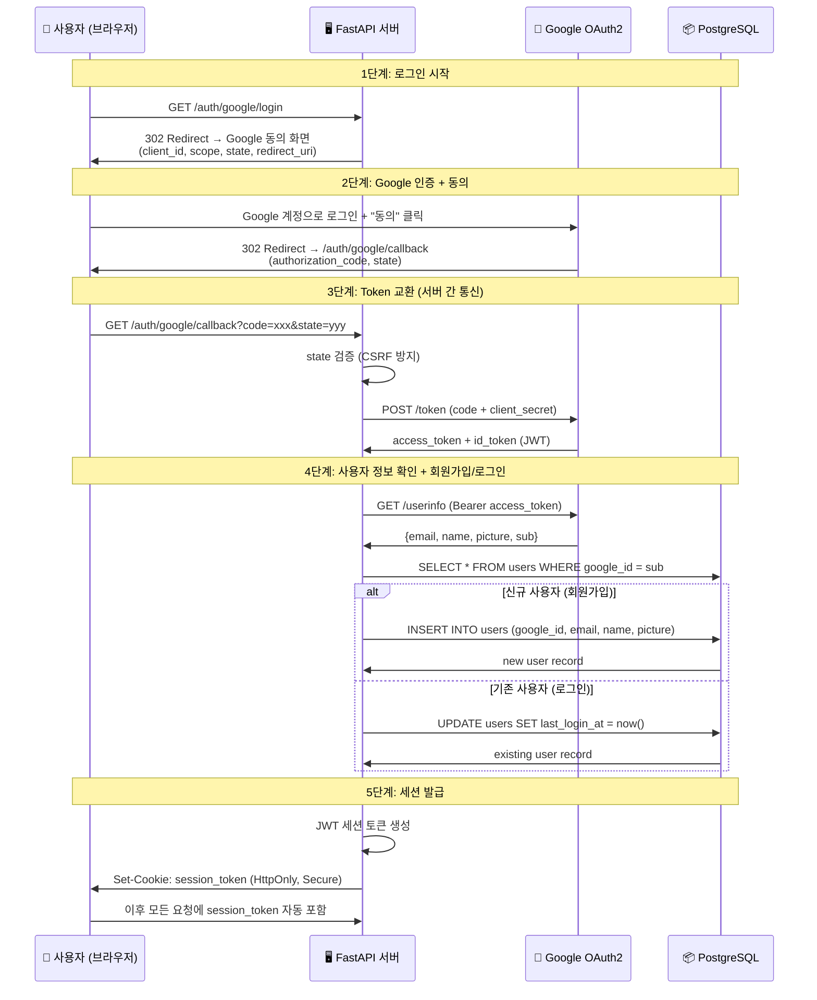

# SSO-OAuth 관계 정리 + OAuth1 vs OAuth2 비교 + Google SSO 아키텍처

> **관련 문서**: [[sso-concept-explainer]], [[oauth1-concept-explainer]], [[oauth2-concept-explainer]]
> **JWT 토큰 라이프사이클**: [[docs/verify-jwt-auth-token-lifecycle/report]]

---

## 1. SSO와 OAuth의 관계: "목표" vs "수단"

가장 먼저 이해해야 할 것은 **SSO와 OAuth는 같은 레벨의 개념이 아니다**라는 점이다.

### 현실 비유

| 개념 | 비유 | 설명 |
|------|------|------|
| **SSO** | "한 번만 표를 사면 모든 놀이기구를 탈 수 있다" (목표) | **달성하고 싶은 것** |
| **OAuth** | "자유이용권 발급 시스템" (수단) | **목표를 달성하는 방법 중 하나** |
| **SAML** | "또 다른 자유이용권 발급 시스템" (수단) | **목표를 달성하는 다른 방법** |
| **OIDC** | "OAuth 자유이용권 + 신분증 확인" (수단+확장) | **OAuth 위에 인증을 추가한 것** |

### 관계 다이어그램

```
┌─────────────────────────────────────────────────────────────┐
│                                                             │
│   SSO (Single Sign-On) = 목표/개념                          │
│   "한 번 로그인하면 여러 서비스에 접근"                        │
│                                                             │
│   ┌─────────────────────────────────────────────────┐       │
│   │           구현 프로토콜 (수단)                     │       │
│   │                                                   │       │
│   │  ┌─────────┐  ┌──────────┐  ┌───────────────┐   │       │
│   │  │ SAML    │  │ OAuth 2.0│  │ OIDC          │   │       │
│   │  │ 2.0     │  │          │  │ (OAuth2 기반)  │   │       │
│   │  │         │  │          │  │               │   │       │
│   │  │ 인증+인가│  │ 인가만   │  │ 인증+인가      │   │       │
│   │  │ XML     │  │ JSON     │  │ JWT           │   │       │
│   │  │ 레거시   │  │ API 위임  │  │ ⭐ 신규 표준   │   │       │
│   │  └─────────┘  └─────┬────┘  └───────┬───────┘   │       │
│   │                      │               │           │       │
│   │                      └───── 확장 ─────┘           │       │
│   │                    (OIDC = OAuth 2.0 + 인증 레이어) │       │
│   └─────────────────────────────────────────────────┘       │
│                                                             │
│   ┌─────────────────────────────────────────────────┐       │
│   │           레거시 (현재 사용 중단)                   │       │
│   │  ┌──────────┐                                    │       │
│   │  │ OAuth 1.0│  ← 2007년 등장, 서명 기반           │       │
│   │  │ (1.0a)   │  ← 2023년 Twitter 전환으로 사실상 종료│       │
│   │  └──────────┘                                    │       │
│   └─────────────────────────────────────────────────┘       │
│                                                             │
└─────────────────────────────────────────────────────────────┘
```

### 핵심 관계 요약

1. **SSO는 "개념/목표"**이고, OAuth/SAML/OIDC는 SSO를 **"구현하는 프로토콜"**이다
2. **OAuth 2.0 자체는 "인가(Authorization)"만** 담당 → SSO를 직접 구현하기엔 부족
3. **OIDC = OAuth 2.0 + 인증 레이어** → SSO에 가장 적합한 현대적 프로토콜
4. **OAuth 1.0은 OAuth 2.0의 전신**이지만, 완전히 다시 설계되어 호환되지 않음

---

## 2. OAuth 1.0 vs OAuth 2.0 비교표

| # | 비교 차원 | OAuth 1.0 | OAuth 2.0 |
|---|----------|-----------|-----------|
| 1 | **보안 방식** | HMAC-SHA1 서명 (매 요청마다) | HTTPS(TLS) 의존 (Bearer Token) |
| 2 | **HTTP 지원** | ✅ HTTP에서도 안전 (서명 덕분) | ❌ HTTPS 필수 |
| 3 | **구현 복잡도** | 🔴 극히 높음 (서명 생성, Base String 조립) | 🟡 중간 (리다이렉트 + 토큰 관리) |
| 4 | **토큰 체계** | Access Token만 (만료 없는 경우 多) | Access Token (단기) + Refresh Token (장기) |
| 5 | **Grant Type** | 1종 (Three-Legged Flow) | 6종+ (Auth Code, Client Credentials, Device, PKCE 등) |
| 6 | **모바일/SPA 지원** | ❌ 어려움 (Secret 보관 문제) | ✅ 우수 (PKCE로 Public Client 지원) |
| 7 | **역할 분리** | Authorization + Resource 미분리 | Authorization Server / Resource Server 분리 |
| 8 | **현재 상태** | ⚫ 사실상 사용 중단 (Deprecated) | 🟢 업계 표준 |
| 9 | **인증(Authentication)** | 미지원 | 미지원 (OIDC 추가 필요) |
| 10 | **표준화** | RFC 5849 (2010) | RFC 6749 (2012), OAuth 2.1 진행 중 |

### 비유로 정리

```
OAuth 1.0 = 수동 변속기 자동차 🚗
  - 운전(구현)이 어렵지만, 연비(HTTP에서도 안전)가 좋다
  - 하지만 이제는 자동 변속기(OAuth 2.0)가 충분히 좋아져서 굳이 수동을 쓸 이유가 없다

OAuth 2.0 = 자동 변속기 자동차 🚙
  - 운전(구현)이 쉽고, 다양한 모드(Grant Type)가 있다
  - 단, 도로(HTTPS)가 잘 깔려있어야 안전하다
```

### 결론: 2026년 현재 무엇을 써야 하나?

```
신규 프로젝트 → OAuth 2.0 + OIDC + PKCE (100%)
레거시 호환   → OAuth 1.0a (어쩔 수 없는 경우만)
엔터프라이즈  → SAML 2.0 또는 OIDC (고객사 요구에 따라)
```

---

## 3. OAuth2 + Google SSO 아키텍처

### 현실 비유

**Google로 로그인**은 마치 **아파트 공용 출입문**과 같다:
- Google(아파트 관리실)이 "이 사람은 입주민이 맞습니다"라고 확인해주면
- 우리 서비스(아파트 내 상점)는 별도의 신분 확인 없이 입장을 허가한다
- 처음 오는 사람이면 회원 등록을 해주고, 이미 있는 사람이면 바로 입장시킨다

### 시퀀스 다이어그램



### 핵심 포인트

1. **Authorization Code Flow**: 가장 안전한 OAuth2 흐름 사용
2. **state 파라미터**: CSRF 공격 방지 (랜덤 문자열 생성 → 콜백에서 검증)
3. **서버 간 통신**: Access Token은 브라우저에 노출되지 않음
4. **회원가입/로그인 통합**: google_id(sub)로 기존 사용자 여부를 판단하여 자동 분기

---

## 4. 예제 코드 (Python + FastAPI + SQLAlchemy 2.0 + Pydantic v2)

### 프로젝트 구조

```
google-sso-example/
├── main.py              # FastAPI 앱 엔트리포인트
├── config.py            # 환경 변수 설정 (pydantic-settings)
├── models.py            # SQLAlchemy 2.0 모델
├── schemas.py           # Pydantic v2 스키마
├── auth.py              # Google OAuth2 + JWT 로직
├── database.py          # DB 연결 설정
├── requirements.txt
└── .env                 # 환경 변수 (절대 커밋 금지!)
```

### `.env` — 환경 변수

```env
# Google OAuth2 Credentials (Google Cloud Console에서 발급)
GOOGLE_CLIENT_ID=your-client-id.apps.googleusercontent.com
GOOGLE_CLIENT_SECRET=your-client-secret
GOOGLE_REDIRECT_URI=http://localhost:8000/auth/google/callback

# JWT 설정
JWT_SECRET_KEY=your-super-secret-key-change-this
JWT_ALGORITHM=HS256
JWT_EXPIRE_MINUTES=60

# 데이터베이스
DATABASE_URL=sqlite+aiosqlite:///./sso_example.db
```

### `config.py` — 환경 변수 설정 (pydantic-settings)

```python
"""
pydantic-settings를 사용하여 .env 파일에서 설정을 안전하게 로드한다.
절대로 코드에 Secret을 하드코딩하지 않는다!
"""
from pydantic_settings import BaseSettings, SettingsConfigDict


class Settings(BaseSettings):
    """애플리케이션 설정. .env 파일에서 자동으로 값을 읽어온다."""

    # Google OAuth2
    google_client_id: str
    google_client_secret: str
    google_redirect_uri: str

    # JWT
    jwt_secret_key: str
    jwt_algorithm: str = "HS256"
    jwt_expire_minutes: int = 60

    # Database
    database_url: str

    model_config = SettingsConfigDict(
        env_file=".env",
        env_file_encoding="utf-8",
    )


settings = Settings()
```

### `database.py` — DB 연결 설정

```python
"""SQLAlchemy 2.0 비동기 엔진 + 세션 설정."""
from sqlalchemy.ext.asyncio import AsyncSession, create_async_engine, async_sessionmaker
from sqlalchemy.orm import DeclarativeBase

from config import settings

engine = create_async_engine(settings.database_url, echo=True)
async_session = async_sessionmaker(engine, class_=AsyncSession, expire_on_commit=False)


class Base(DeclarativeBase):
    pass


async def get_db():
    """FastAPI Dependency: 요청마다 DB 세션을 제공."""
    async with async_session() as session:
        yield session
```

### `models.py` — SQLAlchemy 2.0 모델

```python
"""
사용자 모델. SQLAlchemy 2.0의 Mapped[] 타입 힌트를 사용한다.
(레거시 Column() 스타일이 아닌 현대적 mapped_column() 사용)
"""
from datetime import datetime

from sqlalchemy import String, DateTime, func
from sqlalchemy.orm import Mapped, mapped_column

from database import Base


class User(Base):
    """Google OAuth로 가입한 사용자 모델."""
    __tablename__ = "users"

    id: Mapped[int] = mapped_column(primary_key=True, autoincrement=True)
    google_id: Mapped[str] = mapped_column(
        String(255), unique=True, index=True,
        comment="Google 고유 식별자 (sub claim)",
    )
    email: Mapped[str] = mapped_column(
        String(255), unique=True, index=True,
        comment="Google 이메일 주소",
    )
    name: Mapped[str] = mapped_column(String(255), comment="사용자 이름")
    picture: Mapped[str | None] = mapped_column(
        String(512), nullable=True,
        comment="Google 프로필 사진 URL",
    )
    created_at: Mapped[datetime] = mapped_column(
        DateTime(timezone=True), server_default=func.now(),
    )
    last_login_at: Mapped[datetime] = mapped_column(
        DateTime(timezone=True), server_default=func.now(), onupdate=func.now(),
    )
```

### `schemas.py` — Pydantic v2 스키마

```python
"""Pydantic v2 스키마. ConfigDict 사용 (레거시 class Config 아님)."""
from datetime import datetime

from pydantic import BaseModel, ConfigDict, EmailStr


class GoogleUserInfo(BaseModel):
    """Google OAuth에서 받아오는 사용자 정보."""
    sub: str
    email: EmailStr
    name: str
    picture: str | None = None


class UserResponse(BaseModel):
    """API 응답용 사용자 스키마."""
    id: int
    email: str
    name: str
    picture: str | None
    created_at: datetime
    last_login_at: datetime

    model_config = ConfigDict(from_attributes=True)


class TokenResponse(BaseModel):
    """로그인 성공 시 반환하는 토큰 응답."""
    access_token: str
    token_type: str = "bearer"
    user: UserResponse
```

### `auth.py` — Google OAuth2 + JWT 로직

```python
"""
Google OAuth2 인증 로직.
1. Google 로그인 URL 생성 (state 파라미터 포함)
2. Callback에서 Authorization Code → Access Token 교환
3. Access Token으로 사용자 정보 조회
4. JWT 세션 토큰 생성/검증
"""
import secrets
from datetime import datetime, timedelta, timezone

import httpx
import jwt

from config import settings
from schemas import GoogleUserInfo

# Google OAuth2 엔드포인트
GOOGLE_AUTH_URL = "https://accounts.google.com/o/oauth2/v2/auth"
GOOGLE_TOKEN_URL = "https://oauth2.googleapis.com/token"
GOOGLE_USERINFO_URL = "https://www.googleapis.com/oauth2/v3/userinfo"

# CSRF 방지를 위한 state 저장소 (프로덕션에서는 Redis 사용 권장)
_state_store: dict[str, bool] = {}


def create_google_login_url() -> str:
    """Google OAuth2 로그인 URL을 생성한다."""
    state = secrets.token_urlsafe(32)
    _state_store[state] = True

    params = {
        "client_id": settings.google_client_id,
        "redirect_uri": settings.google_redirect_uri,
        "response_type": "code",
        "scope": "openid email profile",
        "state": state,
        "access_type": "offline",
        "prompt": "consent",
    }
    query = "&".join(f"{k}={v}" for k, v in params.items())
    return f"{GOOGLE_AUTH_URL}?{query}"


def verify_state(state: str) -> bool:
    """callback에서 돌아온 state가 우리가 보낸 것과 같은지 검증."""
    return _state_store.pop(state, False)


async def exchange_code_for_token(code: str) -> dict:
    """Authorization Code를 Access Token으로 교환 (서버 간 통신)."""
    async with httpx.AsyncClient() as client:
        response = await client.post(
            GOOGLE_TOKEN_URL,
            data={
                "code": code,
                "client_id": settings.google_client_id,
                "client_secret": settings.google_client_secret,
                "redirect_uri": settings.google_redirect_uri,
                "grant_type": "authorization_code",
            },
        )
        response.raise_for_status()
        return response.json()


async def get_google_user_info(access_token: str) -> GoogleUserInfo:
    """Access Token으로 Google 사용자 정보를 조회한다."""
    async with httpx.AsyncClient() as client:
        response = await client.get(
            GOOGLE_USERINFO_URL,
            headers={"Authorization": f"Bearer {access_token}"},
        )
        response.raise_for_status()
        return GoogleUserInfo(**response.json())


def create_session_token(user_id: int) -> str:
    """우리 서비스의 JWT 세션 토큰을 생성한다."""
    payload = {
        "sub": str(user_id),
        "exp": datetime.now(timezone.utc) + timedelta(minutes=settings.jwt_expire_minutes),
        "iat": datetime.now(timezone.utc),
    }
    return jwt.encode(payload, settings.jwt_secret_key, algorithm=settings.jwt_algorithm)


def verify_session_token(token: str) -> int | None:
    """JWT 세션 토큰을 검증하고 user_id를 반환한다."""
    try:
        payload = jwt.decode(
            token, settings.jwt_secret_key, algorithms=[settings.jwt_algorithm],
        )
        return int(payload["sub"])
    except (jwt.ExpiredSignatureError, jwt.InvalidTokenError):
        return None
```

### `main.py` — FastAPI 앱 엔트리포인트

```python
"""
FastAPI 메인 앱.
Google OAuth2를 통한 회원가입/로그인 SSO 예제.
"""
from contextlib import asynccontextmanager

from fastapi import FastAPI, Depends, HTTPException
from fastapi.responses import RedirectResponse
from sqlalchemy import select
from sqlalchemy.ext.asyncio import AsyncSession

from auth import (
    create_google_login_url,
    verify_state,
    exchange_code_for_token,
    get_google_user_info,
    create_session_token,
    verify_session_token,
)
from database import Base, engine, get_db
from models import User
from schemas import TokenResponse, UserResponse


@asynccontextmanager
async def lifespan(app: FastAPI):
    """앱 시작 시 테이블 자동 생성 (학습용. 프로덕션에서는 Alembic 사용)."""
    async with engine.begin() as conn:
        await conn.run_sync(Base.metadata.create_all)
    yield


app = FastAPI(
    title="Google SSO Example",
    description="OAuth2 + Google 계정으로 회원가입/로그인하는 예제",
    lifespan=lifespan,
)


@app.get("/auth/google/login")
async def google_login():
    """사용자를 Google 로그인 페이지로 리다이렉트."""
    login_url = create_google_login_url()
    return RedirectResponse(url=login_url)


@app.get("/auth/google/callback")
async def google_callback(
    code: str,
    state: str,
    db: AsyncSession = Depends(get_db),
):
    """
    Google Callback: 핵심 로직.
    1. state 검증 (CSRF 방지)
    2. Code → Token 교환 (서버 간 통신)
    3. 사용자 정보 조회
    4. 회원가입 or 로그인
    5. 세션 토큰 발급
    """
    # Step 1: state 검증
    if not verify_state(state):
        raise HTTPException(status_code=400, detail="Invalid state (CSRF 의심)")

    # Step 2: Code → Token 교환
    token_data = await exchange_code_for_token(code)
    access_token = token_data["access_token"]

    # Step 3: 사용자 정보 가져오기
    google_user = await get_google_user_info(access_token)

    # Step 4: DB에서 사용자 조회 (google_id 기준)
    result = await db.execute(
        select(User).where(User.google_id == google_user.sub)
    )
    user = result.scalar_one_or_none()

    if user is None:
        # 신규 사용자 → 회원가입
        user = User(
            google_id=google_user.sub,
            email=google_user.email,
            name=google_user.name,
            picture=google_user.picture,
        )
        db.add(user)
        await db.commit()
        await db.refresh(user)

    # Step 5: 세션 토큰 생성
    session_token = create_session_token(user.id)

    return TokenResponse(
        access_token=session_token,
        user=UserResponse.model_validate(user),
    )


async def get_current_user(
    db: AsyncSession = Depends(get_db),
    token: str = "",
) -> User:
    """JWT 토큰을 검증하고 현재 사용자를 반환하는 Dependency."""
    user_id = verify_session_token(token)
    if user_id is None:
        raise HTTPException(status_code=401, detail="로그인이 필요합니다")

    result = await db.execute(select(User).where(User.id == user_id))
    user = result.scalar_one_or_none()
    if user is None:
        raise HTTPException(status_code=401, detail="사용자를 찾을 수 없습니다")
    return user


@app.get("/me", response_model=UserResponse)
async def get_my_profile(current_user: User = Depends(get_current_user)):
    """현재 로그인한 사용자의 프로필을 반환."""
    return current_user
```

### `requirements.txt`

```
fastapi>=0.115.0
uvicorn[standard]>=0.30.0
sqlalchemy[asyncio]>=2.0.0
aiosqlite>=0.20.0
pydantic[email]>=2.0.0
pydantic-settings>=2.0.0
httpx>=0.27.0
PyJWT>=2.8.0
```

### 실행 방법

```bash
# 1. 의존성 설치
pip install -r requirements.txt

# 2. .env 파일에 Google OAuth2 자격 증명 입력
# (Google Cloud Console → APIs & Services → Credentials에서 발급)

# 3. 서버 실행
uvicorn main:app --reload

# 4. 브라우저에서 http://localhost:8000/auth/google/login 접속
```

### Google Cloud Console 설정 가이드

```
1. https://console.cloud.google.com 접속
2. 새 프로젝트 생성 (또는 기존 프로젝트 선택)
3. APIs & Services → OAuth consent screen 설정
   - User Type: External
   - App name, Email 입력
4. APIs & Services → Credentials → Create Credentials → OAuth 2.0 Client ID
   - Application type: Web application
   - Authorized redirect URIs: http://localhost:8000/auth/google/callback
5. 발급된 Client ID와 Client Secret을 .env 파일에 입력
```
