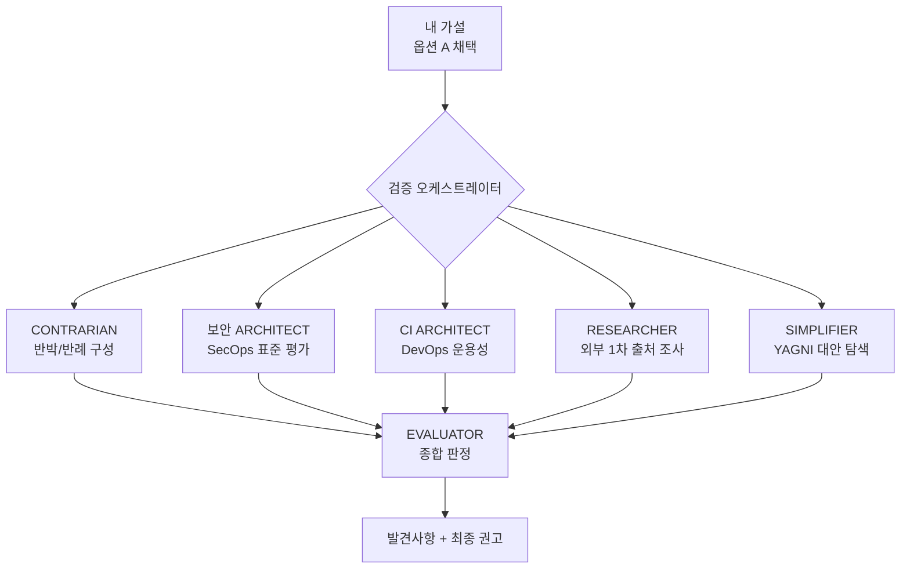
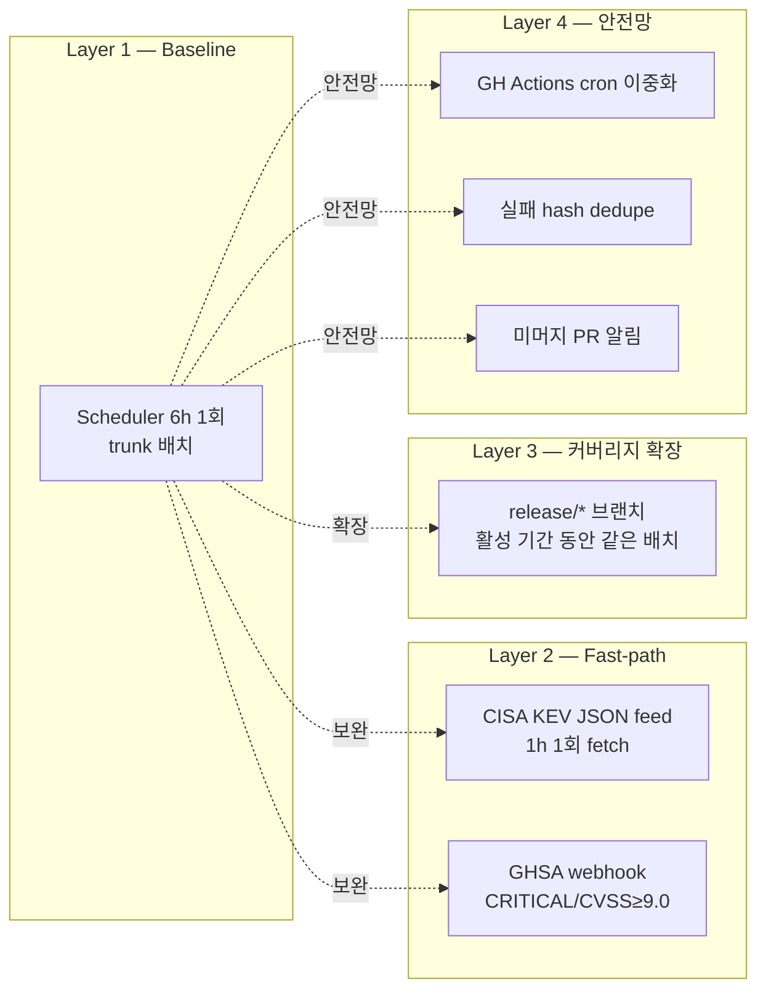

# 🛡️ Trivy 보안 패치 자동화 운영 모델 — Cron 배치 vs CI 트리거, 어느 쪽이 옳을까?

> 모노레포 환경에서 의존성 취약점 자동 패치 워크플로우를 설계할 때, "스케줄러로 trunk를 주기적으로 스캔" vs "CI 단계에서 PR별 자동 패치" 중 무엇이 옳을지를 5개 검증 관점(반박/보안표준/CI운용/외부근거/단순화)으로 교차 검증한 기록.
>
> 결론을 먼저 적자면: **"Cron 배치 + Trunk-only 패치"가 산업 표준이며, 단 빈도와 커버리지 보완이 필요하다.**

---

## 1️⃣ 왜 이 고민을 시작했나

여러 언어(Go/Python/Kotlin)로 구성된 모노레포에서 Trivy 기반 자동 보안 패치 스킬을 직접 만들어 운영하고 있었다. 현재는 외부 스케줄러가 매시간 trunk 브랜치를 대상으로 스캔하고, 검출되면 언어 그룹별로 별도 보안 패치 PR을 만들어 trunk에 머지하는 방식이다.

그런데 문득 이런 의문이 들었다:

> "CI(GitHub Actions)에서 이미 PR 푸시/머지마다 Trivy를 돌리고 있는데, 차라리 **CI 단계에서 취약점이 발견되면 그 PR 브랜치에서 바로 자동 패치**하는 게 낫지 않을까?"

이 질문을 한 줄로 정리하면 두 옵션의 선택 문제다.

### 옵션 A — Cron 배치 (현재)

```
       ┌─────────────────┐
       │   Scheduler     │  매시간 트리거
       │ (Cronicle 등)   │
       └────────┬────────┘
                │ /security-patch 호출
                ▼
       ┌─────────────────────────────────────┐
       │  trunk 브랜치 대상 Trivy 스캔       │
       │  (Go / Python / Kotlin ...)         │
       └────────┬────────────────────────────┘
                │
                ▼
       ┌─────────────────────────────────────┐
       │  언어별 별도 보안 패치 PR 생성/재사용│
       │  security-patch-{lang}-{timestamp}  │
       └────────┬────────────────────────────┘
                │ PR 리뷰 → merge
                ▼
              trunk
                │ merge
                ▼
       ┌─────────────────────────────────────┐
       │  feature branch A, B, C, ...        │
       │  (trunk 흡수 시 패치 자동 반영)     │
       └─────────────────────────────────────┘
```

### 옵션 B — CI 트리거 (가설적 대안)

```
       ┌─────────────────┐
       │  PR open /      │
       │  trunk merge    │
       └────────┬────────┘
                │ GitHub Actions trigger
                ▼
       ┌─────────────────────────────────────┐
       │  CI Gate → image build → registry   │
       │       ↓ (workflow_run)              │
       │  Trivy image scan                   │
       └────────┬────────────────────────────┘
                │ Trivy fail?
                ▼
       ┌─────────────────────────────────────┐
       │  봇이 같은 PR 브랜치에 직접         │
       │  패치 commit + push                 │
       └────────┬────────────────────────────┘
                │ 재 CI
                ▼
            PR ✅ → merge → trunk
```

### 핵심 차이

| 차원      | 옵션 A                              | 옵션 B                                  |
| --------- | ----------------------------------- | --------------------------------------- |
| 트리거    | 시간 기반 (주기적)                  | 이벤트 기반 (PR/머지)                   |
| 패치 대상 | trunk만                             | 개별 PR 브랜치                          |
| PR 분리   | 별도 보안 PR                        | 작성자 PR에 봇 commit 추가              |
| 흡수 방식 | feature branch가 trunk merge 시 흡수 | 본인 PR에서 직접 해결                   |
| 사람 개입 | 보안 PR 리뷰 1회                    | PR 작성자 + 리뷰어가 봇 commit 같이 봄  |

---

## 2️⃣ 내가 옵션 A를 옹호한 3가지 근거

> **시나리오 가정**: feature branch A, B가 trunk의 `abcd` 커밋을 base로 만들어졌고, `pytest`에 보안 취약점이 발견된 경우.

### 논거 1 — 관심사 분리 (Separation of Concerns)

Feature branch는 **기능 개발에 주안점**을 가져가고, 보안 처리는 별도가 맞다. 기능 PR을 리뷰할 때 봇이 다른 파일을 건드린 커밋이 섞여 있으면 인지 부하가 커진다.

### 논거 2 — 충돌 회피 (Conflict Avoidance)

A와 B 브랜치에 동일한 `pytest` 보안 이슈가 검출되면, 둘 다 동일한 수정이 발생한다. 만약 두 브랜치가 **다른 방식으로 처리**하면 trunk 머지 후 conflict가 발생한다. trunk에서 단일 패치를 만들어 양쪽이 흡수하면 이를 피할 수 있다.

### 논거 2.1 — 버전 업 예외도 일관 처리

다만 B 브랜치에서 기능 목적으로 `pytest` 버전을 올려야 하는 경우가 발생할 수 있다. 이때도 보안 fix는 별도 브랜치 → trunk 머지 → 각각 A, B가 흡수하는 모델이 일관적이라고 봤다.

---

## 3️⃣ 검증 절차 — 5개 관점으로 교차 검증

내 가설을 그대로 받아들이지 않고 5개 관점에서 병렬 검증을 돌렸다. 핵심은 **CONTRARIAN(내 가설을 적극적으로 깨러 가는 관점)** 을 반드시 포함시키는 것.



| 관점            | 역할                              | 주요 질문                                  |
| --------------- | --------------------------------- | ------------------------------------------ |
| CONTRARIAN      | 내 설계가 **틀렸다고** 가정       | "어떤 시나리오에서 옵션 A가 깨지는가?"     |
| 보안 ARCHITECT  | NIST/CISA/OWASP 기준              | "매시간 지연이 SLA를 만족하는가?"          |
| CI ARCHITECT    | GitHub Actions/branch protection  | "옵션 B가 실현 가능한가?"                  |
| RESEARCHER      | 1차 출처 (공식 docs)              | "산업 표준은 무엇인가?"                    |
| SIMPLIFIER      | YAGNI                             | "이 이분법 자체를 의심하라"                |

---

## 4️⃣ 검증 과정에서 드러난 환경 사실 — 가설을 흔든 8가지

가설을 세울 때 내가 명확히 인지하지 못한 환경 사실들이 검증 과정에서 드러났다. 이것들이 결론에 결정적 영향을 미쳤다.

| #   | 사실                                                                                                       | 함의                                                |
| --- | ---------------------------------------------------------------------------------------------------------- | --------------------------------------------------- |
| E-1 | **CI Trivy는 PR 단계가 아니라 빌드 완료 후 컨테이너 이미지를 스캔**한다 (`workflow_run` 트리거)             | "PR 시점 게이트"라는 옵션 B 전제가 부분 부정확      |
| E-2 | **Trivy 실패는 deploy를 차단하지 않는다 (non-blocking)**                                                   | 이미 PR 게이트로 동작하고 있지 않음                 |
| E-3 | trunk branch protection: `enforce_admins: true`, `allow_force_pushes: false`, `required_approving_review_count: 1` | 봇 자가-머지 봉쇄                                   |
| E-4 | TBD 전략의 "일 1회 통합 권장"과 매시간 cron(24x/일)은 **정합성 미세 충돌**                                  | trunk가 매시간 흔들리면 흡수 비용 증가              |
| E-5 | **Trivy DB는 6시간 1회 빌드**, 클라이언트 기본 DB 갱신은 24시간                                             | 매시간 cron은 over-polling                          |
| E-6 | macOS Trivy 캐시 경로는 **`~/Library/Caches/trivy/`** (Linux의 `~/.cache/trivy/`와 다름)                    | macOS 스케줄러에서 캐시 경로 직접 참조 시 즉시 깨짐 |
| E-7 | Trivy 0.69+ 기본 OCI 타깃은 **`mirror.gcr.io/aquasec/trivy-db:2`** (ghcr는 fallback)                        | 2024 ghcr rate limit 사건 후 변경. 폴링 타깃 결정 시 영향 |
| E-8 | metadata.json의 `NextUpdate` 필드 TTL은 **24시간** (DB 빌드 주기 6h과 별개)                                 | 클라이언트는 24h 동안 "최신"으로 판단 → 매시간 폴링 무의미 |

---

## 5️⃣ 핵심 발견사항 — 9가지

```
✅ CONFIRMED (7개)  ████████████████████████████████  D-1 ~ D-6, D-9
⚠️ TENTATIVE (2개)  ████████                          D-7, D-8
🔴 CONTESTED (0개)
```

### ✅ D-1. 옵션 A는 산업 표준 모델과 정렬한다

> **Dependabot 공식 인용**: "Security updates are raised for vulnerable package manifests **only on the default branch**."

| 도구           | 기본 타겟 브랜치       | feature branch 지원              |
| -------------- | ---------------------- | -------------------------------- |
| **Dependabot** | default branch 전용    | 옵션 자체가 없음                 |
| **Renovate**   | default branch (기본)  | `baseBranchPatterns`로 명시 추가만 가능 |
| **Snyk**       | default branch (기본)  | Branch monitoring 추가 과금      |

→ 내 논거 1·2·2.1 모두 **산업 표준과 정렬**.

### ✅ D-2. 옵션 B는 권한/Race/실제 사고 사례 측면에서 위험이 크다

**Branch protection 실측**:

```json
{
  "enforce_admins": { "enabled": true },
  "allow_force_pushes": { "enabled": false },
  "required_approving_review_count": 1
}
```

**알려진 공격 벡터 (2024)**:

- Confused Deputy Attack: 포크 저장소 기본 브랜치에 악성 코드 삽입 → `github.actor == 'dependabot[bot]'` 조건 우회
- Merge Conflict Tango: 의도적 충돌로 브랜치명에 페이로드(`$(id)`) 삽입
- Branch Merge Shuffle: 포크 기본 브랜치 교체 후 자동 머지 트리거
- 한 오픈소스 Ingress Controller 프로젝트가 2024년 12월 실제 공급망 공격 피해

**Race condition 시나리오**:

```
T0  PR-100 push  → Trivy fail (CVE-X in pytest)
T0  PR-200 push  → Trivy fail (CVE-X in pytest)
T1  CI-100이 PR-100에 pytest 패치 commit
T1  CI-200이 PR-200에 pytest 패치 commit  (동시)
T2  PR-100 머지 → trunk pytest 갱신
T3  PR-200 rebase 필요 → uv.lock 충돌 거의 확실
```

### ✅ D-3. 매시간 빈도는 Trivy DB 6시간 주기 대비 over-polling이다

```
Trivy DB 빌드 주기  ████████████████████████████████  6시간 (4회/일)
현재 운영 빈도      ████████████████████████████████████████████████████████████████████████████████████████████████  매시간 (24회/일)
권장 빈도          ████████████████████████████████  6시간 1회 (DB 주기 정렬)
                  ▲
                  └─ 약 75%는 동일 DB로 동일 결과 재생산
```

**CVSS SLA 비교 (옵션 A 1시간 최대 지연 vs 산업 표준)**:

| 표준                 | CRITICAL (≥9.0) | HIGH (7.0~8.9) | MEDIUM    | 1시간 지연 평가                  |
| -------------------- | --------------- | -------------- | --------- | -------------------------------- |
| CISA BOD 22-01 (KEV) | 14일            | —              | —         | ✅ 충분                          |
| NIST SP 800-40r4     | 15일            | 30일           | 60~90일   | ✅ 충분                          |
| UK SS-033 (가장 엄격) | 7일             | 14일           | —         | ✅ 충분                          |
| FedRAMP / PCI-DSS v4.0 | 30일          | 30~90일        | —         | ✅ 충분                          |
| OWASP SAMM (aggressive) | 24~72h       | 7일            | 30일      | ⚠️ 조건부                        |

→ 매시간이 아니라 **6시간 1회로도** 모든 산업 SLA를 충족한다.

### ✅ D-4. 옵션 A는 release/* 브랜치를 커버하지 않는다 (구조적 갭)

```
                  ┌──────────────┐
   Scheduler ───► │ trunk scan   │  ◄── 옵션 A가 보는 영역
                  └──────────────┘
                         │
                         │ backport (자동)
                         ▼
                  ┌──────────────────────┐
                  │ release/* 활성 브랜치 │ ◄── ❌ 미커버
                  └──────────────────────┘
                         │
                         ▼
                  ┌──────────────────────┐
                  │ hotfix/* 브랜치       │ ◄── ❌ 미커버
                  └──────────────────────┘
```

TBD에서도 release branch는 "버그 수정/보안 패치는 허용"되므로, release 활성 기간(보통 최대 2주) 동안 새 CVE가 발견되면 옵션 A는 무방어.

### ✅ D-5. CRITICAL / 0-day는 fast-path가 필요

**0-day 등재 → 패치 머지 경로**:

```
CRITICAL CVE 공개 (T+0)
    ↓
GHSA 등록 (평균 T+2h)
    ↓
Trivy DB 반영 (평균 T+9h, 최대 T+12h)   ← ⚠️ 가장 큰 lag
    ↓
다음 cron 실행 (최대 +1h)
    ↓
PR 생성 (~30분)
    ↓
PR 리뷰 + CI 통과 + 머지 (수십 분 ~ 수 시간)
    ↓
배포

총 T+ 평균 11~14시간, 최악 24h+
```

**KEV 통계**: 활성 익스플로잇 CVE의 **42%는 0-day 무기화**, **75%는 28일 이내 무기화**. 매시간 cron만으로는 부족할 수 있다.

**권고 fast-path**:

| 트리거                              | 동작                                                                  |
| ----------------------------------- | --------------------------------------------------------------------- |
| CISA KEV JSON feed (1h 1회 fetch)   | 의존성과 cross-check → 즉시 패치 트리거 + 보안 채널 알림              |
| GitHub Security Advisory webhook    | CRITICAL+KEV 또는 CVSS≥9.0 → 즉시 트리거                              |
| Manual override                     | 운영자 ad-hoc 트리거                                                  |

### ✅ D-6. "옵션 B = PR 게이트" 전제는 부분 부정확

| 직관                                  | 코드베이스 실측                                                            |
| ------------------------------------- | -------------------------------------------------------------------------- |
| "CI Trivy fail = PR 머지 차단"        | ❌ Trivy는 **non-blocking** — sticky PR comment + 알림만                   |
| "CI Trivy는 PR 시점에 즉시 실행"      | ❌ CI Gate → image build → registry push **이후** `workflow_run`           |
| "옵션 B로 PR 단계에서 패치 가능"      | ⚠️ 가능은 하지만 워크플로우 전면 재작성 필요                               |

→ 옵션 B는 내가 우려한 만큼의 위협도 아니고, 기대한 만큼의 효과도 아니다. 양쪽 다 약하다.

### ⚠️ D-7. 논거 2(conflict 회피)의 실제 빈도는 과대평가일 수 있다 — TENTATIVE

**관찰**: 실제 자동 패치 스킬의 변경 패턴은 매우 좁다.

```kotlin
// Kotlin BOM transitive — 단 한 줄로 BOM 전체 override
extra["netty.version"] = "4.2.13.Final"
```

```toml
# Python pyproject.toml — 단 한 줄
starlette = ">=0.40.0"  # 0.39.0 → 0.40.0
```

```bash
# Go — 단일 명령
go get golang.org/x/net@v0.38.0
```

→ 매니페스트 자체의 conflict 표면적은 작다. **단, `uv.lock` / `go.sum` / `gradle.lockfile`은 자동 재생성되므로 lockfile 충돌은 여전히 빈번**할 수 있다.

**추가 검증 필요**: 실제 conflict 발생 사례 실측.

### ⚠️ D-8. `.trivyignore` 재검증 기능은 over-engineering일 가능성 — TENTATIVE

자체 스킬에 ".trivyignore에 등록된 항목을 주기적으로 재검증해서 자동 해결됐는지 확인"하는 Phase가 있는데, 실제로는:

```
.trivyignore 활성 항목 분석
├── 대부분: devDependency (배포 이미지 미포함 → 영구 무시)
└── 일부: PATCH_FAILED (호환성 문제로 미해결)

"라이브러리가 자체 backport로 자동 해결되는" 케이스: 거의 발생 안 함
```

스킬 코드의 약 28%가 이 재검증 로직에 할애되어 있고 Subagent + worktree를 사용. 발생 빈도가 낮다면 분기별 수동 명령으로 분리하는 것이 단순.

### ✅ D-9. 옵션 A의 운영 위험 3가지

```
┌─────────────────────────────────────────────────────────┐
│ R1. 외부 스케줄러 단일 장애점                           │
│     스케줄러 다운 → 모노레포 전체 패치 coverage 상실    │
│     완화: GitHub Actions schedule cron 이중화           │
├─────────────────────────────────────────────────────────┤
│ R2. trunk 빌드 실패 시 동일 실패 24x/일 반복            │
│     매시간 cron이 같은 실패 누적 + .trivyignore 오염    │
│     완화: 실패 hash dedupe, N회 연속 실패만 알림        │
├─────────────────────────────────────────────────────────┤
│ R3. 미머지 보안 PR 누적 → 거대 PR 변질                  │
│     1주 미머지 시 168 push 가능 → 리뷰 비용 비선형 폭증 │
│     완화: auto-merge after CI green + 데일리 알림       │
└─────────────────────────────────────────────────────────┘
```

---

## 6️⃣ 위협 모델 매트릭스 — 정량 평가

| 위협 시나리오                                       | 옵션 A     | 옵션 B     | 근거                                                                |
| --------------------------------------------------- | ---------- | ---------- | ------------------------------------------------------------------- |
| **T1**: trunk에 이미 들어간 CVE                     | Strong (3) | None (0)   | A는 정기 스캔, B는 PR 이벤트 없으면 무동작                          |
| **T2**: 새 feature branch에서 신규 의존성 + CVE     | Partial (2)| Strong (3) | A는 trunk 머지 후에야 검출, B는 PR open 즉시                        |
| **T3**: 외부 0-day가 KEV 등재                        | Partial (2)| Weak (1)   | 둘 다 fast-path 별도 필요                                           |
| **T4**: 동일 라이브러리 CVE가 다수 PR에 동시 검출   | Strong (3) | Weak (1)   | A는 trunk 1회로 일괄, B는 N개 PR + conflict                         |
| **T5**: release/* 브랜치 CVE                         | None (0)   | Partial (2)| A는 trunk만 스캔                                                    |

```
종합 점수
옵션 A:  ████████████████████████████████████████  10/15
옵션 B:  ███████████████████████████              7/15

→ 옵션 A 우세 (T1, T4에서 압도). 단 T5에서 구조적 갭 — 보완 필요.
```

---

## 7️⃣ 운용 리스크 비교

| 항목                       | 옵션 A                              | 옵션 B                                       |
| -------------------------- | ----------------------------------- | -------------------------------------------- |
| **단일 장애점**            | 스케줄러 서버 (이중화 가능)         | GitHub Actions + PAT/App + 모든 PR CI        |
| **권한/토큰 위험**         | 격리된 환경 1회 발급                | 모든 워크플로우에 PAT 노출, recursion 위험   |
| **CI 시간 영향**           | **0분** (PR 흐름 무관)              | **+15~30분** (최악 +50분) per PR             |
| **멱등성**                 | 高 (기존 PR 재사용 + 중복 CVE 제외) | 低 (force push race, 동시 PR 충돌)           |
| **개발자 UX**              | 투명 (별도 PR)                      | 침입적 (본인 PR에 안 만진 파일 변경)         |
| **디버깅**                 | 스케줄러 로그 + GH PR 분리 명확     | 봇 commit이 git blame 오염                   |
| **branch protection 호환** | 高 (정상 PR 경유)                   | 低 (`enforce_admins: true`로 봉쇄)           |
| **race condition**         | 없음 (단일 cron 직렬)               | 빈번 (동시 PR 동일 라이브러리)               |
| **CVE 검출 지연**          | 최대 1시간                          | 즉시 — **B의 유일한 강점**                   |
| **구축 비용**              | 이미 운영 중 (0)                    | 신규 워크플로우 + GitHub App + lock 메커니즘 |

### 종합 점수

```
                보안응답성   개발자UX    운영안정성   구축비용    총점
옵션 A          ★★★★★★      ★★★★★★★★★  ★★★★★★★★    ★★★★★★★★★★  33/40 ✅
옵션 B          ★★★★★★★★★★  ★★★         ★★★★         ★★★          20/40
하이브리드      ★★★★★★★★    ★★★★★★★★   ★★★★★★★★    ★★★★★★★     31/40
```

---

## 8️⃣ 최종 결론 — 옵션 A 유지 + 4가지 보완

내 큰 방향은 맞았지만, 그대로 두기엔 over-polling과 구조적 갭이 있다. 다음 4계층 보완을 더하는 것이 적정선.



| #   | 보완 항목                                                | 우선순위    | 근거                                                                                            |
| --- | -------------------------------------------------------- | ----------- | ----------------------------------------------------------------------------------------------- |
| 1   | **빈도: 매시간 → 6시간 1회** (또는 평일 업무시작 1회)    | 🔴 High     | Trivy DB 6h 빌드 주기 정렬 + TBD "일 1회 통합 권장"과 정합 + 24x/일 over-polling 해소           |
| 2   | **KEV/CRITICAL fast-path** (CISA KEV feed 또는 GHSA webhook) | 🔴 High | 42% 0-day weaponization, NIST SP 800-40r4 §4.3 Emergency Patching                               |
| 3   | **release/* 브랜치 커버리지** 추가                       | 🟡 Medium   | 구조적 갭 해소, 다중 release branch 운영 시 정합                                                |
| 4   | **운영 안전망** (이중화/dedupe/PR 알림)                  | 🟡 Medium   | 스케줄러 단일 장애점, 동일 실패 24x 반복, 거대 PR 누적 방지                                     |

> 💡 **보완 #1 후속 검증**: "6시간"이라는 빈도는 맞지만, 그 안에서 "정각 vs 10분 마진 vs DB metadata 폴링" 같은 디테일은 **§1️⃣1️⃣ 후속 검증**에서 한 번 더 깨지고 단순화됐다. 결국 정답은 **6시간 cron + random jitter + Slack webhook**이라는 한 줄로 수렴한다.

### 옵션 B를 채택하지 않는 이유

- 산업 표준 비정합 (Dependabot/Renovate가 기본 지원 안 함)
- branch protection 정면 충돌 (`enforce_admins: true`)
- 모든 PR에 +15~30분 CI 페널티
- 2024년 실제 공급망 공격 사고 사례 존재
- Trivy 자체가 PR 게이트가 아니므로 효과 제한적

다만 **옵션 B의 핵심 가치(CRITICAL 즉시 패치)는 보완 #2 fast-path가 흡수**한다.

---

## 9️⃣ 내 가설별 최종 평가

```
┌─────────────────────────────────────────────────────────────────┐
│  논거 1 (관심사 분리)                                            │
│  ████████████████████████████████████  ✅ CONFIRMED              │
│  Dependabot/Renovate 산업 표준과 동일 패턴                       │
├─────────────────────────────────────────────────────────────────┤
│  논거 2 (충돌 회피)                                              │
│  ████████████████████████░░░░░░░░░░░░  ⚠️ 방향 ✓, 빈도 과대평가  │
│  BOM/한 줄 변경 패턴이 다수라 매니페스트 conflict는 드뭄.        │
│  단, lockfile 자동 재생성으로 인한 conflict는 여전 → TENTATIVE   │
├─────────────────────────────────────────────────────────────────┤
│  논거 2.1 (별도 trunk 패치로 일관 처리)                          │
│  ████████████████████████████████████  ✅ CONFIRMED              │
│  B가 이미 더 높은 버전이면 trunk 패치 자연 흡수 (noop).          │
│  Dependabot/Renovate 운영 모델과 정확히 동일.                    │
└─────────────────────────────────────────────────────────────────┘
```

---

## 🔟 회고 — 이번 검증에서 얻은 메타 교훈

이번 설계 검증에서 가장 유용했던 건 **CONTRARIAN 관점을 의무화한 것**이었다. 혼자 설계할 때 가장 쉽게 빠지는 함정은 "이 방향이 옳다"는 가설을 강화하는 근거만 찾는 것인데, 명시적으로 "왜 이 가설이 틀렸는가"를 묻는 관점을 따로 둬야 균형이 잡힌다.

또 하나는 **환경 사실(E-1 ~ E-5)이 결론을 뒤집을 수도 있다는 점**이다. 나는 옵션 B를 "PR 게이트로 활용"한다고 가정했는데, 실제 CI Trivy가 non-blocking이고 사후 이미지 스캔이라는 사실을 검증 중에 처음 직시했다. 가설을 세우기 전에 환경을 한 번 더 들여다봤어야 했다.

마지막으로 **산업 표준은 좋은 닻**이다. Dependabot/Renovate가 모두 default branch 전용이라는 사실 하나가 내 논거 1·2·2.1을 동시에 지지해줬다. 자체 도구를 만들 때도 메이저 도구의 기본 동작과 정렬되는지 확인하는 것이 유효한 sanity check다.

**추가 교훈 — "권고를 한 번 더 깨러 가기"**: 첫 검증에서 옵션 A가 옳다고 확인된 뒤에도, 그 안의 디테일(빈도 6시간을 어떻게 운영하는지)에 대해 또 한 번 권고를 만들었는데, 그 권고도 두 번째 검증을 돌리니 사실 오류와 over-engineering이 다수 드러났다 (§1️⃣1️⃣). **큰 그림 결론이 옳다고 운영 디테일까지 옳은 건 아니다.** 디테일도 같은 강도로 검증해야 한다.

---

## 1️⃣1️⃣ 후속 — 6시간 빈도를 어떻게 운영할 것인가 (다시 깨러 가기)

큰 그림이 정해진 뒤 운영 디테일을 권고했는데, 그 권고도 검증으로 다시 단순화된 과정.

### 11-1. 처음 떠올린 의문 — 정각 vs 마진 vs DB 갱신 시점?

6시간으로 줄이기로 한 뒤 곧바로 떠오른 질문 세 가지:

1. **시각 정렬**: KST 00/06/12/18 정각이 좋을까, 00:10/06:10... 10분 마진이 좋을까?
2. **빈도 적정성**: Trivy DB 빌드 주기가 6시간이라도 ±편차가 있을 텐데, 실제 갱신 시점을 알 방법은?
3. **결국**: DB가 실제 갱신된 직후 스캔하는 게 가장 정확하지 않을까?

### 11-2. 처음 권고한 3계층 패턴 (나중에 대부분 정정됨)

```
Layer 1 (Primary): 매시간 trivy --download-db-only → metadata.json의 UpdatedAt 변경 감지 → 변경 시 /security-patch
Layer 2 (Safety Net): 하루 1회 09:10 KST 강제 실행
Layer 3 (Fast-path): CISA KEV JSON feed 1h fetch → 의존성 매칭 시 즉시 트리거
```

직관적으로는 합리적으로 보였다. "DB 갱신 시점을 추측 안 해도 metadata.json에 적혀있다", "안전망과 fast-path로 누락 방지". 그러나 두 번째 검증을 돌리자마자 거의 모든 가정이 무너졌다.

### 11-3. 두 번째 rl-verify로 드러난 사실 오류와 설계 결함

8가지 핵심 주장 중 **사실 오류 3건 + 설계 오류 다수**가 드러났다.

#### 사실 오류 (치명)

| 항목 | 처음 권고 | 실측 결과 |
|------|----------|----------|
| macOS 캐시 경로 | `~/.cache/trivy/db/metadata.json` | **`~/Library/Caches/trivy/db/metadata.json`** (macOS XDG 디폴트 차이) |
| `--download-db-only` 비용 | "가벼운 HEAD 호출" | 실측 **1.0 GB 다운로드** (NextUpdate 경계 시) |
| OCI 다운로드 타깃 | `ghcr.io/aquasecurity/trivy-db:2` | Trivy 0.69+ 기본은 **`mirror.gcr.io/aquasec/trivy-db:2`** (2024 ghcr 사건 후) |

#### 가정 무너짐

- **NextUpdate TTL은 24시간**: `pkg/db/db.go`의 `NeedsUpdate()` 로직상 클라이언트는 24h 동안 "최신"으로 판단. DB 서버가 6h마다 빌드되어도 매시간 폴링이 변경을 감지하지 못함 → 폴링 패턴 자체가 무의미
- **"정각 회피 5~15분 마진"은 공식 권고 아님**: AWS/GCP/Kubernetes 공식 docs에 명시 없음. 커뮤니티 관행 수준. **Google SRE Book Ch.24는 random jitter를 권장**
- **안전망 cron은 폴링과 race + 의미 중복**: 09:00 폴링 + 09:10 안전망은 같은 변경에 대해 두 번 트리거 → security-patch PR 2개

### 11-4. Random jitter — 진짜 SRE 표준

**정의**: 여러 작업이 정확히 같은 시각에 시작하지 않도록 각 실행에 무작위로 짧은 지연을 추가하는 기법. 다른 이름: "thundering herd" 방지.

**일상 비유**: 12:00 점심 종소리에 600명이 동시에 매점으로 돌진 → 줄 폭발. "각자 0~10분 무작위로 출발"로 분산 → 한가.

**Jitter 없는 cron의 문제** (Google SRE Book Ch.24 직접 경고):

```
00:00 정각 → 모든 cron이 동시 실행 → 외부 API 429 → DB pool 고갈
```

**Jitter 적용**:

```bash
# 6시간 정각 + 0~10분(600초) 무작위 지연
0 0,6,12,18 * * *  bash -c 'sleep $((RANDOM % 600)) && /usr/local/bin/security-patch'
```

`RANDOM`은 bash 내장 변수로 매번 다른 정수를 반환. `% 600`은 0~599초로 만들어 sleep.

**Jitter는 어디에나 적용된다**:

- Cron jitter (지금 케이스)
- Retry jitter (AWS의 ["Exponential Backoff and Jitter"](https://aws.amazon.com/blogs/architecture/exponential-backoff-and-jitter/) 권장)
- Cache TTL jitter (cache stampede 방지)
- Heartbeat jitter (health check 1초 boundary 부하 spike 방지)

### 11-5. Heartbeat 패턴 검토 → over-engineering 인정

처음에는 안전망 cron 대신 Healthchecks.io 같은 "dead-man switch" SaaS로 대체하라고 권고했다. **이것도 over였다.**

#### Healthchecks.io의 본질

- 일반 Slack webhook = "내가 살아있을 때만 알려줄게" 모델 → cron 자체가 안 돌면 침묵
- Healthchecks.io = "정해진 시각에 신호 안 오면 죽은 거야" 모델 → 부재 감지 (absence detection)

**"신호의 부재"가 진짜 신호**라는 점은 SRE 표준 dead-man switch 개념. 하지만 우리 케이스에는 과한 추천.

#### 우리 케이스에 진짜 필요한가?

진짜 본질 질문은 **"cron이 안 돌았을 때를 어떻게 알 것인가"** 단 하나. 3가지 옵션:

| 옵션 | 침묵 케이스 감지 | 비용 | 추천 상황 |
|------|----------------|------|----------|
| Slack webhook만 | ❌ | 0원 | **우리 케이스 default** — 매주 사람 눈으로 확인 |
| 기존 모니터링 묻어가기 | ✅ | 0원 | Datadog/Prometheus가 이미 있을 때 |
| Healthchecks.io | ✅ | $5/월 | 위 둘 다 어려운 환경 |

**보안 패치는 하루 한 번 안 돌아도 CISA SLA 14일 이내라 critical하지 않음.** Slack webhook 한 줄로 시작 → 침묵 케이스가 실제 문제가 되는지 본 다음 도구 도입이 YAGNI에 맞다.

### 11-6. 최종 단순화 — 한 줄로 끝나는 코드

```bash
# /etc/cron.d/security-patch (UTC 기준)

# 환경 변수 — 검증에서 드러난 사실 정정
TRIVY_CACHE_DIR=/var/cache/trivy
TRIVY_DB_REPOSITORY=mirror.gcr.io/aquasec/trivy-db:2
TRIVY_USERNAME=__bot_user__
TRIVY_PASSWORD=__ghcr_pat__
SLACK_WEBHOOK=https://hooks.slack.com/...

# 6시간 cron + random jitter + Slack 알림
0 0,6,12,18 * * *  bash -c '
  sleep $((RANDOM % 600))
  if /usr/local/bin/security-patch; then
    curl -s -X POST $SLACK_WEBHOOK -d "{\"text\":\"✅ Trivy patch OK $(date -u +%FT%TZ)\"}"
  else
    curl -s -X POST $SLACK_WEBHOOK -d "{\"text\":\"❌ Trivy patch FAIL $(date -u +%FT%TZ)\"}"
  fi
'
```

이게 끝. **3계층 → 1계층으로 단순화** + **사실 오류 4건 정정** + **SRE 표준 패턴(random jitter) 적용**.

### 11-7. 처음 vs 최종 비교

| 단계 | 처음 안 | 최종 안 | 정정 이유 |
|------|--------|--------|----------|
| 빈도 | 매시간 24x/일 | **6시간 4x/일** | Trivy DB 빌드 주기 정렬 |
| 시각 정렬 | 정각 vs 10분 마진 | **Random jitter** (0~10분) | Google SRE Book Ch.24 권고 |
| DB 갱신 감지 | metadata.json UpdatedAt 폴링 + LAST_FILE | **불필요** | NextUpdate TTL 24h라 폴링 무의미. Trivy 자체 캐시가 처리 |
| OCI 타깃 | `ghcr.io/aquasecurity/trivy-db:2` | **`mirror.gcr.io/aquasec/trivy-db:2`** | Trivy 0.69+ 기본값 |
| macOS 캐시 경로 | `~/.cache/trivy/` | **`~/Library/Caches/trivy/`** (또는 `TRIVY_CACHE_DIR` 통일) | macOS XDG 차이 |
| 안전망 cron | 하루 1회 09:10 KST 강제 | **불필요** | 폴링과 race + 의미 중복 |
| KEV fast-path 자동 트리거 | CISA KEV JSON 1h 폴링 + 매칭 | **Slack 알림만, 사람이 수동 트리거** | 매칭 빈도 연 5~10건, 자동화 비용 안 맞음 |
| 침묵 케이스 감지 | Healthchecks.io | **Slack에서 사람 눈으로 매주 확인** | $5/월 외부 의존 추가가 over |

---

## 📚 참고 자료

### 산업 표준

- [About Dependabot security updates — GitHub Docs](https://docs.github.com/en/code-security/concepts/supply-chain-security/about-dependabot-security-updates)
- [Renovate Configuration Options — baseBranchPatterns](https://docs.renovatebot.com/configuration-options/)
- [Trunk Based Development — trunkbaseddevelopment.com](https://trunkbaseddevelopment.com/)
- [DORA Capabilities: Trunk-based development](https://dora.dev/capabilities/trunk-based-development/)

### 보안 표준

- **CISA BOD 22-01** — Known Exploited Vulnerabilities Catalog 의무 패치
- [**NIST SP 800-40 Rev.4** — Enterprise Patch Management Planning](https://nvlpubs.nist.gov/nistpubs/SpecialPublications/NIST.SP.800-40r4.pdf)
- **NIST SP 800-218 (SSDF v1.1)** — Secure Software Development Framework
- **OWASP SAMM v2** — Defect Management practice levels
- **PCI-DSS v4.0** Requirement 6.3.3

### 보안 사고 사례

- [Weaponizing Dependabot: Pwn Request at Its Finest — BoostSecurity](https://boostsecurity.io/blog/weaponizing-dependabot-pwn-request-at-its-finest)
- [Hardening GitHub Actions — Wiz Blog](https://www.wiz.io/blog/github-actions-security-guide)
- [Bypassing required reviews using GitHub Actions — Cider Security](https://medium.com/cider-sec/bypassing-required-reviews-using-github-actions-6e1b29135cc7)

### 도구 문서

- [trivy-db README — Aqua Security](https://github.com/aquasecurity/trivy-db)
- [aquasecurity/trivy `pkg/db/db.go` (NeedsUpdate 로직)](https://github.com/aquasecurity/trivy/blob/main/pkg/db/db.go)
- [aquasecurity/trivy-db `pkg/metadata/metadata.go` (스키마)](https://github.com/aquasecurity/trivy-db/blob/main/pkg/metadata/metadata.go)
- [aquasecurity/trivy-db `cron.yml` (빌드 스케줄)](https://github.com/aquasecurity/trivy-db/blob/main/.github/workflows/cron.yml)
- [Trivy DB 캐시 docs](https://aquasecurity.github.io/trivy/latest/docs/configuration/cache/)
- [Edgescan 2024 Vulnerability Statistics Report](https://www.edgescan.com/wp-content/uploads/2025/04/2024-Vulnerability-Statistics-Report.pdf)

### SRE / 운영 표준

- Google SRE Book Ch.24 — "Distributed Periodic Scheduling with Cron" (random jitter, thundering herd)
- Google SRE Workbook Ch.2, 5 — SLO / Error Budget / multi-window burn rate alert
- [AWS Architecture Blog — Exponential Backoff and Jitter](https://aws.amazon.com/blogs/architecture/exponential-backoff-and-jitter/)
- AWS Well-Architected Reliability Pillar — REL05/09/11
- [Healthchecks.io — Dead Man's Switch monitoring](https://healthchecks.io/) (참고용; 본 케이스에는 적용 안 함)

### Trivy 운영 이슈

- [Trivy Discussion #8009 — TOOMANYREQUESTS rate limit](https://github.com/aquasecurity/trivy/discussions/8009)
- [trivy-action 2026-03 공급망 사고 (SHA pin 필수 사유)](https://thehackernews.com/2026/03/trivy-security-scanner-github-actions.html)

---

## 📌 한 줄 요약

> **"Cron 배치 + Trunk-only 패치 모델은 옳다. 단, 매시간을 6시간으로 줄이고, KEV fast-path와 release/* 커버리지를 추가하라."**
>
> 운영 한 줄: **6시간 cron + random jitter + Slack webhook + 환경변수 4개**. 그 외(폴링/안전망 cron/Healthchecks.io)는 over-engineering.
